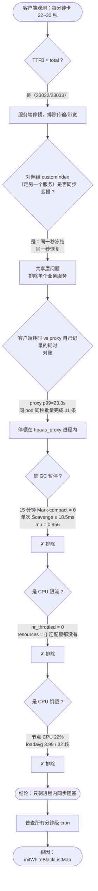
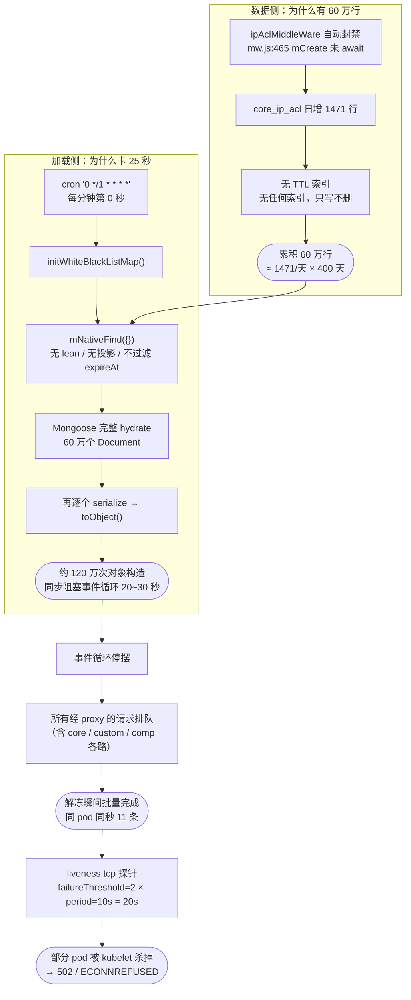
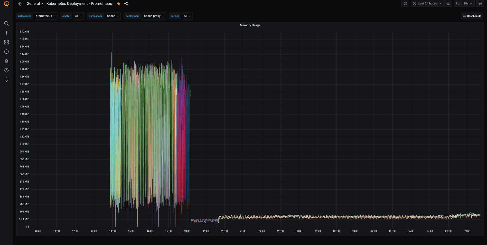

# hpaas 网关每分钟卡 25 秒：一次跨 8 个假设的排查复盘

**现象**：`memberShow` / `memberAll` 等接口间歇性耗时 7~30 秒，刷新页面又正常。
**根因**：`hpaas_proxy` 的一个每分钟 cron，把 60 万行 IP 黑名单全量 hydrate 成 Mongoose 文档，同步阻塞事件循环 20~30 秒。
**结果**：已修复并验证 —— 峰值内存 2.14 GiB → 190 MiB，每分钟的内存锯齿消失，连续平稳 14 小时以上。
**教训**：**先定层，再定因**。前 8 个假设全部来自"读代码找到一个像的东西"，无一命中；真正定位靠的是两层耗时对账和资源指标。

---

## 一、现象与最初的误导

用户反馈低码平台页面偶发白屏数十秒。浏览器 Network 面板：

| 接口 | 第一次 | 刷新后 |
|---|---|---|
| `InnerApp/memberShow` | 7.45 s | 209 ms |
| `FlowDef/memberAll` | 5.89 s | 203 ms |
| `countAllRemind` | 454 ms | 3.45 s |
| `customIndex` | 127 ms | 133 ms |

三个特征从一开始就该引起注意，但当时被忽略了：

1. **响应体只有 14 kB 却要 7.45 秒** → 不是带宽问题
2. **刷新一下就好** → 不是固定成本，是间歇状态
3. **Postman 单独调用很快** → 不是单请求的计算量问题

最初的排查方向是"慢查询"，因为手上正好有一份 `system.profile` 导出。**这是第一个错误：手上有什么数据就往哪查，而不是先想清楚该测什么。**

---

## 二、排查路径



### 关键测量手段

**① 按秒采样探针**（`hpaas_custom/data/probe-member-api.sh`）

每秒各打一次 3 个接口，按**发起秒**（不是结束秒）聚合。两个设计点是必须的：

- **按发起秒聚合**：一个 `:20` 发起、耗时 15 秒的请求结束在 `:35`，按结束秒统计会把锅扣到 `:35` 头上
- **并发闸门**：每接口同时只允许 1 个在途，超出记 `skip`。第一版没有闸门，在途请求堆到 42~88 个，探针自己变成压测工具，耗时 3 分钟内从 3.4s 涨到 22s —— **数据完全作废**

`skip` 率是最干净的指标，它不受探针自身负载影响：

```
秒  │ customIndex   │ memberAll     │ memberShow
17  │  100% (9/9)   │  100% (9/9)   │  100% (9/9)
…   │               │               │
28  │  100% (11/11) │  100% (11/11) │  100% (11/11)
31  │   55% (6/11)  │   91% (10/11) │   55% (6/11)
```

**② 两层耗时对账**（决定性的一刀）

给探针的 URL 加查询串标记 `?p=<tag>-<seq>-<name>`，proxy 的 access log 会记下 `:url`，于是同一个请求在两侧都能被认出来：

```
时刻      接口         客户端ms  proxy_ms  差值
16:12:09  customIndex    22015      530    21485
16:13:07  memberShow     23713     1008    22705
16:13:15  customIndex    26385      572    25813
```

这一步曾经**得出错误结论**："proxy 只用 0.5 秒，停顿在 nginx 之前"。实际是 nginx 重试造成的假象——探针请求打到冻结的 pod、超时、被重试到健康 pod，日志里只留下那条快的。

**纠正方式是看 proxy 日志的整体分布**，而不只看探针请求：

| pod | 中位 | p95 | p99 | 最大 | >10s |
|---|---|---|---|---|---|
| bwwfv | 84 | 1,576 | **24,624** | 29,367 | 36 |
| wps8l | 83 | 1,393 | 8,121 | 28,562 | 22 |

**③ 进程级 stop-the-world 的签名**

按 pod + 结束时刻聚类：

```
16:12:30  bwwfv × 11 条  (24007~29367 ms)   ← 同一 pod、同一秒、11 条一起结束
16:12:38  wps8l ×  8 条  (24309~26258 ms)
16:13:29  wps8l × 10 条  (23307~28562 ms)
```

**耗时从 23 到 29 秒不等的一批请求，在同一毫秒内全部完成** —— 只可能是它们被同一个东西卡住，然后在解冻瞬间一起放行。这个签名排除了"排队爬坡"，锁定"进程冻结"。

---

## 三、被推翻的 8 个假设

记录在此，避免以后重复走。

| # | 假设 | 推翻依据 |
|---|---|---|
| 1 | MongoDB 慢查询 / 缺索引 | `system.profile` 里 20 条全是 **0~1ms**，索引命中正常；唯一 COLLSCAN 是 Navicat 自己查 profile |
| 2 | 并发争用 | 是**探针自身**缺并发闸门造成的自激反馈（平均在途 42、峰值 88） |
| 3 | AppRole 缓存每小时击穿 + 无锁惊群 | core 日志中 `memberShow` 最大仅 **2033ms**，从未出现 5~7 秒尖峰 |
| 4 | hpaas_custom 的 `runHeapDump` | `heapdump.writeSnapshot()` 确实是 stop-the-world，但**关闭后问题依旧** |
| 5 | hpaas_comp 的 `storageOnlineStatsMinute`（`BITCOUNT` 阻塞共享 Redis） | 代码上成立（proxy 与 comp 共用 `redis-service2`），但**关闭后问题依旧** |
| 6 | proxy 内存 churn / GC 暂停 | 15 分钟内 `Scavenge` **33,586 次**、`Mark-compact` **0 次**；单次 Scavenge 8~18.5ms。凑出 25,000ms 需要 1,351 次连续 Scavenge 且期间不执行应用代码，而它们实际间隔 80ms |
| 7 | CPU 被 cgroup 限流 | `nr_periods=0 nr_throttled=0 throttled_time=0`，且 `resources: {}` —— 连配额都没配置 |
| 8 | CPU 饥饿（BestEffort 抢不到 CPU） | 节点 CPU **22%**，loadavg **3.99 / 32 核** |

**第 4、5 条的代价最大**：都做了配置变更并重新部署，问题依旧。原因是两者都只是"长得像"——周期性 + 阻塞型，但从未有任何实测把它们和那 25 秒连起来。

---

## 四、根因



改造前的实现（`hpaas_proxy/api/lib/init.js`）：

```js
async function initWhiteBlackListMap () {
    global.ipWhiteListMap = {};        // ← 问题④：开头就清空
    global.ipBlackListMap = {};
    const ipAclList = await models.IpAclManager.mNativeFind({});   // ← 问题①②③
    for (let ipAcl of ipAclList) {
        if (ipAcl.type === 'WHITE') global.ipWhiteListMap[ipAcl.ip] = true;
        else if (ipAcl.type === 'BLACK') global.ipBlackListMap[ipAcl.ip] = true;
    }
}
```

而 `BaseManager.mNativeFind` 做了两遍重活：

```js
async mNativeFind (search, fields = [], opts = {}) {
    let objs = await this.mod.find(this.processBaseSearch(search), fields, opts);  // Mongoose hydrate
    objs = objs.map(x => this.serialize(x));                                       // 每个再 toObject
    ...
}
```

### 四个叠加问题

| # | 问题 | 后果 |
|---|---|---|
| ① | 走 `mNativeFind`，不带 `.lean()`，且额外 `serialize` | 120 万次对象构造，**这是 25 秒的主体** |
| ② | 无字段投影 | 每条约 400B，白搬 `expireAt`/`desc`/`province` |
| ③ | 不过滤 `expireAt` | `ipBanDays: 1` 的"封禁一天"**实际变成永久封禁** |
| ④ | 开头清空两个 map | 重建期间名单为空，**白名单 IP 短暂失去豁免** |

`accessControl` 在 `app.js:133` 全局挂载，所以这两个 map 在每个请求上被消费。

---

## 五、处理方案

### 1. 代码（已改）

`hpaas_proxy/api/lib/init.js` 重写 `initWhiteBlackListMap`，拆成三条查询：

```js
const IP_ACL_BATCH_SIZE = 2000;

async function initWhiteBlackListMap () {
    const now = new Date();
    const whiteMap = {};
    const blackMap = {};
    const model = models.IpAclManager.mod;     // 绕开 mNativeFind 的 hydrate + serialize

    // 白名单：量小，一次取
    for (const doc of await model.find({ type: "WHITE" }, { ip: 1, _id: 0 }).lean()) {
        whiteMap[doc.ip] = true;
    }

    // 永久黑名单：不设 expireAt 即为永久。
    // { expireAt: null } 同时匹配「值为 null」与「字段缺失」，与 TTL 索引语义一致
    for (const doc of await model.find({ type: "BLACK", expireAt: null }, { ip: 1, _id: 0 }).lean()) {
        blackMap[doc.ip] = true;
    }

    // 限时封禁：量大，游标流式消费，批间让出事件循环
    const cursor = model
        .find({ type: "BLACK", expireAt: { $gt: now } }, { ip: 1, _id: 0 })
        .lean()
        .batchSize(IP_ACL_BATCH_SIZE)
        .cursor();
    for await (const doc of cursor) {
        blackMap[doc.ip] = true;
    }

    global.ipWhiteListMap = whiteMap;          // 最后一次性替换
    global.ipBlackListMap = blackMap;
    logger.info(`ip acl loaded: white=${Object.keys(whiteMap).length} black=${Object.keys(blackMap).length}`);
}
```

| 改动 | 修掉 |
|---|---|
| `.lean()` | ① —— **最大的一项** |
| 字段投影 `{ip:1,_id:0}` | ② 单条 400B → 40B |
| `expireAt: {$gt: now}` | ③ 永久封禁 Bug |
| `.batchSize().cursor()` + `for await` | ① 批间让出事件循环，**表再膨胀也不会卡死网关** |
| 最后原子替换 | ④ 重建期间名单半空 |
| 独立的永久黑名单查询 | 保留"永久封禁"能力（否则 `$gt: now` 会把它们排除） |

拆三条而不用 `$or`：白名单可能没有 `expireAt`，`{ $or: [{expireAt:{$gt:now}}, {expireAt:null}] }` 走不了索引。

> 依赖确认：Mongoose **5.13.16**（`.lean()` / `.cursor()` / 异步迭代均稳定支持）；Node ≥ 12（`api/lib/throttle.js` 使用了私有类字段 `#store`）。`.lean()` / `for await` 在该代码库中是新引入的模式，已在注释中说明理由。

### 2. 数据治理（待做）

**先清历史再建索引** —— 在 3 千条上建索引比在 60 万条上便宜得多。低峰期分批删，避免 60 万条 oplog 一次性冲击 4 个从库：

```javascript
use hpaas_proxy
var total = 0;
while (true) {
  var ids = db.core_ip_acl.find({ expireAt: { $lt: new Date() } }, { _id: 1 })
                          .limit(20000).toArray().map(d => d._id);
  if (!ids.length) break;
  total += db.core_ip_acl.deleteMany({ _id: { $in: ids } }).deletedCount;
  print("已删 " + total);
  sleep(1000);
}

db.core_ip_acl.createIndex({ expireAt: 1 }, { expireAfterSeconds: 0 })   // 根治增长
db.core_ip_acl.createIndex({ type: 1, expireAt: 1 })                      // 支撑三条查询
```

TTL 只删 `expireAt` 为 Date 的文档，**永久条目（null/缺失）不会被清理** —— 与代码语义对齐。

### 3. 配置（待做）

```json
// config/kub.json → log4jsConfig.categories
"init": { "appenders": ["console"], "level": "trace" }
```

否则新加的 `ip acl loaded` 日志会被 `default: error` 丢掉。

顺带放宽 liveness —— 现在 `period=10s timeout=1s failureThreshold=2` 意味着**连续 20 秒探测失败就杀容器**，而停顿是 22~30 秒，会形成"卡顿 → 杀 pod → 剩余 pod 压力更大 → 更卡"的正反馈：

```bash
kubectl -n hpaas patch deployment hpaas-proxy --type=json -p='[
  {"op":"replace","path":"/spec/template/spec/containers/0/livenessProbe/failureThreshold","value":6},
  {"op":"replace","path":"/spec/template/spec/containers/0/livenessProbe/timeoutSeconds","value":5}
]'
```

### 4. 长期增长评估

日增 **1,471** 行，`ipBanDays: 1`，所以：

```
TTL 生效后的稳态 = 日封禁量 × ipBanDays ≈ 1,500 ~ 3,000 行
```

**从 60 万降到几千，两个数量级。** 60 万 ÷ 1471 ≈ 400 天，说明它纯粹是"缺 TTL 导致的历史累积"，不是当前流量的问题。

因此 **Redis SET 替代、CIDR 聚合、下沉到 nginx 这些方案都不需要做** —— 在这个量级属于过度设计。游标版在十万级都不会卡死网关，余量是当前的 30~300 倍。

需要重新评估的唯一触发条件：**日封禁量涨到几万以上**（遭持续大规模扫描）。那时正确方向也不是优化这段代码，而是把限流下沉到 nginx 的 `limit_req`（共享内存、O(1)、根本不需要名单表）—— 现有这套"应用层限流 → 写库 → 每分钟全量重载"本质上是在重复实现 nginx 已内置的能力。

监控项：

```javascript
db.core_ip_acl.countDocuments({ createdAt: { $gt: new Date(Date.now() - 86400000) } })
```

---

## 六、验证

```bash
# 1. 确认加载量降下来（需先加 init 日志分类）
kubectl -n hpaas logs -l app=hpaas-proxy --since=5m --tail=-1 | grep 'ip acl loaded'
#    预期 black 是几千而不是 60 万

# 2. 最终标准：探针复测
cd ~/Code/hbridata/hpaas_custom/data
export TOKEN='<新 authtoken>'
DURATION=600 ./probe-member-api.sh
#    看「跳过率 × 发起秒」，三列不再出现连续 100% 带即为解决
```

> ⚠️ `kubectl logs` 带 `-l`/`--selector` 时 `--tail` **默认只有 10**（不带 selector 才是全部）。排查中曾因此得出"15 分钟 0 次 Scavenge"的错误结论，必须显式写 `--tail=-1`。

### 实测结果：已验证有效

hpaas-proxy 的内存曲线（Grafana `kube-deployment` 面板，最近 24 小时）：



| 时段 | 内存表现 |
|---|---|
| **14:00 ~ 18:00**（修复前） | 在 **95 MiB ↔ 2.14 GiB** 之间高频剧烈震荡，锯齿密集成片 |
| 约 18:00 ~ 19:45 | 部署窗口 |
| **19:45 ~ 次日 09:00+**（修复后） | **稳定在 95 ~ 190 MiB 的平线**，仅有微小的规律性涟漪 |

- 峰值内存：**2.14 GiB → 约 190 MiB**，降低约 **11 倍**
- 每分钟一次的内存锯齿**完全消失**
- 已连续平稳运行 **14 小时以上**

这条曲线同时反证了排查中期的一个误判：当时怀疑这个锯齿是 GC 暂停或 OOM 重启，实际它就是**每分钟把 60 万条文档 hydrate 进内存再丢弃**的直接投影 —— 去掉这个动作，锯齿随之消失。

**当前状态**：代码已改并验证有效；数据治理（清历史 + 两个索引）与配置（`init` 日志分类、放宽 liveness）待做。

---

## 七、复盘

### 方法论

**错误模式**：读代码 → 找到一个"长得像"的东西 → 断言它是根因 → 改掉 → 问题依旧 → 换下一个。8 次。

`runHeapDump` 和 `storageOnlineStatsMinute` 都符合"周期性 + 阻塞型"的画像，代码上完全说得通，但**从未有任何实测把它们和那 25 秒连起来**。真正有效的动作只有三个，全都是测量而非阅读：

1. **两层耗时对账** —— 把链路砍成两半，不依赖任何机制假设
2. **资源指标**（`cpu.stat` / `loadavg` / `--trace-gc`）—— 逐个排除整类原因
3. **进程级 stop-the-world 签名**（同 pod 同秒批量完成）—— 锁定"冻结"而非"排队"

`resources: {}`、`nr_throttled`、`loadavg` 这几个基础设施指标应该在看到 Grafana 那两张图时就问，而不是第 20 轮才查。

### 工具教训

| 坑 | 后果 |
|---|---|
| 探针无并发上限 | 探针变压测工具，数据自激作废（在途峰值 88） |
| `kubectl logs -l` 的 `--tail` 默认 10 | 得出"15 分钟 0 次 Scavenge"的错误结论 |
| 只看探针请求的 proxy 耗时 | 被 nginx 重试误导，错判"proxy 无辜" |
| `--trace-gc` 放进 `NODE_OPTIONS` | Node 白名单不含它，pod 直接 CrashLoop（应改容器 `command`） |
| proxy 缺 access log | 前 15 轮中间层完全是黑盒。**根因是配置漏了 `http` 日志分类**——`log4js.connectLogger` 本来就配好了，只是 `getLogger('http')` 回落到 `default: error` 被丢弃 |

---

## 八、顺带发现的独立问题

与本次停顿无关，但都是实测发现的真实问题，建议单独排期。

**安全**

- `hpaas_core/api/controllers/AppAuthController.js` 写的是 `result.false = false` 而非 `result.flag = false`，而调用方 `hpaas_custom/api/services/authService.js:21` 检查 `modAuth.flag` —— **视图级权限检查实际失效**，无权限用户可查看视图及全部字段（可编辑性因 `fieldEditableMap` 为 `undefined` 恰好被挡住）。已修。
- proxy 启动日志把 Redis 密码明文打出。
- `routes/file.js:46` 与 `routes/proxy.js:797` 透传整个 `req.headers`，因 `...headers` 最后展开，**入站 `authtoken` 会覆盖刚签发的后端 JWT**。

**性能**

- `AppAuth/getModPermission`：84,586 次 / **3923 秒** core 处理时间（第二名的 4.3 倍），无缓存。已加 60s/600s Redis 缓存。
- hpaas_core 的负载 **90.5% 来自 hpaas_custom 的内部调用**（156,579 / 172,912），用户流量仅 8.8%。
- `AppRoleManager.populateRoleFlows`（`:137-154`）双层循环内 `await`，真正的串行 N+1。
- `AppRoleManager.js:36` 的 `_allRoles` Redis SET **无 TTL**，而校验标志有 1 小时 TTL → 陈旧 role key 单调累积，每次冷路径都白跑一次查询。
- `BaseManager.js:319` 写缓存与 `:330` 读缓存 key 不一致（`InnerApp` 无 `appKey` 字段），**`mGet` 永远命中不了自己写的缓存**，应用文档每请求从 Mongo 读两遍。
- `outer_dxdp_map.base_project` 缺索引：`hbService.js:7867` 每次项目更新都 `mFindOne`，全扫 1324 条只为拿到 `null`（4 秒内同参调用 4 次）。
- `hb_service_guide.item_code` 缺索引：`hbConService.js:10059` 硬编码 `$in` 两值，扫 15,366 条返回 503 条。
- `cust_flowinst` / `cust_stepinst` 内嵌全量快照（`dataObj` + `oldDataObj` + `form`，占 39KB 的 77%）；`cust_flowtask` 单文档约 57KB → 更新 8 个文档的 3 个短字段需读 457KB 磁盘、耗时 188ms。
- proxy 的 `maxContentLength: Infinity`：axios 0.18 的 http adapter 在该值 `> -1` 时**每个 chunk 都 `Buffer.concat` 已累积内容**，而 `length > Infinity` 永不成立 —— 纯 O(n²) 白做功，实测额外 **270~1030 MB/min** 拷贝。且 `maxBodyLength` 在 0.18 上是死选项。
- proxy 12 处 axios 调用**全部无 timeout、无上限**，最关键的是 `api/lib/mw.js:65` 的全局登录检查（每请求必调）。
- `hpaas_custom` 的 zrzy 轮询：`zrt/interface.js:35` 在检查 `result.status` **之前**就做双层 `JSON.parse`，上游返回中文明文时必抛 `Unexpected token 未`；失败项目因 `zrzy_fqxjc` 不变而永久留在轮询集，约 2 分钟重试一次、永不终止。
- `cust_customlog.dataName` 取"表单第一个 text 字段原值、不截断"，实测装进 4458B 的 base64 PNG 和带容器路径的 JS 堆栈；单次远程查询报文被存 3 遍（约 14KB）。

**运维**

- proxy 3 个副本**全部调度在同一节点**，且 `resources: {}` → QoS `BestEffort`（无 requests/limits，调度优先级最低、内存压力下最先被驱逐）。
- 一个 proxy pod 出现**退出码 139（SIGSEGV）**，与 `v8-profiler-node8` 依赖有关（`dumpCpuProfile` cron 未启用，但依赖本身在新版 Node 上是隐患）。
- `system.profile` 默认 1MB capped，在该库上约 1~2 秒就绕一圈 —— **慢查询留不住**。应扩容并把 `slowms` 设为有意义的阈值。
- `code_wiki` 里留档的 `08hpaas_proxy.yaml` 与线上已脱节（`replicas: 1` vs 实际 3，无 resources/probes），不可直接 `kubectl apply`。
