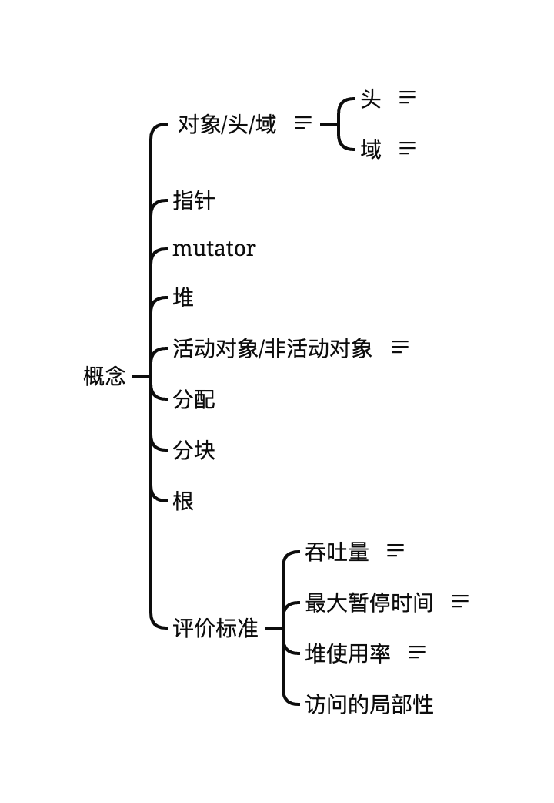

# 概念

| | 
|:--:| 
| *GC-概念-脑图* |

## 对象/头/域
### 对象
### 头
我们将对象中保存对象本身信息的部分称为“头”。头主要含有以下信息。
* 对象的大小
* 对象的种类
### 域
我们把对象使用者在对象中可访问的部分称为“域”。对象使用者会引用或替换对象的域值。另一方面，对象使用者基本上无法直接更改头的信息。  
域中的数据类型大致分为以下2种。
* 指针
* 非指针

## 指针

## mutator

## 堆
堆指的是用于动态（也就是执行程序时）存放对象的内存空间。

## 活动对象/非活动对象
我们将分配到内存空间中的对象中那些能通过mutator引用的对象称为“活动对象”。反过来，把分配到堆中那些不能通过程序引用的对象称为“非活动对象”。也就是说，不能通过程序引用的对象已经没有人搭理了，所以死掉了。死掉的对象（即非活动对象）我们就称为“垃圾”。

## 分配

## 根

## 评价标准

* 吞吐量
* 最大暂停时间
* 堆使用效率 
* 访问的局部性

### 吞吐量
吞吐量指的是单位时间内执行程序的工作量。
### 最大暂停时间
最大暂停时间指的是mutator执行程序时，GC暂停mutator的最长时间。
### 堆使用效率
堆使用效率指的是mutator使用堆的效率。
### 访问的局部性
PC上有4种存储器，分别是寄存器、缓存、内存、辅助存储器。它们的访问速度有着如图所示的层级关系  
***寄存器 > 缓存 > 内存 > 辅助存储器***