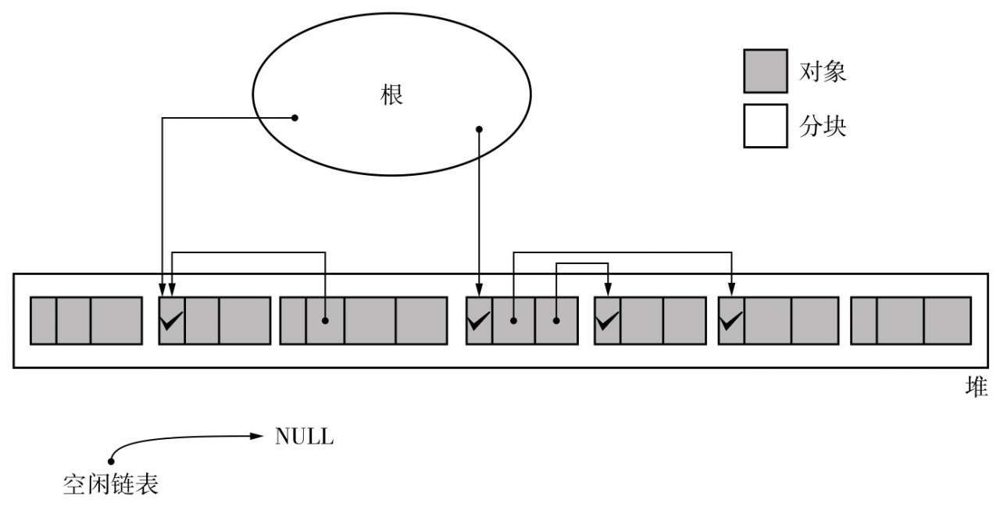
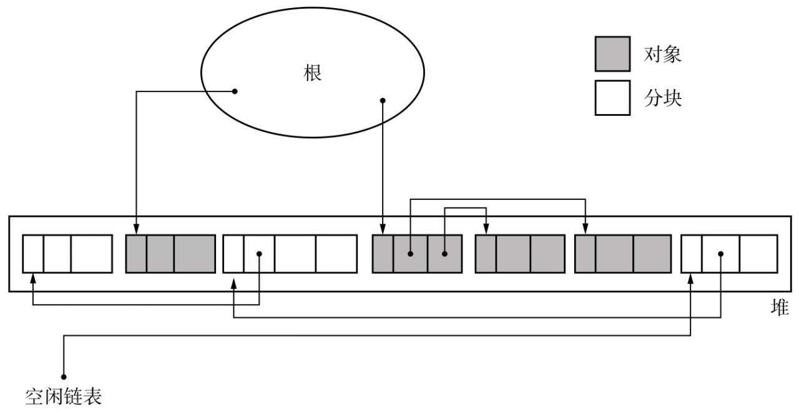

# GC标记-清除算法

## 定义 
GC标记-清除算法由标记阶段和清除阶段构成。
* 标记阶段是把所有活动对象都做上标记的阶段。
* 清除阶段是把那些没有标记的对象，也就是非活动对象回收的阶段。
```C++
1   mark_sweep(){
2     mark_phase()
3     sweep_phase()
4   }
```

| | 
|:--:| 
| *执行GC前堆的状态* |

## 标记阶段
通过根对象（如全局变量、栈中的引用等）开始，标记所有能够从根对象访问到的对象。遍历对象图，通过可达性分析，标记所有与根对象直接或间接相关联的对象。
```C++
1   mark_phase(){
2     for(r : $roots)
3        mark(*r)
4   }

1   mark(obj){
2     if(obj.mark == FALSE)
3        obj.mark = TRUE
4        for(child : children(obj))
5          mark(*child)
6   }
```
| |
|:--:|
| *执行GC后堆的状态* |

## 清除阶段
遍历整个堆（heap），对未标记的对象进行清除。释放被标记为未使用的内存，使其可供后续的内存分配使用。[^3]

```C++
1   sweep_phase(){
2     sweeping = $heap_start
3     while(sweeping < $heap_end)
4        if(sweeping.mark == TRUE)
5          sweeping.mark = FALSE
6        else
7          sweeping.next = $free_list
8          $free_list = sweeping
9        sweeping += sweeping.size
10   }
```
***free_list***是一个指向空闲链表的指针。[^1]  
***size***是一个域，用于存储对象的大小（字节数）。[^2]  

| |
|:--:|
| *执行GC后堆的状态* |

## 分配
这里的分配是指将回收的垃圾进行再利用。   


[^1]: 我们必须把非活动对象回收再利用。回收对象就是把对象作为分块，连接到被称为“空闲链表”的单向链表。在之后进行分配时只要遍历这个空闲链表，就可以找到分块了   
[^2]: 在此出现了叫作size的域，这是存储对象大小（字节数）的域。跟mark域一样，我们事先在各对象的头中定义它们     
[^3]:在清除阶段，程序会遍历所有堆，进行垃圾回收。也就是说，所花费时间与堆大小成正比。堆越大，清除阶段所花费的时间就会越长