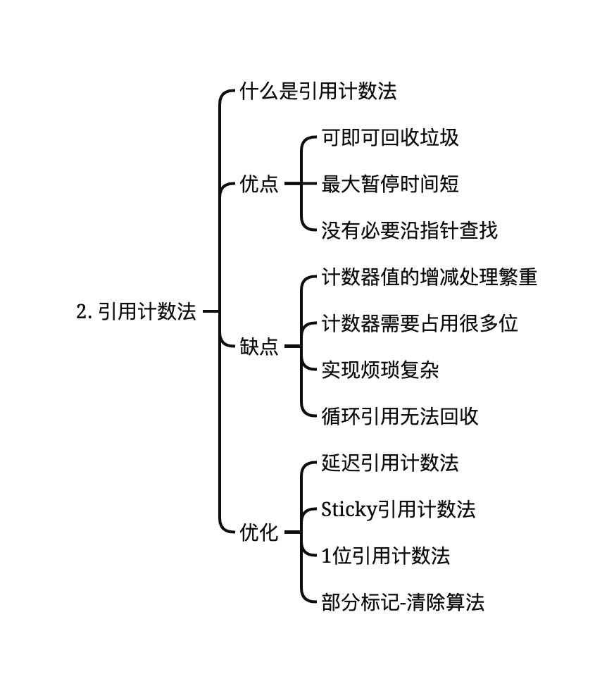

# 引用计数法

| | 
|:--:| 
| *GC-引用计数法-脑图* |

## 什么是引用计数法
引用计数法中引入了一个概念，那就是“计数器”。计数器表示的是对象的人气指数，也就是有多少程序引用了这个对象（被引用数）。计数器是无符号的整数，用于计数器的位数根据算法和实现而有所不同。

### 计数器值的增减

### newObj()函数
```C
1   new_obj(size){
2     obj = pickup_chunk(size, $free_list)
3
4     if(obj == NULL)
5        allocation_fail()
6     else
7        obj.ref_cnt = 1 // 初始化计数器
8        return obj
9   }
```

### update ptr()函数
update_ptr()函数用于更新指针ptr，使其指向对象obj，同时进行计数器值的增减。
```C
1   update_ptr(ptr, obj){
2     inc_ref_cnt(obj) // 1．对指针ptr新引用的对象（obj）的计数器进行增量操作
3     dec_ref_cnt(*ptr) // 2．对指针ptr之前引用的对象（*ptr）的计数器进行减量操作
4     *ptr = obj
5   }    
```
:question: ***为什么要先调用inc_ref_cnt()函数，后调用dec_ref_cnt()函数呢***  
:key: 答案就是“为了处理*ptr和obj是同一对象时的情况”。如果按照先dec_ref_cnt()后inc_ref_cnt()函数的顺序调用，*ptr和obj又是同一对象的话，执行dec_ref_cnt(*ptr)时*ptr的计数器的值就有可能变为0而被回收。这样一来，下面再想执行inc_ref_cnt(obj)时obj早就被回收了，可能会引发重大的BUG。

```C
1   inc_ref_cnt(obj){
2     obj.ref_cnt++
3   }
```

```C
1   dec_ref_cnt(obj){
2     obj.ref_cnt--
3     if(obj.ref_cnt == 0)
4        for(child : children(obj))
5          dec_ref_cnt(*child)
6        reclaim(obj)
7   }
```
首先对更新指针之前引用的对象*ptr的计数器进行减量操作。减量操作后，计数器的值为0的对象变成了“垃圾”。因此，这个对象的指针会全部被删除。换言之，程序需要对*ptr的子对象的计数器进行减量操作。在第5行递归调用dec_ref_cnt()函数就是为了这个。然后，通过reclaim()函数将obj连接到空闲链表。    

**特点** 在变更数组元素等的时候会进行指针的更新。通过更新指针，可能会产生没有被任何程序引用的垃圾对象。引用计数法中会监督在更新指针的时候是否有产生垃圾，从而在产生垃圾时将其立刻回收。  


## 优点

### 可即可回收垃圾
在变更数组元素等的时候会进行指针的更新。通过更新指针，可能会产生没有被任何程序引用的垃圾对象。引用计数法中会监督在更新指针的时候是否有产生垃圾，从而在产生垃圾时将其立刻回收。   

### 最大暂停时间短
在引用计数法中，只有当通过mutator更新指针时程序才会执行垃圾回收。也就是说，每次通过执行mutator生成垃圾时这部分垃圾都会被回收，因而大幅度地削减了mutator的最大暂停时间

### 没有必要沿指针进行扫描
引用计数法和GC标记-清除算法不一样，没必要由根沿指针查找。当我们想减少沿指针查找的次数时，它就派上用场了。

## 缺点
### 计数器值的增减处理繁重

### 计数器需要占用很多位

### 实现烦琐复杂

### 无法处理循环引用

## 优化