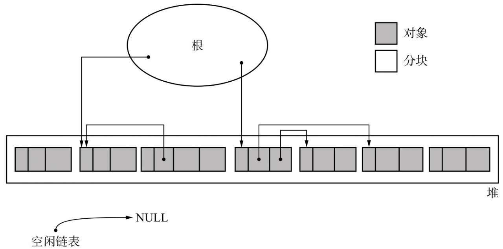

# GC标记-清除算法

## 定义 
GC标记-清除算法由标记阶段和清除阶段构成。
* 标记阶段是把所有活动对象都做上标记的阶段。
* 清除阶段是把那些没有标记的对象，也就是非活动对象回收的阶段。
```C++
1   mark_sweep(){
2     mark_phase()
3     sweep_phase()
4   }
```

| | 
|:--:| 
| *执行GC前堆的状态* |