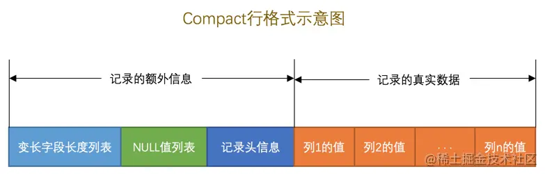
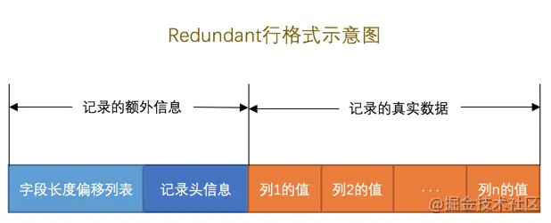

>出处： [MySQL 是怎样运行的：从根儿上理解 MySQL](https://juejin.cn/book/6844733769996304392)


1. 页是`MySQL`中磁盘和内存交互的基本单位，也是`MySQL`是管理存储空间的基本单位。

2. 指定和修改行格式的语法如下：
```mysql
CREATE TABLE 表名 (列的信息) ROW_FORMAT=行格式名称

ALTER TABLE 表名 ROW_FORMAT=行格式名称
```

3. InnoDB目前定义了4种行格式

* COMPACT行格式 



* Redundant行格式


* Dynamic和Compressed行格式  
这两种行格式类似于`COMPACT`行格式，只不过在处理行溢出数据时有点儿分歧，它们不会在记录的真实数据处存储字符串的前768个字节，而是把所有的字节都存储到其他页面中，只在记录的真实数据处存储其他页面的地址。  
另外，`Compressed`行格式会采用压缩算法对页面进行压缩。

一个页一般是 **16KB**，当记录中的数据太多，当前页放不下的时候，会把多余的数据存储到其他页中，这种现象称为行溢出。