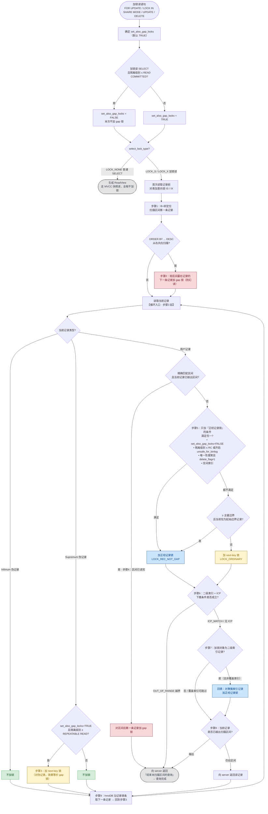

# MySQL 锁与 MVCC

> 本文整理自一次深入问答，涵盖 InnoDB 的 MVCC、锁体系、加锁分析、AUTO-INC 锁、隐式锁，以及完整的加锁流程图。参考版本 MySQL 5.7 / 8.0，源码参考 5.7.22。

## 目录

- [一、MVCC 与读写冲突](#一mvcc-与读写冲突)
- [二、快照读 + 写的实用场景](#二快照读--写的实用场景)
- [三、快照读 + 后续写的陷阱（RR 下超卖）](#三快照读--后续写的陷阱rr-下超卖)
- [四、MVCC 解决了什么](#四mvcc-解决了什么)
- [五、MySQL 锁类型全景](#五mysql-锁类型全景)
- [六、S 锁 vs X 锁：两个正交的维度](#六s-锁-vs-x-锁两个正交的维度)
- [七、LOCK IN SHARE MODE 的应用场景](#七lock-in-share-mode-的应用场景)
- [八、NOWAIT 与 SKIP LOCKED](#八nowait-与-skip-locked)
- [九、MDL 长事务导致 DDL 阻塞的坑](#九mdl-长事务导致-ddl-阻塞的坑)
- [十、加锁分析实战题](#十加锁分析实战题)
- [十一、AUTO-INC 锁的坑](#十一auto-inc-锁的坑)
- [十二、隐式锁：INSERT 真的不加锁吗](#十二隐式锁insert-真的不加锁吗)
- [十三、InnoDB 加锁完整流程图](#十三innodb-加锁完整流程图)
- [面试高频三连](#面试高频三连)

---

## 一、MVCC 与读写冲突

**核心结论：MVCC 让「快照读」和「写」不冲突。**

### 快照读（Snapshot Read）—— 不冲突

普通 `SELECT` 就是快照读，通过 **undo log + Read View** 读取历史版本快照。

- 读操作不加锁，读的是某个版本的快照
- 写操作生成新版本（通过 undo log 链）
- 二者互不阻塞：**读不阻塞写，写不阻塞读**

```sql
SELECT * FROM t WHERE id = 1;   -- 快照读，读旧版本，不阻塞写
```

### 当前读（Current Read）—— 会冲突

以下操作读最新版本并加锁，会与写冲突：

```sql
SELECT ... FOR UPDATE;          -- 加排他锁 X
SELECT ... LOCK IN SHARE MODE;  -- 加共享锁 S
UPDATE / DELETE / INSERT;       -- 隐含当前读 + 加锁
```

### 总结

| 操作类型 | 是否加锁 | 与写是否冲突 |
|---------|---------|------------|
| 快照读（普通 SELECT） | 否 | **不冲突** |
| 当前读（FOR UPDATE / UPDATE 等） | 是 | 冲突 |

一句话：**MVCC 让普通读和写不冲突，但写和写、当前读和写仍需靠锁来串行化。**

---

## 二、快照读 + 写的实用场景

MVCC 让「长读 / 大量读」与「在线写」能真正并发：

1. **报表/统计查询 与 在线交易并发**——几十秒的统计查询不锁表，前台照常下单。
2. **数据库备份**——`mysqldump --single-transaction` 在一个 RR 事务里做全库快照读，导出期间业务持续读写。
3. **数据迁移 / 全量同步**——全量读走快照，增量靠 binlog 补，不影响线上写入。
4. **页面详情展示 与 后台编辑并发**——用户看详情（快照读），运营改价格（写），互不阻塞。
5. **读多写少接口**——海量 C 端 `SELECT` 完全不加锁，走版本快照。

---

## 三、快照读 + 后续写的陷阱（RR 下超卖）

### RR 保证什么

**RR 保证「快照读可重复」，不保证「快照读的值和后续 current read 的值一致」。** 同一事务里 `SELECT`（快照读）和 `UPDATE`（当前读）看的是两套不同的数据视图。

| 读类型 | 在 RR 下看到的 |
|--------|--------------|
| 快照读（普通 SELECT） | 事务第一次快照读时的 Read View，之后冻结 |
| 当前读（UPDATE/DELETE/FOR UPDATE） | 执行那一刻的最新已提交值（穿透快照） |

### 事故时间线（初始 stock = 1）

```
时刻   事务 A                                     外部事务 B
 t1                                              stock = 1（初始）
 t2   BEGIN;
 t3   SELECT stock WHERE id=1;
      -- 快照读，建立 Read View，读到 stock = 1
 t4                                              UPDATE stock=stock-1 WHERE id=1;
                                                 COMMIT;  -- 真实 stock=0
 t5   -- 应用层拿 t3 的快照值 1 > 0 判断 → 决定发货！
 t6   UPDATE stock=stock-1 WHERE id=1;
      -- 当前读：读到最新值 0，扣成 -1
 t7   COMMIT;                                    -- 结果：库存 -1，超卖
```

**错在哪：** t5 的业务判断用的是 t3 的过期快照值（1），而真实库存已是 0。行锁只能保证「写和写串行」，保护不了「基于过期快照读做的业务决策」。

### 更严重的变体：丢失更新

应用层算好绝对值再写回：

```sql
SELECT stock FROM product WHERE id=1;   -- 快照读到 10
-- 应用层计算：10 - 1 = 9
UPDATE product SET stock = 9 WHERE id=1;  -- 若期间 B 已扣到 5，B 的扣减彻底丢失
```

### 正确写法：把「读后要据此写」改成当前读

```sql
-- 方案一：加锁读
SELECT stock FROM product WHERE id=1 FOR UPDATE;

-- 方案二：判断下推到 SQL
UPDATE product SET stock = stock - 1
WHERE id = 1 AND stock > 0;   -- 检查 affected_rows，为 0 说明没库存
```

---

## 四、MVCC 解决了什么

**核心：MVCC 让「读操作不加锁也能读到一致的数据」，从而实现「读写不互相阻塞」。**

| 问题 | RC（读已提交） | RR（可重复读） |
|------|--------------|--------------|
| 脏读 | MVCC 解决 | MVCC 解决 |
| 不可重复读 | ❌ 不解决 | MVCC 解决 |
| 快照读幻读 | ❌ 不解决 | MVCC 解决 |
| 当前读幻读 | ❌ | 靠间隙锁 |

区别在于 **Read View 的创建时机**：RC 每次快照读都新建，RR 整个事务只建一次。

### MVCC 没有解决什么

- **写-写冲突**——靠行锁串行
- **当前读的幻读**——靠间隙锁
- **「读后据此写」的丢失更新**——MVCC 反而是陷阱来源，要靠 `FOR UPDATE`

### 底层三大件

1. **隐藏字段**：`DB_TRX_ID`（最后修改的事务 id）、`DB_ROLL_PTR`（回滚指针）
2. **undo log**：保存历史版本，串成版本链
3. **Read View**：活跃事务快照 + 可见性算法

---

## 五、MySQL 锁类型全景

```
按粒度
├── 表级锁
│   ├── 表锁 (LOCK TABLES)
│   ├── 元数据锁 MDL（防 DDL 与 DML 打架）
│   ├── 意向锁 IS / IX（配合行锁）
│   ├── 自增锁 AUTO-INC
│   └── 全局锁 FTWRL（全库备份）
└── 行级锁
    ├── 记录锁 Record Lock（锁行）
    ├── 间隙锁 Gap Lock（锁间隙，防插入）
    ├── 临键锁 Next-Key Lock（记录+间隙，默认，防幻读）
    └── 插入意向锁 Insert Intention Lock

按功能
├── 共享锁 S（读锁）
└── 排他锁 X（写锁）

并发思想（非内建）
├── 悲观锁（FOR UPDATE）
└── 乐观锁（版本号 / CAS）
```

### 行级锁的三种形态（重点）

| 锁 | 范围 | 说明 |
|----|------|------|
| **记录锁 Record Lock** | 锁单条记录 | `WHERE id=5 FOR UPDATE`，唯一索引等值命中 |
| **间隙锁 Gap Lock** | 锁记录之间的开区间 | 防插入、防幻读；间隙锁之间互不冲突；仅 RR 生效 |
| **临键锁 Next-Key Lock** | 左开右闭区间 `(a, b]` | = 记录锁 + 间隙锁，**InnoDB 默认形态**，RR 下防幻读 |

> **临键锁 = 记录锁 + 间隙锁。** 唯一索引等值命中时退化为记录锁，未命中时退化为间隙锁。

### 意向锁（表级，配合行锁）

- 给行加 S 锁前，先给表加 `IS`；给行加 X 锁前，先给表加 `IX`
- **目的**：让想加表级锁的事务无需逐行检查（O(n) → O(1)）
- 意向锁之间**全兼容**，只和表级 S/X 锁冲突

### 特殊锁

- **插入意向锁**：特殊的间隙锁，用于 INSERT，彼此不冲突（利于并发插入）
- **自增锁 AUTO-INC**：特殊表级锁，见[第十一节](#十一auto-inc-锁的坑)
- **全局锁 FTWRL**：`FLUSH TABLES WITH READ LOCK`，全库只读，用于全库逻辑备份

---

## 六、S 锁 vs X 锁：两个正交的维度

**S/X 和「记录锁/间隙锁/临键锁」是两个不同维度，不是一一对应。**

```
维度一（功能）：  S 锁  ←→  X 锁          （决定"是否互斥"）
维度二（范围）：  记录锁 / 间隙锁 / 临键锁   （决定"锁哪些数据"）
一个具体的锁 = 维度一 × 维度二
```

### 兼容矩阵

|       | S | X |
|-------|---|---|
| **S** | ✅ | ❌ |
| **X** | ❌ | ❌ |

### 各锁的 S/X 归属

| 锁 | S 还是 X |
|----|---------|
| 表锁 LOCK TABLES | `READ`=S，`WRITE`=X |
| 元数据锁 MDL | DML 加 MDL 读锁(S)，DDL 加 MDL 写锁(X) |
| 意向锁 IS / IX | 本身就是 S/X 的意向版 |
| 自增锁 AUTO-INC | 类 X（独立机制） |
| 全局锁 FTWRL | S（读锁） |
| 记录锁 / 间隙锁 / 临键锁 | 由语句决定：`FOR SHARE`→S 型，`FOR UPDATE`/`UPDATE`/`DELETE`→X 型 |

示例：

```sql
SELECT * FROM t WHERE id = 5 FOR UPDATE;                -- X 型 记录锁
SELECT * FROM t WHERE id BETWEEN 5 AND 10 FOR SHARE;    -- S 型 临键锁
UPDATE t SET c=1 WHERE id > 5;                          -- X 型 临键锁
```

### 不参与普通 S/X 矩阵的「另类」

- **意向锁**：IS/IX 彼此全兼容，只跟表级 S/X 冲突
- **间隙锁**：S/X 型之间都不冲突，只阻止插入
- **插入意向锁**：彼此不冲突，只被普通间隙锁阻塞
- **自增锁**：独立机制，由 `innodb_autoinc_lock_mode` 控制

---

## 七、LOCK IN SHARE MODE 的应用场景

`SELECT ... LOCK IN SHARE MODE`（8.0 改叫 `FOR SHARE`）给行加 **S 锁**：其他事务可继续读，但不能改。

**语义**：「我要读这行，保证事务结束前别人不能改它，但允许别人也读。」

### 实际场景

1. **校验外键/依赖存在性**（最经典）——插入子表前确认父表记录存在，且不希望校验后被删。用 S 锁而非 X 锁，是因为允许并发插子表。
2. **基于稳定配置做计算**——读汇率/配置做一系列计算，期间不希望配置被改，但允许别的计算并发读。
3. **多事务并发只读校验**——对账/结算期间，多个只读校验事务共存，集体阻止修改。

### 为什么用得少：锁升级死锁

```
事务A: SELECT ... LOCK IN SHARE MODE (拿S锁)
事务B: SELECT ... LOCK IN SHARE MODE (也拿S锁，共享，OK)
事务A: UPDATE ...  -- 想升X锁，但B持S锁 → 等待
事务B: UPDATE ...  -- 想升X锁，但A持S锁 → 死锁！
```

**判断标准**：读了要改这行 → 直接 `FOR UPDATE`；读了不改但要防止别人改且允许别人读 → `LOCK IN SHARE MODE`；只是读不在乎别人改 → 普通 SELECT。

---

## 八、NOWAIT 与 SKIP LOCKED

MySQL 8.0 引入的两个锁修饰符，只对当前读（`FOR UPDATE`/`FOR SHARE`）有效。

### NOWAIT —— 锁不到立即报错

```sql
SELECT ... FOR UPDATE NOWAIT;
-- 目标行被锁着时立即抛错，不等 innodb_lock_wait_timeout（默认 50s）
```

**场景**：后台独占编辑（快速失败提示"正在被他人编辑"）、高并发防雪崩、死锁防御。

### SKIP LOCKED —— 跳过被锁的行

```sql
SELECT ... FOR UPDATE SKIP LOCKED;  -- 跳过被锁行，只返回并锁定可用行，不报错
```

**场景：数据库实现任务队列（最经典）**

```sql
BEGIN;
SELECT id, payload FROM job_queue
WHERE status = 'pending'
ORDER BY created_at
LIMIT 1
FOR UPDATE SKIP LOCKED;   -- 多 worker 各拿不同任务，不重复不阻塞
UPDATE job_queue SET status = 'processing' WHERE id = ?;
COMMIT;
```

还适用于：抢占式资源分配（发券、分配号码池、抢座位）、批量并行消费。

### 对比

| 维度 | NOWAIT | SKIP LOCKED |
|------|--------|-------------|
| 遇到锁的行为 | 整个语句报错失败 | 跳过被锁行，返回其余行 |
| 典型场景 | 独占编辑、快速失败 | 任务队列、资源抢占 |
| 核心诉求 | 我要的就是这一行，拿不到就别等 | 我要任意可用行，被占的跳过 |

⚠️ **SKIP LOCKED 会导致结果不完整**，绝不能用于精确统计（如 `SUM`）。

---

## 九、MDL 长事务导致 DDL 阻塞的坑

### MDL 是什么

**元数据锁（Metadata Lock）** 是表级锁，自动加、**事务提交才释放**，保护表结构。DML 加 MDL 读锁，DDL 加 MDL 写锁；读锁之间兼容，读写/写写互斥。

### 事故链条

```
会话A（长事务）:  BEGIN; SELECT ...;  -- 拿 MDL 读锁，一直不提交
会话B（DDL）:     ALTER TABLE t ...;  -- 要 MDL 写锁 → 被 A 的读锁阻塞
会话C、D…（查询）: SELECT ...;         -- 读锁本该和 A 兼容，但被 B 卡住！
```

### 最反直觉的一点：为什么 C（普通读）也被卡

**MDL 等待队列是 FIFO 公平锁，不允许插队。** 一旦写锁（B）在排队，后面所有读锁请求必须排在它后面——否则源源不断的读会让 DDL 永远饿死。

```
A（持读锁，不放）
  └─ 堵住 B（写锁）
        └─ 堵住 C、D、E…（所有后续读锁）
→ 全表不可访问 → 连接打满 → 库挂
```

### 排查与预防

```sql
-- 排查：找长事务
SELECT * FROM information_schema.innodb_trx ORDER BY trx_started ASC;
SHOW PROCESSLIST;  -- ALTER 状态为 "Waiting for table metadata lock"
KILL <thread_id>;  -- 应急：kill 掉持锁的长事务

-- 预防：给 DDL 加超时（8.0）
SET SESSION lock_wait_timeout = 5;
ALTER TABLE t ADD COLUMN x INT;  -- 拿不到锁自己超时退出，不连累后续查询
```

其他预防：业务杜绝长事务、DDL 前查长事务、用 gh-ost / pt-online-schema-change、对该状态设告警。

> **一句话：不是 DDL 本身慢，而是长事务卡住了 DDL，DDL 又卡住了所有人。**

---

## 十、加锁分析实战题

### 前置表结构

```sql
CREATE TABLE hero (
    number INT,
    name VARCHAR(100),
    country varchar(100),
    PRIMARY KEY (number),
    KEY idx_name (name)
) Engine=InnoDB;

-- 数据（number）: 1, 3, 8, 15, 20
-- 隔离级别：RR
```

> ⚠️ 所有 `FOR UPDATE` 都固定带三层锁：**表级 MDL 读锁 + 表级 IX 意向锁 + 行级锁**。下面各题的区别只在第三层（行锁形态）。

### 题一：等值查主键 + 命中

```sql
SELECT * FROM t WHERE id = 10 FOR UPDATE;
```

**答案**：仅 id=10 上加 **X 型记录锁**。等值 + 唯一索引 + 命中 → 临键锁退化为记录锁，不加间隙锁。

### 题二：等值查主键 + 未命中

```sql
SELECT * FROM t WHERE id = 12 FOR UPDATE;  -- 表中有 10, 15
```

**答案**：**X 型间隙锁 `(10, 15)`**（开区间）。等值 + 唯一索引 + 未命中 → 退化为间隙锁，10 和 15 本身不锁。

### 题三：范围查主键（含纠正）

```sql
SELECT * FROM t WHERE id > 5 AND id <= 15 FOR UPDATE;  -- 数据 5,10,15,20
```

**规则**：对满足条件的记录加临键锁，对第一个不满足条件的记录（stop record）只加间隙锁。

| 区间 | 锁类型 |
|------|--------|
| `(5, 10]` | X 型临键锁 |
| `(10, 15]` | X 型临键锁 |
| `(15, 20)` | **X 型间隙锁**（不是临键锁！id=20 本身不锁） |

- ❌ 不能 INSERT：6~14、16~19
- ✅ 可以 INSERT：≤5、≥21（**id=21、100 可以插入**）

> **supremum 只在「无上界或上界超出所有记录」时才出现**。如 `WHERE id > 5`（无上界）会锁到 `(20, supremum]`，此时 id=100 也不能插入。

### 题四：等值查普通索引 + 命中

```sql
SELECT * FROM t WHERE age = 20 FOR UPDATE;  -- age 是普通索引，有多行 age=20
```

**答案**（锁范围远大于唯一索引）：

- **二级索引**：`(10,20]` 临键锁 + `(20,20]` 临键锁 + `(20,30)` 间隙锁
- **聚簇索引**：命中行加记录锁

**为什么更大**：普通索引可重复，即使命中 age=20，别人还能再插一个 age=20 → 必须保留间隙锁防幻读。

### 题五：无索引列

```sql
SELECT * FROM t WHERE name = '李四' FOR UPDATE;  -- name 无索引
```

**答案**：全表扫描，给**每一行都加 X 型临键锁**，近似锁全表。

> **WHERE 不走索引的当前读 = 灾难。加锁一定要走索引。**

---

## 十一、AUTO-INC 锁的坑

### 三种模式

```sql
SHOW VARIABLES LIKE 'innodb_autoinc_lock_mode';
```

| 值 | 模式 | 行为 | 默认 |
|----|------|------|------|
| 0 | 传统 | 所有 INSERT 加表级自增锁，语句结束才释放 | 5.x |
| 1 | 连续 | 不确定行数用表锁，确定行数用轻量锁 | 5.7 |
| 2 | 交错 | 所有 INSERT 用轻量锁，值可能不连续 | **8.0** |

### 三个核心坑

**坑 1：mode=0/1 下长 INSERT 阻塞所有插入**——传统模式下 INSERT 期间持表级自增锁，`INSERT ... SELECT` 跑 30 秒会阻塞其他所有插入（但不阻塞 SELECT/UPDATE）。

**坑 2：mode=2 + STATEMENT binlog = 主从不一致（生产事故级）**

真正的风险不是"id 变了"，而是：**STATEMENT binlog 记录的是 SQL 文本，从库重放时会重新分配 AUTO_INCREMENT**。若同一事务先用 `LAST_INSERT_ID()` 拿了 id，再把这个 id 的**字面值**写进关联表：

```sql
-- 主库
INSERT INTO orders VALUES (NULL, 100, 99.99);       -- 主库分配 id=1000
INSERT INTO order_items VALUES (NULL, 1000, 55, 2);  -- 1000 是字面值

-- STATEMENT binlog 记录原文 → 从库重放 orders 时重新分配 id=5000
-- 但 order_items 仍写 order_id=1000 → 从库上 1000 不存在或指向别人 → 数据错乱
```

- 有外键 → 复制中断（相对好，至少知道出错）
- 无外键 → **静默数据损坏**（关联错误、逻辑丢失，从库提升为主后业务数据全错）

> **ROW binlog 安全**：记录每行最终数据（含 id），从库原样写入，不存在重新分配。所以官方强制 **mode=2 必须配 `binlog_format=ROW`**。

**坑 3：自增锁在语句结束时释放**（非事务结束），所以自增 id 分配顺序不代表提交顺序。

### 注意事项

- **自增值回滚不回收**：`ROLLBACK` 后 id 已消耗，永久空缺（别指望连续无空洞）
- **`INSERT ... ON DUPLICATE KEY UPDATE` 也消耗自增值**：即使走 UPDATE 分支，计数器仍 +1，高并发下自增值快速膨胀
- **mode=1 下 `INSERT ... SELECT` 仍退化到表锁**（为保证 STATEMENT binlog 一致性）

### 选择建议

| 场景 | 推荐 mode |
|------|----------|
| 批量导入（要连续值） | 0 |
| 常规 OLTP（5.7） | 1 |
| 高并发插入（8.0 + ROW binlog） | 2 |
| 主从 + STATEMENT binlog | **绝不能用 2** |

---

## 十二、隐式锁：INSERT 真的不加锁吗

INSERT 通常不加**显式锁**（不创建内存 lock 结构），但利用聚簇索引每行的隐藏字段 `DB_TRX_ID` 构成 **隐式锁（Implicit Lock）**。

### 场景

```sql
事务 A: INSERT INTO t VALUES (10, 'data');           -- 未提交，DB_TRX_ID=A
事务 B: SELECT * FROM t WHERE id = 10 FOR UPDATE;     -- 想拿 X 锁
```

### 隐式锁转换（Implicit Lock Conversion）

B 访问 id=10 时的三阶段：

1. **检查 `DB_TRX_ID`**：发现 = 事务 A 的 id，且 A 未提交 → 这是"未提交插入"的行
2. **隐式锁转换**：B **替 A** 在 id=10 上创建显式 **X 型记录锁**（持有者是 A，不是 B）
3. **B 尝试加锁**：与 A 的 X 锁冲突 → **B 阻塞等待 A 提交**

不管 B 要 S 锁还是 X 锁，都和 A 的 X 锁冲突，结果都是等。

### 核心思想

```
没人来碰 → 无锁开销（乐观假设，只靠 DB_TRX_ID）
有人来碰 → 由"第一个访问者"触发隐式锁转换，当场补上显式锁
```

- 防**脏读**：`FOR UPDATE`/`FOR SHARE` 是当前读，拿不到锁 → 阻塞 → 读不到未提交数据
- 防**脏写**：B 想拿 X 锁与 A 的 X 冲突 → 阻塞 → 不会基于幻影数据修改

> 和 MVCC 一脉相承：乐观假设无冲突，冲突时再走悲观加锁路径。

---

## 十三、InnoDB 加锁完整流程图

基于 `row_search_mvcc` 加锁流程（步骤 1~9）：



### 三种最终锁的含义

| 颜色 | 锁类型 | 触发点 |
|------|--------|--------|
| 🟩 绿色 | 不加锁 | 普通 SELECT(MVCC)、Infimum、RC 下的 Supremum |
| 🟦 蓝色 | 正经记录锁 `LOCK_REC_NOT_GAP` | 步骤5命中条件、回表加锁 |
| 🟨 黄色 | next-key 锁 `LOCK_ORDINARY` | 步骤5都不满足、RR 下的 Supremum |
| 🟥 红色 | gap 锁 | 步骤2(DESC 最右)、步骤4(精确匹配读完) |

### 三条主线记忆

1. **入口两次分流**——先算 `set_also_gap_locks`（RC 下加锁读 = FALSE），再看 `select_lock_type`（普通 SELECT 走 MVCC 无锁，加锁读才进入加锁流程 + 意向锁）。
2. **循环体是核心**——从步骤3 开始，每条记录按「Infimum / Supremum / 用户记录」分类；用户记录再经步骤5 决定加正经记录锁还是 next-key 锁。
3. **RR 才有间隙**——几乎所有 gap / next-key 分支都带「隔离级别 ≥ RR 且未开 `unsafe_for_binlog`」前提；降到 RC 后间隙锁基本消失，退化成纯记录锁。

---

## 面试高频三连

1. **临键锁 = 记录锁 + 间隙锁，RR 下防幻读**，以及退化规则：唯一索引等值命中 → 退化记录锁；等值未命中 → 退化间隙锁；普通索引/范围查询不退化；无索引锁全表。
2. **意向锁为什么存在**——避免表级锁与行锁共存时的全表逐行检查（O(n) → O(1)）。
3. **MDL 长事务导致 DDL 阻塞的坑**——长事务持 MDL 读锁不放 → DDL 被阻塞 → 公平队列导致后续所有读锁排在 DDL 后 → 全表雪崩。解法：消灭长事务 + 给 DDL 设 `lock_wait_timeout`。

### 可能的追问延伸

- **RR 真的完全防幻读吗？** 快照读靠 MVCC 防，当前读靠临键锁防；但快照读和当前读混用仍可能出问题（超卖陷阱）。
- **生产用 RR 还是 RC？** RC 并发高、死锁少、无间隙锁，但需业务自防幻读；金融类偏 RR。
