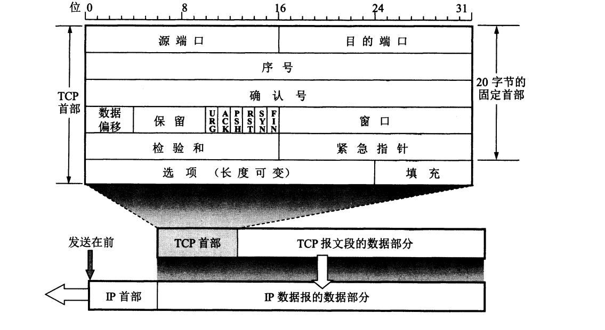

# UDP

## UDP特点
1. UDP是无连接的，即发送数据之前不需要建立连接。**因此减少了延时和开销**
2. UDP使用**尽最大努力交付**，即不保证可靠交付。**因此主机不需要维持复杂的连接状态**
3. UDP是面向报文的。应用层交下来的报文，UDP添加首部后直接交给网络层，不进行拆分。**如果控制不好报文的大小，都会降低网络层的效率（如： 太长：网络层会对运输层发下来的报文进行拆分。太短：由于首部增多，降低了网络层的利用率）**
4. UDP没有拥塞控制。可能由于网络拥塞，导致丢包。
5. UDP支持 `一对一`，`一对多`,`多对多`，`多对一`的交互通信。
6. UDP首部开销校，只有8字节。

## UDP首部格式
UDP有两部分组成：数据和首部。首部只有8字节（64位），由4部分组成，每部分都是2字节（16位）。

1. 源端口
2. 目的端口
3. 长度
4. 校验和

# TCP

## TCP特点
1. TCP是**面向连接**的的运输层协议，应用程序在用TCP之前要先建立TCP连接。在传送数据完毕后，必须释放连接。
2. TCP仅支持**一对一**交互。
3. TCP使用**可靠交付**服务。保证数据无差错，不丢失，不重复，并且按序到达。
4. TCP提供**双全工通信**。TCP允许通信双方的应用进程在任何时候都可以发送数据。
5. TCP是**面向字节流**的。TCP会根据对方给给出的窗口值和当前网络拥塞的程度决定一个报文应当包含多少个字节。

## TCP报文首部格式
TCP首部的前20字段是固定的。如下图：  

首部格式具体意义如下：[TCP首部格式详解](./net-TCP首部格式.md)
 
## 实现可靠传输
由于网络层（IP层）只能提供**最大努力交付**服务，这就使实现可靠传输的任务放在了运输层。可靠传输理想的状态如下：
* 传输信息不产生差错。
* 不管发送方以多快的速度发送数据，接收方总是来得及处理收到的数据。

要实现上述的状态，TCP给出了两种方案，如下：
1. 停止等待协议（互联网早期使用，现已废弃）  
停止等待协议大致的思想就是：每发送一个分组就停止发送，等待对方的确认。在收到确认后再发送下一个分组。**缺点：可想而知，这样做会让信道的利用率变的很低。怎样才能提高信道的利用率呢？**

2. **滑动窗口协议（重点）**  
为了提高信道的利用率，滑动窗口协议一次性可以发送**多组报文**，而不需要发送一组就等待确认一组。滑动窗口协议规定，发送方每收到一个确认，就把发送窗口向前滑动一个分组的位置。接收方一般采用**积累确认**的方式，即接收方不必对收到的分组这个发送确认，而是收到几个分组后，**对按序到达的最后一个分组发送确认**。有点：容易实现，即使丢失也不必重传。**缺点：由于向发送方确认的是最后一个分组，所以之后收到的报文都是不可用的。**

**积累确认 缺点 的例子**：如果发送方发送了5个分组，而中间的3个分组丢失了，这时接收方只能对前两个分组发出确认。发送方无法知道后面三个分组下落，而只好把后面三个分组都重传一次（有可能第三个丢失了，但第四第五都没有丢失）。导致信道浪费。

## TCP 流量控制

## TCP 拥塞控制

## TCP 建立连接（三次握手）

## TCP 释放连接（四次握手）