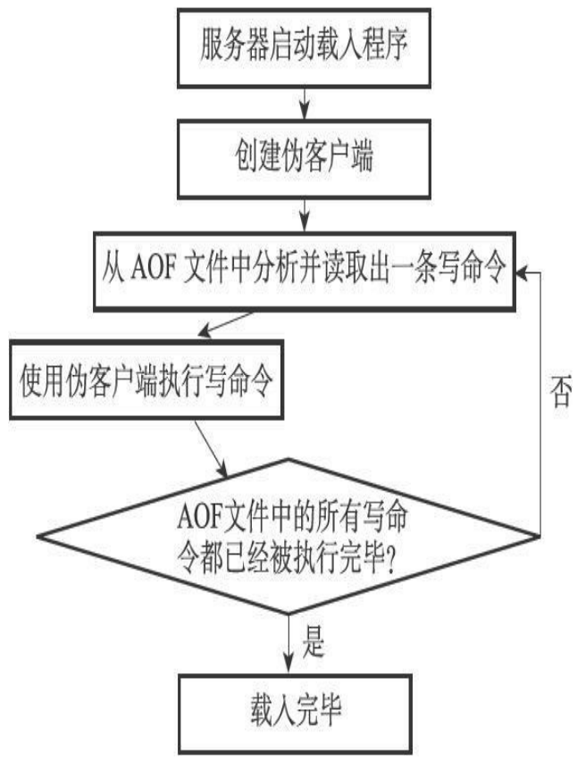
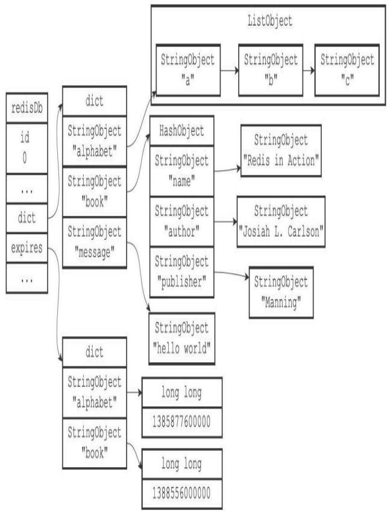
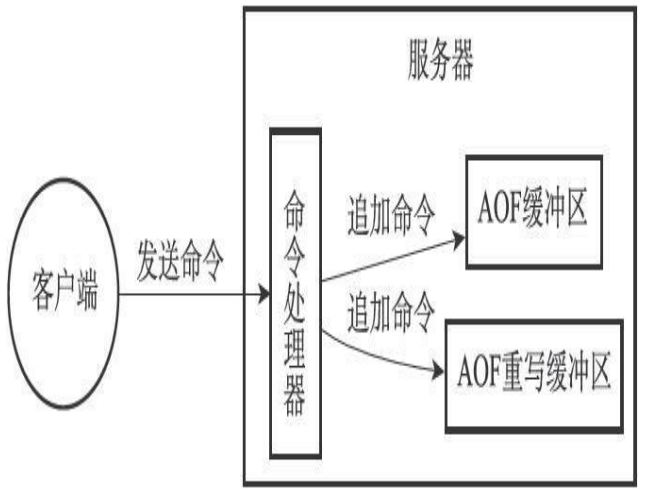

# AOF持久化
除了RDB持久化功能之外，`Redis`还提供了`AOF（Append Only File）`持久化功能。与`RDB`持久化通过保存数据库中的键值对来记录数据库状态不同，`AOF`持久化是通过保存`Redis`服务器所执行的写命令来记录数据库状态的。如图所示。

```
                                       保存被执行的
┌───────────┐  发送写命令    ┌────────┐   写命令     ┌──────────┐                          
|  client   |————————————>  | Server | ——————————>  | AOF file |         
└───────────┘               └────────┘              └──────────┘               
                   AOF持久化
```

举个例子，如果我们对空白的数据库执行以下写命令，那么数据库中将包含三个键值对：
```shell
redis> SET msg "hello"
OK
redis> SADD fruits "apple" "banana" "cherry"
(integer) 3
redis> RPUSH numbers 128 256 512
(integer) 3
```
`RDB`持久化保存数据库状态的方法是将`msg`、`fruits`、`numbers`三个键的键值对保存到`RDB`文件中，而`AOF`持久化保存数据库状态的方法则是将服务器执行的`SET`、`SADD`、`RPUSH`三个命令保存到`AOF`文件中。被写入`AOF`文件的所有命令都是以Redis的命令请求协议格式保存的，因为`Redis`的命令请求协议是纯文本格式。

## AOF持久化的实现
`AOF`持久化功能的实现可以分为命令追加（`append`）、文件写入、文件同步（`sync`）三个步骤。

### 命令追加
当`AOF`持久化功能处于打开状态时，服务器在执行完一个写命令之后，会以协议格式将被执行的写命令追加到服务器状态的`aof_buf`缓冲区的末尾：
```c
struct redisServer {
    // ...
    // AOF 缓冲区
    sds aof_buf;
    // ...
};
```

举个例子，如果客户端向服务器发送以下命令:
```shell
redis> SET KEY VALUE
OK
```
那么服务器在执行这个`SET`命令之后，会将以下协议内容追加到`aof_buf`缓冲区的末尾：
```
*3\r\n$3\r\nSET\r\n$3\r\nKEY\r\n$5\r\nVALUE\r\n
```
又例如，如果客户端向服务器发送以下命令：
```shell
redis> RPUSH NUMBERS ONE TWO THREE
(integer) 3
```
那么服务器在执行这个`RPUSH`命令之后，会将以下协议内容追加到`aof_buf`缓冲区的末尾：
```
*5\r\n$5\r\nRPUSH\r\n$7\r\nNUMBERS\r\n$3\r\nONE\r\n$3\r\nTWO\r
```

### AOF文件的写入与同步

`Redis`的服务器进程就是一个事件循环（`loop`），这个循环中的文件事件负责接收客户端的命令请求，以及向客户端发送命令回复，而时间事件则负责执行像`serverCron`函数这样需要定时运行的函数。

因为服务器在处理文件事件时可能会执行写命令，使得一些内容被追加到`aof_buf`缓冲区里面，所以在服务器每次结束一个事件循环之前，它都会调用`flushAppendOnlyFile`函数，考虑是否需要将`aof_buf`缓冲区中的内容写入和保存到`AOF`文件里面，这个过程可以用以下伪代码表示：
```c++
def eventLoop():
    while True:
    # 处理文件事件，接收命令请求以及发送命令回复
    # 处理命令请求时可能会有新内容被追加到 aof_buf 缓冲区中
    processFileEvents()
    # 处理时间事件
    processTimeEvents()
    # 考虑是否要将 aof_buf 中的内容写入和保存到 AOF 文件里面
    flushAppendOnlyFile()
```
`flushAppendOnlyFile`函数的行为由服务器配置的`appendfsy nc`选项的值来决定，各个不同值产生的行为如表所示。

 <table>
　　　        <thead>
　　　            <tr>
　　　                <th>appendfsync选项的值</th>
　　　                <th>flushAppendOnlyFile函数的行为</th>
　　　            </tr>
　　　        </thead>
　　　        <tbody>
　　　            <tr>
　　　                <td>always</td>
　　　                <td>将aof_buf缓冲区中的所有内容吸入并同步到AOF文件</td>
　　　            </tr>
　　　            <tr>
　　　                <td>everysec</td>
　　　                <td>将aof_bug缓冲区中的所有内容写入到AOF文件，如果上次同步AOF文件的时间距离现在超过一秒钟，那么
                       再次对AOF文件进行同步，并且这个同步操作是由一个线程专门负责执行的。
                      </td>
　　　            </tr>
　　　            <tr>
　　　              　<td>no</td>
　　　                <td>将aof_buf缓冲区中的所有内容写入到AOF文件，但并不对AOF文件进行同步，何时同步由操作系统来决定</td>
　　　            </tr>
 　　　       </tbody>
　　　    </table>
 
如果用户没有主动为`appendfsync`选项设置值，那么`appendfsync`选项的默认值为`everysec`，关于`appendfsync`选项的更多信息，请参考`Redis`项目附带的示例配置文件`redis.conf`。

服务器配置`appendfsync`选项的值直接决定`AOF`持久化功能的效率和安全性。

* 当`appendfsync`的值为`always`时，服务器在每个事件循环都要将`aof_buf`缓冲区中的所有内容写入到`AOF`文件，并且同步`AOF`文件，所以`always`的效率是`appendfsync`选项三个值当中最慢的一个，但从安全性来说，`always`也是最安全的，因为即使出现故障停机，`AOF`持久化也只会丢失一个事件循环中所产生的命令数据。

* 当`appendfsync`的值为`everysec`时，服务器在每个事件循环都要将`aof_buf`缓冲区中的所有内容写入到`AOF`文件，并且每隔一秒就要在子线程中对`AOF`文件进行一次同步。从效率上来讲，`everysec`模式足够快，并且就算出现故障停机，数据库也只丢失一秒钟的命令数据。

* 当`appendfsync`的值为`no`时，服务器在每个事件循环都要将`aof_buf`缓冲区中的所有内容写入到`AOF`文件，至于何时对`AOF`文件进行同步，则由操作系统控制。因为处于`no`模式下的`flushAppendOnlyFile`调用无须执行同步操作，所以该模式下的`AOF`文件写入速度总是最快的，不过因为这种模式会在系统缓存中积累一段时间的写入数据，所以该模式的单次同步时长通常是三种模式中时间最长的。从平摊操作的角度来看，`no`模式和`everysec`模式的效率类似，当出现故障停机时，使用`no`模式的服务器将丢失上次同步`AOF`文件之后的所有写命令数据。


## AOF文件的载入与数据还原

因为`AOF`文件里面包含了重建数据库状态所需的所有写命令，所以服务器只要读入并重新执行一遍`AOF`文件里面保存的写命令，就可以还原服务器关闭之前的数据库状态。  
`Redis`读取`AOF`文件并还原数据库状态的详细步骤如下:  
1）创建一个不带网络连接的伪客户端（`fake client`）：因为`Redis`的命令只能在客户端上下文中执行，而载入`AOF`文件时所使用的命令直接来源于`AOF`文件而不是网络连接，所以服务器使用了一个没有网络连接的伪客户端来执行`AOF`文件保存的写命令，伪客户端执行命令的效果和带网络连接的客户端执行命令的效果完全一样。  
2）从`AOF`文件中分析并读取出一条写命令。  
3）使用伪客户端执行被读出的写命令。  
4）一直执行步骤`2`和步骤`3`，直到`AOF`文件中的所有写命令都被处理完毕为止。  

当完成以上步骤之后，`AOF`文件所保存的数据库状态就会被完整地还原出来，整个过程如图所示。


## AOF重写
因为`AOF`持久化是通过保存被执行的写命令来记录数据库状态的，所以随着服务器运行时间的流逝，`AOF`文件中的内容会越来越多，文件的体积也会越来越大，如果不加以控制的话，体积过大的`AOF`文件很可能对`Redis`服务器、甚至整个宿主计算机造成影响，并且`AOF`文件的体积越大，使用`AOF`文件来进行数据还原所需的时间就越多。

为了解决`AOF`文件体积膨胀的问题，`Redis`提供了`AOF`文件重写（`rewrite`）功能。通过该功能，`Redis`服务器可以创建一个新的`AOF`文件来替代现有的`AOF`文件，新旧两个`AOF`文件所保存的数据库状态相同，但新`AOF`文件不会包含任何浪费空间的冗余命令，所以新`AOF`文件的体积通常会比旧`AOF`文件的体积要小得多。

在接下来的内容中，我们将介绍`AOF`文件重写的实现原理，以及`BGREWEITEAOF`命令的实现原理。

## AOF文件重写的实现

虽然`Redis`将生成新`AOF`文件替换旧`AOF`文件的功能命名为`“AOF文件重写”`，但实际上，`AOF`文件重写并不需要对现有的`AOF`文件进行任何读取、分析或者写入操作，这个功能是通过读取服务器当前的数据库状态来实现的。

整个重写过程可以用以下伪代码表示：
```c++
def aof_rewrite(new_aof_file_name):
    # 创建新 AOF 文件
    f = create_file(new_aof_file_name)
    # 遍历数据库
    for db in redisServer.db:
        # 忽略空数据库
        if db.is_empty(): continue
        # 写入SELECT 命令，指定数据库号码
        f.write_command("SELECT" + db.id)
        # 遍历数据库中的所有键
        for key in db:
            # 忽略已过期的键
            if key.is_expired(): continue
            # 根据键的类型对键进行重写
            if key.type == String:
                rewrite_string(key)
            else if key.type == List:
                rewrite_list(key)
            else if key.type == Hash:
                rewrite_hash(key)
            else if key.type == Set:
                rewrite_set(key)
            else if key.type == SortedSet:
                rewrite_sorted_set(key)
            # 如果键带有过期时间，那么过期时间也要被重写
            if key.have_expire_time():
                rewrite_expire_time(key)
        # 写入完毕，关闭文件
        f.close()

def rewrite_string(key):
    # 使用GET 命令获取字符串键的值
    value = GET(key)
    # 使用SET 命令重写字符串键
    f.write_command(SET, key, value)

def rewrite_list(key):
    # 使用LRANGE 命令获取列表键包含的所有元素
    item1, item2, ..., itemN = LRANGE(key, 0, -1)
    # 使用RPUSH 命令重写列表键
    f.write_command(RPUSH, key, item1, item2, ..., itemN)

def rewrite_hash(key):
    # 使用HGETALL 命令获取哈希键包含的所有键值对
    field1, value1, field2, value2, ..., fieldN, valueN = HGETALL(key)
    # 使用HMSET 命令重写哈希键
    f.write_command(HMSET, key, field1, value1, field2, value2, ..., fieldN, valueN)

def rewrite_set(key);
    # 使用SMEMBERS 命令获取集合键包含的所有元素
    elem1, elem2, ..., elemN = SMEMBERS(key)
    # 使用SADD 命令重写集合键
    f.write_command(SADD, key, elem1, elem2, ..., elemN)

def rewrite_sorted_set(key):
    # 使用ZRANGE 命令获取有序集合键包含的所有元素
    member1, score1, member2, score2, ..., memberN, scoreN = ZRANGE(key, 0, -1, "WITHSCORES")
    # 使用ZADD 命令重写有序集合键
    f.write_command(ZADD, key, score1, member1, score2, member2, ..., scoreN, memberN)

def rewrite_expire_time(key):
    # 获取毫秒精度的键过期时间戳
    timestamp = get_expire_time_in_unixstamp(key)
    # 使用PEXPIREAT 命令重写键的过期时间
    f.write_command(PEXPIREAT, key, timestamp)
```
因为`aof_rewrite`函数生成的新`AOF`文件只包含还原当前数据库状态所必须的命令，所以新`AOF`文件不会浪费任何硬盘空间。
  
```
                 一个数据库
```

例如，对于图所示的数据库，`aof_rewrite`函数产生的新`AOF`文件将包含以下命令：
```
SELECT 0
RPUSH alphabet "a" "b" "c"
EXPIREAT alphabet 1385877600000
HMSET book "name" "Redisin Action"
"author" "Josiah L. Carlson"
"publisher" "Manning"
EXPIREAT book 1388556000000
SET message "hello world"
```
* 在实际中，为了避免在执行命令时造成客户端输入缓冲区溢出，重写程序在处理列表、哈希表、集合、有序集合这四种可能会带有多个元素的键时，会先检查键所包含的元素数量，如果元素的数量超过了`redis.h/REDIS_AOF_REWRITE_ITEMS_PER_CMD`常量的值，那么重写程序将使用多条命令来记录键的值，而不单单使用一条命令。

* 另一方面如果一个列表键包含了超过64个项，那么重写程序会用多条RPUSH命令来保存这个列表，并且每条命令设置的项数量也为64个。

## AOF后台重写
上面介绍的`AOF`重写程序`aof_rewrite`函数可以很好地完成创建一个新`AOF`文件的任务，但是，因为这个函数会进行大量的写入操作，所以调用这个函数的线程将被长时间阻塞，因为`Redis`服务器使用单个线程来处理命令请求，所以如果由服务器直接调用`aof_rewrite`函数的话，那么在重写`AOF`文件期间，服务期将无法处理客户端发来的命令请求。

很明显，作为一种辅佐性的维护手段，`Redis`不希望`AOF`重写造成服务器无法处理请求，所以Redis决定将AOF重写程序放到子进程里执行，这样做可以同时达到两个目的：
* 子进程进行`AOF`重写期间，服务器进程（父进程）可以继续处理命令请求。
* 子进程带有服务器进程的数据副本，使用子进程而不是线程，可以在避免使用锁的情况下，保证数据的安全性。

为了解决这种数据不一致问题，`Redis`服务器设置了一个AOF重写缓冲区，这个缓冲区在服务器创建子进程之后开始使用，当`Redis`服务器执行完一个写命令之后，它会同时将这个写命令发送给`AOF`缓冲区和`AOF`重写缓冲区，如图所示。


```
                      服务器同时将命令发送给AOF文件和AOF重写缓冲区
```

这也就是说，在子进程执行`AOF`重写期间，服务器进程需要执行以下三个工作：  
1）执行客户端发来的命令。   
2）将执行后的写命令追加到AOF缓冲区。  
3）将执行后的写命令追加到AOF重写缓冲区。  

这样一来可以保证：  
&emsp;AOF缓冲区的内容会定期被写入和同步到AOF文件，对现有AOF文件的处理工作会如常
进行。  
&emsp;从创建子进程开始，服务器执行的所有写命令都会被记录到AOF重写缓冲区里面。

当子进程完成`AOF`重写工作之后，它会向父进程发送一个信号，父进程在接到该信号之后，会调用一个信号处理函数，并执行以下工作：  
1）将`AOF`重写缓冲区中的所有内容写入到新`AOF`文件中，这时新`AOF`文件所保存的数据库状态将和服务器当前的数据库状态一致。  
2）对新的`AOF`文件进行改名，原子地（`atomic`）覆盖现有的`AOF`文件，完成新旧两个`AOF`文件的替换。  

这个信号处理函数执行完毕之后，父进程就可以继续像往常一样接受命令请求了。在整个`AOF`后台重写过程中，只有信号处理函数执行时会对服务器进程（父进程）造成
阻塞，在其他时候，`AOF`后台重写都不会阻塞父进程，这将`AOF`重写对服务器性能造成的影响降到了最低。
