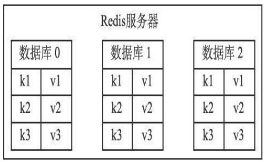

# RDB 持久化
`Redis`是一个键值对数据库服务器，服务器中通常包含着任意个非空数据库，而每个非空数据库中又可以包含任意个键值对，为了方便起见，我们将服务器中的非空数据库以及它们的键值对统称为数据库状态。

举个例子，图展示了一个包含三个非空数据库的Redis服务器，这三个数据库以及数据库中的键值对就是该服务器的数据库状态。


因为`Redis`是内存数据库，它将自己的数据库状态储存在内存里面，所以如果不想办法将储存在内存中的数据库状态保存到磁盘里面，那么一旦服务器进程退出，服务器中的数据库状态也会消失不见。为了解决这个问题，`Redis`提供了`RDB`持久化功能，这个功能可以将`Redis`在内存中的数
据库状态保存到磁盘里面，避免数据意外丢失。

`RDB`持久化既可以手动执行，也可以根据服务器配置选项定期执行，该功能可以将某个时间点上的数据库状态保存到一个`RDB`文件中。   
`RDB`持久化功能所生成的RDB文件是一个经过压缩的二进制文件，通过该文件可以还原生成`RDB`文件时的数据库状态。
因为`RDB`文件是保存在硬盘里面的，所以即使`Redis`服务器进程退出，甚至运行`Redis`服务器的计算机停机，但只要`RDB`文件仍然存在，`Redis`服务器就可以用它来还原数据库状态。

## RDB文件的创建与载入

有两个`Redis`命令可以用于生成`RDB`文件，一个是`SAVE`，另一个是`BGSAVE`。  

* `SAVE`命令会阻塞`Redis`服务器进程，直到`RDB`文件创建完毕为止，在服务器进程阻塞期间，服务器不能处理任何命令请求：
```shell
redis> SAVE //等待直到RDB 文件创建完毕
OK
```

* 和`SAVE`命令直接阻塞服务器进程的做法不同，`BGSAVE`命令会派生出一个子进程，然后由子进程负责创建`RDB`文件，服务器进程（父进程）继续处理命令请求：
```shell
redis> BGSAVE //派生子进程，并由子进程创建RDB 文件 Background saving started
```

创建`RDB`文件的实际工作由`rdb.c/rdbSave`函数完成，`SAVE`命令和`BGSAVE`命令会以不同的方式调用这个函数，通过以下伪代码可以明显地看出这两个命令之间的区别：
```c++
def SAVE():
    # 创建RDB文件
    rdbSave()
def BGSAVE():
    # 创建子进程
    pid = fork()
    if pid == 0:
        # 子进程负责创建RDB文件
        rdbSave()
        # 完成之后向父进程发送信号
        signal_parent()
    else if pid > 0:
        # 父进程继续处理命令请求，并通过轮询等待子进程的信号
        handle_request_and_wait_signal()
    else:
        # 处理出错情况
        handle_fork_error()
```

* 和使用`SAVE`命令或者`BGSAVE`命令创建`RDB`文件不同，`RDB`文件的载入工作是在服务器启动时自动执行的，所以`Redis`并没有专门用于载入`RDB`文件的命令，只要`Redis`服务器在启动时检测到`RDB`文件存在，它就会自动载入`RDB`文件。

以下是`Redis`服务器启动时打印的日志记录，其中第二条日志`DB loaded from disk:...`就是服务器在成功载入`RDB`文件之后打印的：
```shell
$ redis-server
[7379] 30 Aug 21:07:01.270 # Server started, Redis version 2.9.11
[7379] 30 Aug 21:07:01.289 * DB loaded from disk: 0.018 seconds
[7379] 30 Aug 21:07:01.289 * The server is now ready to accept
```
另外值得一提的是，因为`AOF`文件的更新频率通常比`RDB`文件的更新频率高，所以:

* 如果服务器开启了`AOF`持久化功能，那么服务器会优先使用`AOF`文件来还原数据库状
态。
* 只有在`AOF`持久化功能处于关闭状态时，服务器才会使用`RDB`文件来还原数据库状态。

### SAVE 命令执行是的服务器状态

前面提到过，当`SAVE`命令执行时，`Redis`服务器会被阻塞，所以当`SAVE`命令正在执行时，客户端发送的所有命令请求都会被拒绝。   
只有在服务器执行完`SAVE`命令、重新开始接受命令请求之后，客户端发送的命令才会被处理。

### BGSAVE 命令执行是的服务器状态

因为`BGSAVE`命令的保存工作是由子进程执行的，所以在子进程创建`RDB`文件的过程中，`Redis`服务器仍然可以继续处理客户端的命令请求，但是，在`BGSAVE`命令执行期间，服务器处理`SAVE`、`BGSAVE`、`BGREWRITEAOF`三个命令的方式会和平时有所不同。

首先，在`BGSAVE`命令执行期间，客户端发送的`SAVE`命令会被服务器拒绝，服务器禁止`SAVE`命令和`BGSAVE`命令同时执行是为了避免父进程（服务器进程）和子进程同时执行两个`rdbSave`调用，防止产生竞争条件。

其次，在`BGSAVE`命令执行期间，客户端发送的`BGSAVE`命令会被服务器拒绝，因为同时执行两个`BGSAVE`命令也会产生竞争条件。

最后，`BGREWRITEAOF`和B`GSAVE`两个命令不能同时执行:
* 如果`BGSAVE`命令正在执行，那么客户端发送的`BGREWRITEAOF`命令会被延迟到`BGSAVE`命令执行完毕之后执行。
* 如果`BGREWRITEAOF`命令正在执行，那么客户端发送的`BGSAVE`命令会被服务器拒绝。

因为`BGREWRITEAOF`和`BGSAVE`两个命令的实际工作都由子进程执行，所以这两个命令在操作方面并没有什么冲突的地方，不能同时执行它们只是一个性能方面的考虑——并发出两个子进程，并且这两个子进程都同时执行大量的磁盘写入操作，这怎么想都不会是一个好主意。

### RDB文件文件载入时的服务器状态

服务器在载入`RDB`文件期间，会一直处于阻塞状态，直到载入工作完成为止。

## 自动间隔性保存

在上一节，我们介绍了`SAVE` 命令和`BGSAVE`的实现方法，并且说明了这两个命令在实现方面的主要区别：`SAVE`命令由服务器进程执行保存工作，`BGSAVE`命令则由子进程执行保存工作，所以`SAVE`命令会阻塞服务器，而`BGSAVE`命令则不会。

因为`BGSAVE`命令可以在不阻塞服务器进程的情况下执行，所以`Redis`允许用户通过设置服务器配置的`save`选项，让服务器每隔一段时间自动执行一次`BGSAVE`命令。用户可以通过`save`选项设置多个保存条件，但只要其中任意一个条件被满足，服务器就会执行`BGSAVE`命令。

举个例子，如果我们向服务器提供以下配置：

```sehll
save 900 1
save 300 10
save 60 10000
```
那么只要满足以下三个条件中的任意一个，`BGSAV`E命令就会被执行：
* 服务器在900秒之内，对数据库进行了至少1次修改。
* 服务器在300秒之内，对数据库进行了至少10次修改。
* 服务器在60秒之内，对数据库进行了至少10000次修改。

### 设置保存条件

当`Redis`服务器启动时，用户可以通过指定配置文件或者传入启动参数的方式设置`save`选项，如果用户没有主动设置`save`选项，那么服务器会为`save`选项设置默认条件：
```shell
save 900 1
save 300 10
save 60 10000
```

接着，服务器程序会根据`save`选项所设置的保存条件，设置服务器状态`redisServer`结构的`saveparams`属性：
```c
struct redisServer {
    // ...
    // 记录了保存条件的数组
    struct saveparam *saveparams;
    // ...
};
```
`saveparams`属性是一个数组，数组中的每个元素都是一个`saveparam`结构，每个`saveparam`结构都保存了一个`save`选项设置的保存条件：
```c
struct saveparam {
    // 秒数
    time_t seconds;
    // 修改数
    int changes;
};
```
比如说，如果`save`选项的值为以下条件：

```shell
save 900 1
save 300 10
save 60 10000
```
那么服务器状态中的`saveparams`数组将会是图所示的样子。'

```
                    ┌───────────────────────┐
                    │      redisServer      │        ┌───────────────┐───────────────┐───────────────┐
                    |───────────────────────|        | saveparams[0] | saveparams[1] | saveparams[2] |
                    │         ...           │        |───────────────|───────────────|───────────────|
                    |───────────────────────|        |    seconds    |    seconds    |    seconds    |
                    │      saveparams       │----->  |     900       |     300       |      60       |
                    |───────────────────────|        |───────────────|───────────────|───────────────|
                    │          ...          │        |    changes    |     changes   |     changes   |
                    └───────────────────────┘        |       1       |       10      |      10000    |
                                                     └───────────────└───────────────└───────────────┘
                                            服务器状态中的保存条件
```

### dirty 计数器和 lastsave 属性

除了`saveparams` 数组之外，服务器状态还维持着一个 `dirty` 计数器，以及一个`lastsave`属性。
* `dirty`计数器记录距离上一次成功执行`SAVE`命令或者`BGSAVE`命令之后，服务器对数据库状态（服务器中的所有数据库）进行了多少次修改（包括写入、删除、更新等操作）。
* `lastsave`属性是一个`UNIX`时间戳，记录了服务器上一次成功执行`SAVE`命令或者`BGSAVE`命令的时间。

当服务器成功执行一个数据库修改命令之后，程序就会对`dirty`计数器进行更新：命令修改了多少次数据库，`dirty`计数器的值就增加多少。

例如，如果我们为一个字符串键设置值：
```shell
redis> SET message "hello"
OK
```
那么程序会将`dirty`计数器的值增加`1`。

```
                                            ┌───────────────────────┐
                                            │      redisServer      |
                                            |───────────────────────|
                                            │         ...           |
                                            |───────────────────────|
                                            │         dirtry        |
                                            |          123          |
                                            |───────────────────────|
                                            │       lastsave        |
                                            |     1631289620057     |
                                            |───────────────────────|
                                            |          ...          |
                                            └───────────────────────┘
                                                 服务器状态示例
```
图展示了服务器状态中包含的`dirty`计数器和`lastsave`属性，说明如下:
* `dirty`计数器的值为`123`，表示服务器在上次保存之后，对数据库状态共进行了`123`次修改。
* `lastsave`属性则记录了服务器上次执行保存操作的时间`1378270800`（`2021`年`9`月`11`日零时）。

### 检查保存条件是否满足

`Redis`的服务器周期性操作函数`serverCron`默认每隔`100`毫秒就会执行一次，该函数用于对正在运行的服务器进行维护，它的其中一项工作就是检查`save`选项所设置的保存条件是否已经满足，如果满足的话，就执行`BGSAVE`命令。以下伪代码展示了`serverCron`函数检查保存条件的过程：
```c++
def serverCron():
    # ...
    # 遍历所有保存条件
    for saveparam in server.saveparams:
        # 计算距离上次执行保存操作有多少秒
        save_interval = unixtime_now() - server.lastsave
        # 如果数据库状态的修改次数超过条件所设置的次数
        # 并且距离上次保存的时间超过条件所设置的时间
        # 那么执行保存操作
        if server.dirty >= saveparam.changes and save_interval > saveparam.seconds:
            BGSAVE()
    # ...
```
程序会遍历并检查`saveparams`数组中的所有保存条件，只要有任意一个条件被满足，那么服务器就会执行`BGSAVE`命令。

## RDB文件结构

图展示了一个完整`RDB`文件所包含的各个部分。
```
                                    ┌────────────┐──────────────┐────────────┐───────┐───────────┐
                                    |   REDIS    |  db_version  |  databases |  EOF  | check_sum |
                                    └────────────┘──────────────┘────────────┘───────┘───────────┘
                                                            RDB文件结构
```

* `RDB`文件的最开头是`REDIS`部分，这个部分的长度为`5`字节，保存着`“REDIS”`五个字符。通过这五个字符，程序可以在载入文件时，快速检查所载入的文件是否`RDB`文件。
* 因为`RDB`文件保存的是二进制数据，而不是`C`字符串，为了简便起见，我们用`"REDIS"`符号代表`'R'、'E'、'D'、'I'、'S'`五个字符，而不是带`'\0'`结尾符号的C字符串`'R'、'E'、'D'、'I'、'S'、'\0'`。本章介绍的所有内容，以及展示的所有`RDB`文件结构图都遵循这一规则。

`db_version`长度为4字节，它的值是一个字符串表示的整数，这个整数记录了`RDB`文件的版本号，比如`"0006"`就代表`RDB`文件的版本为第六版。本章只介绍第六版`RDB`文件的结构。`databases`部分包含着零个或任意多个数据库，以及各个数据库中的键值对数据：
* 如果服务器的数据库状态为空（所有数据库都是空的），那么这个部分也为空，长度为`0`字节。
* 如果服务器的数据库状态为非空（有至少一个数据库非空），那么这个部分也为非空，根据数据库所保存键值对的数量、类型和内容不同，这个部分的长度也会有所不同。  

`EOF`常量的长度为`1`字节，这个常量标志着`RDB`文件正文内容的结束，当读入程序遇到这个值的时候，它知道所有数据库的所有键值对都已经载入完毕了。   
`check_sum`是一个`8`字节长的无符号整数，保存着一个校验和，这个校验和是程序通过对`REDIS`、`db_version`、`databases`、`EOF`四个部分的内容进行计算得出的。服务器在载入`RDB`文件时，会将载入数据所计算出的校验和与`check_sum`所记录的校验和进行对比，以此来检查`RDB`文件是否有出错或者损坏的情况出现。

作为例子，图展示了一个`databases`部分为空的`RDB`文件：文件开头的`"REDIS"`表示这是一个`RDB`文件，之后的`"0006"`表示这是第六版的`RDB`文件，因为`databases`为空，所以版本号之后直接跟着`EOF`常量，最后的`6265312314761917404`是文件的校验和。
```
                                    ┌────────────┐─────────┐──────┐─────────────────────┐
                                    |   "REDIS"  |  "006"  |  EOF | 6265312314761917404 |
                                    └────────────┘─────────┘──────┘─────────────────────┘
                                                databases部分为空的RDB文件
```

### databases部分
一个`RDB`文件的`databases`部分可以保存任意多个非空数据库。

例如，如果服务器的`0`号数据库和`3`号数据库非空，那么服务器将创建一个如图所示的`RDB`文件，图中的`database 0`代表`0`号数据库中的所有键值对数据，而`database 3`则代表3号数据库中的所有键值对数据。
```
                                    ┌──────────┐─────────────┐────────────┐────────────┐─────┐───────────┐
                                    |   REDIS  |  db_version | database 0 | database 3 | EOF | check_sum |
                                    └──────────┘─────────────┘────────────┘────────────┘─────┘───────────┘
                                                     带有两个非空数据库的RDB文件示例
```

每个非空数据库在`RDB`文件中都可以保存为`SELECTDB`、`db_number`、`key_value_pairs`三个部分，如图所示。
```
                                    ┌──────────────┐───────────┐─────────────────┐
                                    |   SELECTEDB  | db_number | key_value_pairs |
                                    └──────────────┘───────────┘─────────────────┘
                                              RDB文件中的数据库结构
```
`SELECTDB`常量的长度为1字节，当读入程序遇到这个值的时候，它知道接下来要读入的将是一个数据库号码。   
`db_number`保存着一个数据库号码，根据号码的大小不同，这个部分的长度可以是`1`字节、`2`字节或者`5`字节。当程序读入`db_number`部分之后，服务器会调用`SELECT`命令，根据读入的数据库号码进行数据库切换，使得之后读入的键值对可以载入到正确的数据库中。   
`key_value_pairs`部分保存了数据库中的所有键值对数据，如果键值对带有过期时间，那么过期时间也会和键值对保存在一起。根据键值对的数量、类型、内容以及是否有过期时间等条件的不同，`key_value_pairs`部分的长度也会有所不同。

作为例子，图展示了`RDB`文件中，`0`号数据库的结构。
```
                                    ┌──────────────┐───┐─────────────────┐
                                    |   SELECTEDB  | 0 | key_value_pairs |
                                    └──────────────┘───┘─────────────────┘
                                              数据库结构示例
```

### key_value_pairs部分
`RDB`文件中的每个`key_value_pairs`部分都保存了一个或以上数量的键值对，如果键值对带有过期时间的话，那么键值对的过期时间也会被保存在内。不带过期时间的键值对在RDB文件中由TYPE、key、value三部分组成，如图所示。
```
                                    ┌──────┐─────┐───────┐
                                    | TYPE | key | value |
                                    └──────┘─────┘───────┘
                                      不带过期时间的键值对

```
`TYPE`记录了`value`的类型，长度为`1`字节，值可以是以下常量的其中一个：
* REDIS_RDB_TYPE_STRING
* REDIS_RDB_TYPE_LIST
* REDIS_RDB_TYPE_SET
* REDIS_RDB_TYPE_ZSET
* REDIS_RDB_TYPE_HASH
* REDIS_RDB_TYPE_LIST_ZIPLIST
* REDIS_RDB_TYPE_SET_INTSET
* REDIS_RDB_TYPE_ZSET_ZIPLIST
* REDIS_RDB_TYPE_HASH_ZIPLIST

以上列出的每个`TYPE`常量都代表了一种对象类型或者底层编码，当服务器读入`RDB`文件中的键值对数据时，程序会根据`TYPE`的值来决定如何读入和解释`value`的数据。`key`和`value`分别保存了键值对的键对象和值对象：
* 其中`key`总是一个字符串对象，它的编码方式和`REDIS_RDB_TYPE_STRING`类型的`value`一样。根据内容长度的不同，`key`的长度也会有所不同。
* 根据`TYPE`类型的不同，以及保存内容长度的不同，保存`value`的结构和长度也会有所不同，本节稍后会详细说明每种`TYPE`类型的`value`结构保存方式。

带有过期时间的键值对在RDB文件中的结构如图所示
```
                                    ┌───────────────┐────┐──────┐──────┐───────┐
                                    | EXPIRETIME_MS | ms | TYPE |  key | vlaue |
                                    └───────────────┘────┘──────┘──────┘───────┘
                                              带有过期时间的键值对
```

带有过期时间的键值对中的`TYPE`、`key`、`value`三个部分的意义，和前面介绍的不带过期时间的键值对的`TYPE`、`key`、`value`三个部分的意义完全相同，至于新增的`EXPIRETIME_MS`和`ms`，它们的意义如下：
* `EXPIRETIME_MS`常量的长度为`1`字节，它告知读入程序，接下来要读入的将是一个以毫秒为单位的过期时间。
* `ms`是一个`8`字节长的带符号整数，记录着一个以毫秒为单位的`UNIX`时间戳，这个时间戳就是键值对的过期时间。

### value的编码

`RDB`文件中的每个`value`部分都保存了一个值对象，每个值对象的类型都由与之对应的`TYPE`记录，根据类型的不同，`value`部分的结构、长度也会有所不同。

1. 字符串对象  

如果`TYPE`的值为`REDIS_RDB_TYPE_STRING`，那么`value`保存的就是一个字符串对象，字符串对象的编码可以是`REDIS_ENCODING_INT`或者R`EDIS_ENCODING_RAW`。  
如果字符串对象的编码为`REDIS_ENCODING_INT`，那么说明对象中保存的是长度不超过`32`位的整数，这种编码的对象将以图所示的结构保存。  
其中，`ENCODING`的值可以是`REDIS_RDB_ENC_INT8`、`REDIS_RDB_ENC_INT16`或者`REDIS_RDB_ENC_INT32`三个常量的其中一个，它们分别代表`RDB`文件使用`8位`（bit）、`16位`或者`32位`来保存整数值`integer`。

```
                        ┌──────────┐─────────┐                  ┌────────────────────┐─────┐          
                        | ENCODING | integer |                  | REDIS_RDB_ENC_INT8 | 123 |
                        └──────────┘─────────┘                  └────────────────────┘─────┘
                      INT编码字符串对象的保存结构                     用8位来保存整数的例子
```
如果字符串对象的编码为`REDIS_ENCODING_RAW`，那么说明对象所保存的是一个字符串值，根据字符串长度的不同，有压缩和不压缩两种方法来保存这个字符串： 
* 如果字符串的长度小于等于`20字节`，那么这个字符串会直接被原样保存。 
* 如果字符串的长度大于`20字节`，那么这个字符串会被压缩之后再保存。
>以上两个条件是在假设服务器打开了`RDB`文件压缩功能的情况下进行的，如果服务器关闭了`RDB`文件压缩功能，那么`RDB`程序总以无压缩的方式保存字符串值。  

对于没有被压缩的字符串，`RDB`程序会以图所示的结构来保存该字符串。

```
                        ┌─────┐────────┐                           
                        | len | string |              
                        └─────┘────────┘                 
                      无压缩字符串的保存结构
```
其中，`string`部分保存了字符串值本身，而`len`保存了字符串值的长度。对于压缩后的字符串，`RDB`程序会以图所示的结构来保存该字符串。
```
                        ┌───────────────────┐────────────────┐────────────┐───────────────────┐                           
                        | REDIS_RDB_ENC_LZF | compressed_len | origin_len | compressed_string |           
                        └───────────────────┘────────────────┘────────────┘───────────────────┘                 
                                          压缩后字符串的保存结构
```
其中，`REDIS_RDB_ENC_LZF`常量标志着字符串已经被 [LZF](http://liblzf.plan9.de) 算法压缩过了，读入程序在碰到这个常量时，会根据之后的`compressed_len`、`origin_len`和`compressed_string`三部分，对字符串进行解压缩：其中`compressed_len`记录的是字符串被压缩之后的长度，而`origin_len`记录的是字符串原来的长度，`compressed_string`记录的则是被压缩之后的字符串。
2. 列表对象
如果`TYPE`的值为`REDIS_RDB_TYPE_LIST`，那么`value`保存的就是一个`REDIS_ENCODING_LINKEDLIST`编码的列表对象，`RDB`文件保存这种对象的结构如图所示。
```
                                    ┌─────────────┐───────┐───────┐─────┐───────┐                          
                                    | list_length | item1 | item2 | ... | itemN |          
                                    └─────────────┘───────┘───────┘─────┘───────┘               
                                          LINKEDLIST编码列表对象的保存结构
```
`list_length`记录了列表的长度，它记录列表保存了多少个项（`item`），读入程序可以通过这个长度知道自己应该读入多少个列表项。
```
                                    ┌───┐───┐─────────┐───┐─────────┐───┐─────┐                          
                                    | 3 | 5 | "hello" | 5 | "world" | 1 | "!" |        
                                    └───┘───┘─────────┘───┘─────────┘───┘─────┘               
                                          保存LINKEDLIST编码列表的例子
```
结构中的第一个数字3是列表的长度，之后跟着的分别是第一个列表项、第二个列表项和第三个列表项，其中：
* 第一个列表项的长度为5，内容为字符串"hello"。
* 第二个列表项的长度也为5，内容为字符串"world"。
* 第三个列表项的长度为1，内容为字符串"！"。

3. 集合对象
如果`TYPE`的值为`REDIS_RDB_TYPE_SET`，那么`value`保存的就是一个`REDIS_ENCODING_HT`编码的集合对象，`RDB`文件保存这种对象的结构如图所示。
```
                                    ┌──────────┐───────┐───────┐─────┐───────┐                          
                                    | set_size | elem1 | elem2 | ... | elemN |        
                                    └──────────┘───────┘───────┘─────┘───────┘     
                                           HT编码集合对象的保存结构       
```
其中，`set_size`是集合的大小，它记录集合保存了多少个元素，读入程序可以通过这个大小知道自己应该读入多少个集合元素。图中以elem开头的部分代表集合的元素，因为每个集合元素都是一个字符串对象，所以程序会以处理字符串对象的方式来保存和读入集合元素。图展示了一个包含四个元素的集合。
```
                                    ┌───┐───┐─────────┐───┐──────────┐───┐───────┐───┐──────┐                          
                                    | 4 | 5 | "hello" | 6 | "banana" | 3 | "cat" | 3 | "dog"|      
                                    └───┘───┘─────────┘───┘──────────┘───┘───────┘───┘──────┘               
                                               保存HT编码集合的例子
```
结构中的第一个数字`4`记录了集合的大小，之后跟着的是集合的四个元素：
* 第一个元素的长度为`5`，值为`"apple"`。
* 第二个元素的长度为`6`，值为`"banana"`。
* 第三个元素的长度为`3`，值为`"cat"`。
* 第四个元素的长度为`3`，值为`"dog"`。

4. 哈希表对象

如果`TYPE`的值为`REDIS_RDB_TYPE_HASH`，那么`value`保存的就是一个`REDIS_ENCODING_HT`编码的集合对象，`RDB`文件保存这种对象的结构如图所示：
* `hash_size`记录了哈希表的大小，也即是这个哈希表保存了多少键值对，读入程序可以通过这个大小知道自己应该读入多少个键值对。
* 以`key_value_pair`开头的部分代表哈希表中的键值对，键值对的键和值都是字符串对象，所以程序会以处理字符串对象的方式来保存和读入键值对。
```
                                    ┌───────────┐──────────────────┐───────────────────┐─────┐───────────────────┐                          
                                    | hase_size | key_value_pair 1 |  key_value_pair 2 | ... |  key_value_pair n |        
                                    └───────────┘──────────────────┘───────────────────┘─────┘───────────────────┘     
                                           HT编码哈希表对象的保存结构      
```
结构中的每个键值对都以键紧挨着值的方式排列在一起，如图所示。
```
                                    ┌──────┐────────┐───────┐────────┐────────┐────────┐                          
                                    | key1 | value1 |  key2 | value1 |  key3  | value3 |      
                                    └──────┘────────┘───────┘────────┘────────┘────────┘     
                                           键值对的保存结构     
```
5. 有序集合对象 

如果TYPE的值为`REDIS_RDB_TYPE_ZSET`，那么`value`保存的就是一个`REDIS_ENCODING_SKIPLIST`编码的有序集合对象，`RDB`文件保存这种对象的结构如图所示。

```
                                    ┌─────────────────┐───────┐───────┐─────┐───────┐                          
                                    | sorted_set_size | elem1 | elem2 | ... | elemN |        
                                    └─────────────────┘───────┘───────┘─────┘───────┘     
                                           SKIPLIST编码有序集合对象的保存结构       
```
`sorted_set_size`记录了有序集合的大小，也即是这个有序集合保存了多少元素，读入程序需要根据这个值来决定应该读入多少有序集合元素。  
以`element`开头的部分代表有序集合中的元素，每个元素又分为成员（`member`）和分值（`score`）两部分，成员是一个字符串对象，分值则是一个double类型的浮点数，程序在保存
RDB文件时会先将分值转换成字符串对象，然后再用保存字符串对象的方法将分值保存起来。

有序集合中的每个元素都以成员紧挨着分值的方式排列，如图所示。
```
                                    ┌─────────┐────────┐──────────┐────────┐───────────┐────────┐─────┐                          
                                    | member1 | score1 |  member2 | score2 |  member3  | score3 | ... |   
                                    └─────────┘────────┘──────────┘────────┘───────────┘────────┘─────┘     
                                                      成员和分值的保存结构    
```

6. INTSET编码的集合  
如果`TYPE`的值为`REDIS_RDB_TYPE_SET_INTSET`，那么`value`保存的就是一个整数集合对象，`RDB`文件保存这种对象的方法是，先将整数集合转换为字符串对象，然后将这个字符串对象保存到`RDB`文件里面。  
如果程序在读入`RDB`文件的过程中，碰到由整数集合对象转换成的字符串对象，那么程序会根据`TYPE`值的指示，先读入字符串对象，再将这个字符串对象转换成原来的整数集合对象。

7. ZIPLIST编码的列表、哈希表或者有序集合  
如果`TYPE`的值为`REDIS_RDB_TYPE_LIST_ZIPLIST`、`REDIS_RDB_TYPE_HASH_ZIPLIST`或者`REDIS_RDB_TYPE_ZSET_ZIPLIST`，那么`value`保存的就是一个压缩列表对象，`RDB`文件保存这种对象的方法是：  
1）将压缩列表转换成一个字符串对象。  
2）将转换所得的字符串对象保存到`RDB`文件。  

如果程序在读入`RDB`文件的过程中，碰到由压缩列表对象转换成的字符串对象，那么程序会根据`TYPE`值的指示，执行以下操作：  
1）读入字符串对象，并将它转换成原来的压缩列表对象。  
2）根据`TYPE`的值，设置压缩列表对象的类型：如果`TYPE`的值为`REDIS_RDB_TYPE_LIST_ZIPLIST`，那么压缩列表对象的类型为列表；如果`TYPE`的值为`REDIS_RDB_TYPE_HASH_ZIPLIST`，那么压缩列表对象的类型为哈希表；如果`TYPE`的值为`REDIS_RDB_TYPE_ZSET_ZIPLIST`，那么压缩列表对象的类型为有序集合。  

从步骤2可以看出，由于`TYPE`的存在，即使列表、哈希表和有序集合三种类型都使用压缩列表来保存，`RDB`读入程序也总可以将读入并转换之后得出的压缩列表设置成原来的类型。

## 分析RDB文件