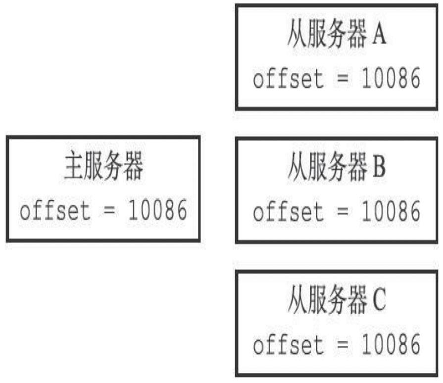
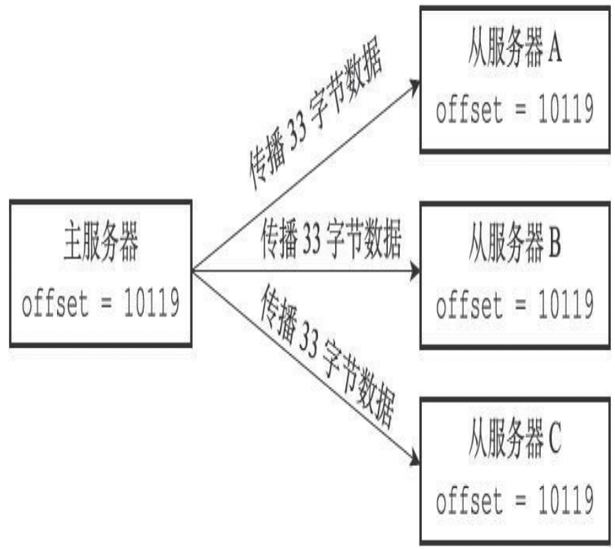
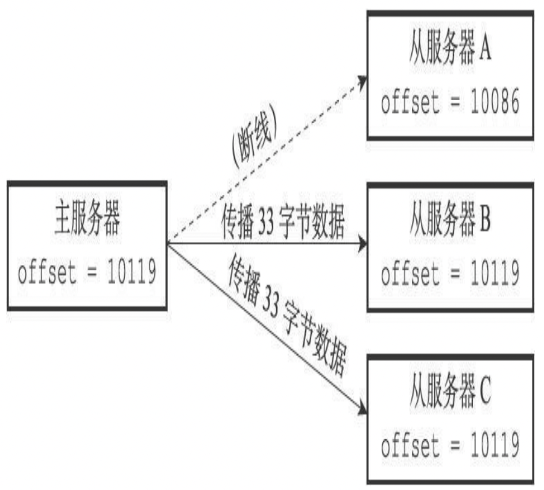
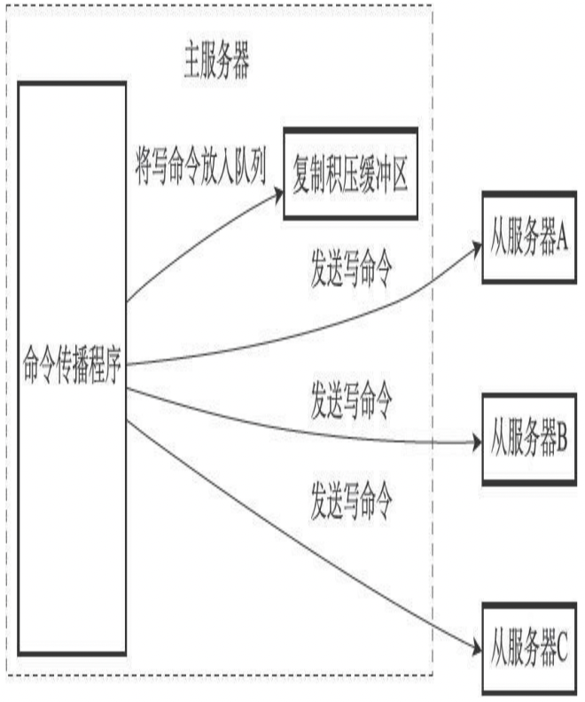
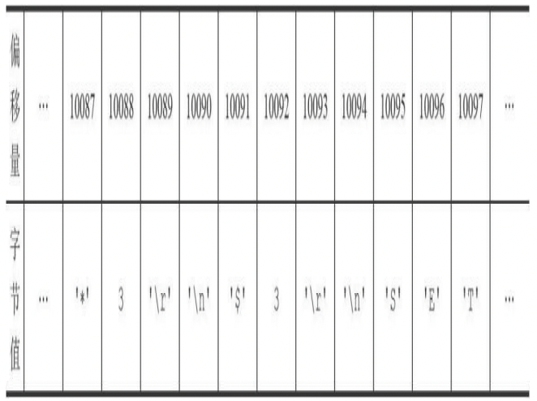
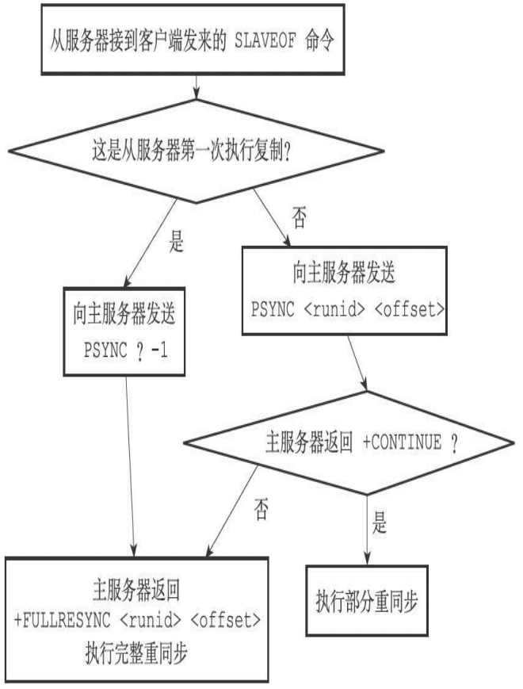
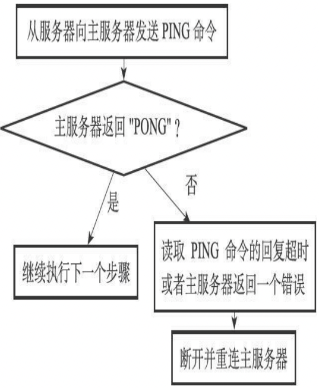
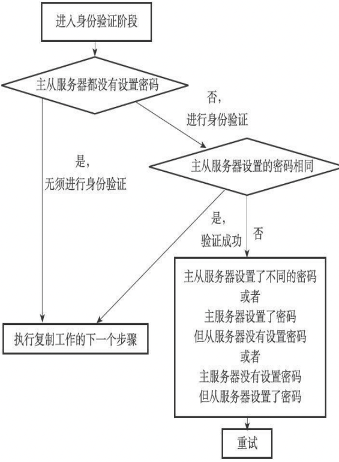
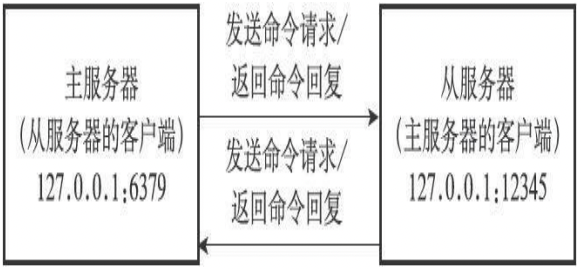

# 介绍
在`Redis`中，用户可以通过执行`SLAVEOF`命令或者设置`slaveof`选项，让一个服务器去复制（`replicate`）另一个服务器，我们称呼被复制的服务器为主服务器（`master`），而对主服务器进行复制的服务器则被称为从服务器（`slave`）。

## 旧版复制功能的实现
Redis的复制功能分为同步(`sync`)和命令传播(`command propagate`)两个操作:
* 同步操作用于将从服务器的数据库状态更新至主服务器当前所处的数据库状态。
* 命令传播操作则用于在主服务器的数据库状态被修改，导致主从服务器的数据库状态出现不一致时，让主从服务器的数据库重新回到一致状态。

### 同步
当客户端向从服务器发送`SLAVEOF`命令，要求从服务器复制主服务器时，从服务器首先需要执行同步操作，也即是，将从服务器的数据库状态更新至主服务器当前所处的数据库状态。从服务器对主服务器的同步操作需要通过向主服务器发送`SYNC`命令来完成，以下是`SYNC`命令的执行步骤：  
1. 从服务器向主服务器发送`SYNC`命令。  
2. 收到`SYNC`命令的主服务器执行`BGSAVE`命令，在后台生成一个`RDB`文件，并使用一个缓冲区记录从现在开始执行的所有写命令。
3. 当主服务器的`BGSAVE`命令执行完毕时，主服务器会将`BGSAVE`命令生成的`RDB`文件发送给从服务器，从服务器接收并载入这个`RDB`文件，将自己的数据库状态更新至主服务器执行`BGSAVE`命令时的数据库状态。
4. 主服务器将记录在缓冲区里面的所有写命令发送给从服务器，从服务器执行这些写命令，将自己的数据库状态更新至主服务器数据库当前所处的状态。

下图展示了一个主从复制的例子：
 <table>
　　　        <thead>
　　　            <tr>
　　　                <th>时间</th>
　　　                <th>主服务器</th>
                     <th>从服务器</th>
　　　            </tr>
　　　        </thead>
　　　        <tbody>
　　　            <tr>
　　　                <td>T0</td>
　　　                <td>服务器启动</td>
                     <td>服务器启动</td>
　　　            </tr>
　　　            <tr>
　　　                <td>T1</td>
　　　                <td>执行SET k1 v1</td>
                     <td></td>
　　　            </tr>
　　　            <tr>
　　　              　<td>T2</td>
　　　                <td>执行SET k2 v2</td>
                     <td></td>
　　　            </tr>
　　　            <tr>
　　　              　<td>T3</td>
　　　                <td>执行SET k3 v3</td>
                     <td></td>
　　　            </tr>
　　　            <tr>
　　　                 <td>T4</td>
　　　                <td></td>
                     <td>向服务器发送SYNC命令</td>
　　　            </tr>
                    <tr>
　　　                 <td>T5</td>
　　　                <td>接收到从服务器发来的SYNC命令，执行BGSAVE命令，创建包含键K1,k2,k3的RDB文件，并使用缓冲区记录接下来执行的所有写命令</td>
                     <td></td>
　　　            </tr>
                   <tr>
　　　                 <td>T6</td>
　　　                <td>执行SET k4 v4, 并将这个命令记录到缓冲区里面</td>
                     <td></td>
　　　            </tr>
                   <tr>
　　　                 <td>T7</td>
　　　                <td>执行SET k5 v5, 并将这个命令记录到缓冲区里面</td>
                     <td></td>
　　　            </tr>
                   <tr>
　　　                 <td>T8</td>
　　　                <td>BGSAVE命令执行完毕，向服务器发送RDB文件</td>
                     <td></td>
　　　            </tr>
                   <tr>
　　　                 <td>T9</td>
　　　                <td></td>
                     <td>接收并载入主服务器发来的RDB文件，获得K1,K2,K3三个键</td>
　　　            </tr>
                   <tr>
　　　                 <td>T10</td>
　　　                <td>向从服务器发送缓冲区中保存的写命令SET K4 v4和SET k5 v5</td>
                     <td></td>
　　　            </tr>
                   <tr>
　　　                 <td>T11</td>
　　　                <td></td>
                     <td>接收并执行主服务器发来的两个SET命令，得到K4和K5两个键</td>
　　　            </tr>
                   <tr>
　　　                 <td>T12</td>
　　　                <td>同步完成，现在主从服务器两者的数据库都包含了键K1,K2,K3,K4和K5</td>
                     <td>同步完成，现在主从服务器两者的数据库都包含了键K1,K2,K3,K4和K5</td>
　　　            </tr>
 　　　       </tbody>
　　　    </table>
&emsp;通过encoding属性来设定对象所使用的编码，而不是为特定类型的对象关联一种固定的编码，极大地提升了Redis的灵活性和效率，因为Redis可以根据不同的使用场景来为一个对象设置不同的编码，从而优化对象在某一场景下的效率。    

### 命令传播
在同步操作执行完毕之后，主从服务器两者的数据库将达到一致状态，但这种一致并不是一成不变的，每当主服务器执行客户端发送的写命令时，主服务器的数据库就有可能会被修改，并导致主从服务器状态不再一致。  
为了让主从服务器再次回到一致状态，主服务器需要对从服务器执行命令传播操作：主服务器会将自己执行的写命令，也即是造成主从服务器不一致的那条写命令，发送给从服务器执行，当从服务器执行了相同的写命令之后，主从服务器将再次回到一致状态。

## 旧版复制功能的缺陷
在 `Redis` 中，从服务器对主服务器的复制可以分为以下两种情况：
* 初次复制：从服务器以前没有复制过任何主服务器，或者从服务器当前要复制的主服务器和上一次复制的主服务器不同。
* 断线后重复制：处于命令传播阶段的主从服务器因为网络原因而中断了复制，但从服务器通过自动重连接重新连上了主服务器，并继续复制主服务器。  

对于初次复制来说，旧版复制功能能够很好地完成任务，但对于断线后重复制来说，旧版复制功能虽然也能让主从服务器重新回到一致状态，但效率却非常低。

下图展示了 从服务器在断线之后重新复制主服务器的例子：
 <table>
　　　        <thead>
　　　            <tr>
　　　                <th>时间</th>
　　　                <th>主服务器</th>
                     <th>从服务器</th>
　　　            </tr>
　　　        </thead>
　　　        <tbody>
　　　            <tr>
　　　                <td>T0</td>
　　　                <td>主从服务器完成同步</td>
                     <td>主从服务器完成同步</td>
　　　            </tr>
　　　            <tr>
　　　                <td>T1</td>
　　　                <td>执行并传播 SET k1 v1</td>
                     <td>执行主服务器传来的 SET k1 v1</td>
　　　            </tr>
　　　            <tr>
　　　              　<td>T2</td>
                     <td>执行并传播 SET k2 v12</td>
                     <td>执行主服务器传来的 SET k2 v2</td>
　　　            </tr>
　　            <tr>
　　　               <td>...</td>
                    <td>...</td>
                    <td>...</td>
　　　            </tr>
　　　            <tr>
　　　              　<td>T10085</td>
　　　                <td>执行并传播 SET k10085 v10085</td>
                     <td>执行主服务器传来的SET k10085 v10085</td>
　　　            </tr>
　　　            <tr>
　　　                <td>T10086</td>
　　　                <td>执行并传播SET k10086 v10086</td>
                     <td>执行主服务器传来的SET k10086 v10086</td>
　　　            </tr>
                    <tr>
　　　                <td>T10087</td>
　　　                <td>主从服务器连接断开</td>
                     <td>主从服务器连接断开</td>
　　　            </tr>
                   <tr>
　　　                <td>T10088</td>
　　　                <td>执行 SET k10087 v10087</td>
                     <td>断线中，尝试重新连接主服务器</td>
　　　            </tr>
                   <tr>
　　　                <td>T10089</td>
　　　                <td>执行 SET k10088 v10088</td>
                     <td>断线中，尝试重新连接主服务器</td>
　　　            </tr>
                   <tr>
　　　　               <td>T10091</td>
　　　                <td>主从服务器重新连接</td>
                     <td>主从服务器重新连接</td>
　　　            </tr>
                   <tr>
　　　　               <td>T10092</td>
　　　                <td></td>
                     <td>向主服务器发送SYNC命令</td>
　　　            </tr>
                   <tr>
　　　                 <td>T10093</td>
　　　                <td>接收到从服务器发送来的SYNC命令，执行BGSAVE命令，创建包含键k1至键k10089的RDB文件, 并使用缓冲区记录接下来执行的所有写命令</td>
                     <td></td>
　　　            </tr>
                   <tr>
　　　                 <td>T10094</td>
　　　                <td>BGSAVE命令执行完毕，向从服务器发送RDB文件</td>
                     <td></td>
　　　            </tr>
                   <tr>
　　　                 <td>T10095</td>
　　　                <td></td>
                     <td>接收并载入主服务器发来的RDB文件，获得键看k1至键10089</td>
　　　            </tr>
                <tr>
　　　                 <td>T10096</td>
　　　                <td>因为在BGSAVE命令执行期间，主服务器没有执行任何写命令，所以跳过发送缓冲区包含的写命令这一步</td>
                     <td></td>
　　　            </tr>
                <tr>
　　　                 <td>T10097</td>
　　　                <td>主从服务器再次完成同步</td>
                     <td>主从服务器再次完成同步</td>
　　　            </tr>
 　　　       </tbody>
　　　    </table>

在时间`T10091`，从服务器终于重新连接上主服务器，因为这时主从服务器的状态已经不再一致，所以从服务器将向主服务器发送`SYNC`命令，而主服务器会将包含键k1至键k10089的
`RDB`文件发送给从服务器，从服务器通过接收和载入这个`RDB`文件来将自己的数据库更新至主服务器数据库当前所处的状态。  
虽然再次发送`SYNC`命令可以让主从服务器重新回到一致状态，但如果我们仔细研究这个断线重复制过程，就会发现传送`RDB`文件这一步实际上并不是非做不可的：   
* 主从服务器在时间`T0`至时间T`10086`中一直处于一致状态，这两个服务器保存的数据大部分都是相同的。
* 从服务器想要将自己更新至主服务器当前所处的状态，真正需要的是主从服务器连接中断期间，主服务器新添加的`k10087`、`k10088`、`k10089`三个键的数据。
* 可惜的是，旧版复制功能并没有利用以上列举的两点条件，而是继续让主服务器生成并向从服务器发送包含键`k1`至键k`10089`的`RDB`文件，但实际上`RDB`文件包含的键k1至键k10086
的数据对于从服务器来说都是不必要的。

上面给出的例子可能有一点理想化，因为在主从服务器断线期间，主服务器执行的写命令可能会有成百上千个之多，而不仅仅是两三个写命令。但总的来说，主从服务器断开的时
间越短，主服务器在断线期间执行的写命令就越少，而执行少量写命令所产生的数据量通常比整个数据库的数据量要少得多，在这种情况下，为了让从服务器补足一小部分缺失的数
据，却要让主从服务器重新执行一次`SYNC`命令，这种做法无疑是非常低效的。

&emsp;&emsp;&emsp;&emsp;&emsp;&emsp;&emsp;&emsp;`SYNC命令是一个非常耗费资源的操作`

每次执行SYNC命令，主从服务器需要执行以下动作：

1. 主服务器需要执行`BGSAVE`命令来生成`RDB`文件，这个生成操作会耗费主服务器大量的`CPU`、内存和磁盘`I/O`资源。
2. 主服务器需要将自己生成的`RDB`文件发送给从服务器，这个发送操作会耗费主从服务器大量的网络资源（带宽和流量），并对主服务器响应命令请求的时间产生影
响。
3. 接收到`RDB`文件的从服务器需要载入主服务器发来的`RDB`文件，并且在载入期间，从服务器会因为阻塞而没办法处理命令请求。

因为`SYNC`命令是一个如此耗费资源的操作，所以`Redis`有必要保证在真正有需要时才执行`SYNC`命令。


## 新版复制功能的实现

为了解决旧版复制功能在处理断线重复制情况时的低效问题，`Redis从2.8`版本开始，使用`PSYNC`命令代替`SYNC`命令来执行复制时的同步操作。

`PSYNC`命令具有完整重同步（`full resynchronization`）和部分重同步（`partial resynchronization`）两种模式：
* 其中完整重同步用于处理初次复制情况：完整重同步的执行步骤和SYNC命令的执行步骤基本一样，它们都是通过让主服务器创建并发送`RDB`文件，以及向从服务器发送保存在缓冲区里面的写命令来进行同步。
* 而部分重同步则用于处理断线后重复制情况：当从服务器在断线后重新连接主服务器时，如果条件允许，主服务器可以将主从服务器连接断开期间执行的写命令发送给从服务器，从服务器只要接收并执行这些写命令，就可以将数据库更新至主服务器当前所处的状
态。

`PSYNC`命令的部分重同步模式解决了旧版复制功能在处理断线后重复制时出现的低效情况，表展示了如何使用`PSYNC`命令高效地处理上一节展示的断线后复制情况。

 <table>
　　　        <thead>
　　　            <tr>
　　　                <th>时间</th>
　　　                <th>主服务器</th>
                     <th>从服务器</th>
　　　            </tr>
　　　        </thead>
　　　        <tbody>
　　　            <tr>
　　　                <td>T0</td>
　　　                <td>主从服务器完成同步</td>
                     <td>主从服务器完成同步</td>
　　　            </tr>
　　　            <tr>
　　　                <td>T1</td>
　　　                <td>执行并传播 SET k1 v1</td>
                     <td>执行主服务器传来的 SET k1 v1</td>
　　　            </tr>
　　　            <tr>
　　　              　<td>T2</td>
                     <td>执行并传播 SET k2 v12</td>
                     <td>执行主服务器传来的 SET k2 v2</td>
　　　            </tr>
　　            <tr>
　　　               <td>...</td>
                    <td>...</td>
                    <td>...</td>
　　　            </tr>
　　　            <tr>
　　　              　<td>T10085</td>
　　　                <td>执行并传播 SET k10085 v10085</td>
                     <td>执行主服务器传来的SET k10085 v10085</td>
　　　            </tr>
　　　            <tr>
　　　                <td>T10086</td>
　　　                <td>执行并传播SET k10086 v10086</td>
                     <td>执行主服务器传来的SET k10086 v10086</td>
　　　            </tr>
                    <tr>
　　　                <td>T10087</td>
　　　                <td>主从服务器连接断开</td>
                     <td>主从服务器连接断开</td>
　　　            </tr>
                   <tr>
　　　                <td>T10088</td>
　　　                <td>执行 SET k10087 v10087</td>
                     <td>断线中，尝试重新连接主服务器</td>
　　　            </tr>
                   <tr>
　　　                <td>T10089</td>
　　　                <td>执行 SET k10088 v10088</td>
                     <td>断线中，尝试重新连接主服务器</td>
　　　            </tr>
                   <tr>
　　　　               <td>T10091</td>
　　　                <td>主从服务器重新连接</td>
                     <td>主从服务器重新连接</td>
　　　            </tr>
                   <tr>
　　　　               <td>T10092</td>
　　　                <td></td>
                     <td>向主服务器发PSYNC命令</td>
　　　            </tr>
                   <tr>
　　　                 <td>T10093</td>
　　　                <td>向服务器返回+CONTINUE回复，表示执行部分重同步</td>
                     <td></td>
　　　            </tr>
                   <tr>
　　　                 <td>T10094</td>
　　　                <td></td>
                     <td>接收+CONTINUE回复，准备执行部分重同步</td>
　　　            </tr>
                   <tr>
　　　                 <td>T10095</td>
　　　                <td>向从服务器发送SET k10087  v10087, SET k10088 v10088, SET k10089 v10089 三个命令</td>
                     <td></td>
　　　            </tr>
                <tr>
　　　                 <td>T10096</td>
　　　                <td></td>
                     <td>接收并执行主服务器传来的三个SET命令</td>
　　　            </tr>
                <tr>
　　　                 <td>T10097</td>
　　　                <td>主从服务器再次完成同步</td>
                     <td>主从服务器再次完成同步</td>
　　　            </tr>
 　　　       </tbody>
　　　    </table>

对比一下`SYNC`命令和`PSYNC`命令处理断线重复制的方法，不难看出，虽然`SYNC`命令和`PSYNC`命令都可以让断线的主从服务器重新回到一致状态，但执行部分重同步所需的资源比起执行`SYNC`命令所需的资源要少得多，完成同步的速度也快得多。执行`SYNC`命令需要生成、传送和载入整个`RDB`文件，而部分重同步只需要将从服务器缺少的写命令发送给从服务器执行就可以了。

## 部分重同步的实现

在了解了`PSYNC`命令的由来，以及部分重同步的工作方式之后，是时候来介绍一下部分重同步的实现细节了。部分重同步功能由以下三个部分构成：  
1. 主服务器的复制偏移量（`replication offset`）和从服务器的复制偏移量。
2. 主服务器的复制积压缓冲区（`replication backlog`）。
3. 服务器的运行`ID`（`run ID`）。

### 复制偏移量

执行复制的双方——主服务器和从服务器会分别维护一个复制偏移量：  
* 主服务器每次向从服务器传播`N`个字节的数据时，就将自己的复制偏移量的值加上`N`。
* 从服务器每次收到主服务器传播来的`N`个字节的数据时，就将自己的复制偏移量的值加上`N`。

在图å所示的例子中，主从服务器的复制偏移量的值都为10086。


```javascript
                                            拥有相同偏移量的主服务器和它的三个从服务器
```

如果这时主服务器向三个从服务器传播长度为33字节的数据，那么主服务器的复制偏移量将更新为10086+33=10119，而三个从服务器在接收到主服务器传播的数据之后，也会将复制偏移量更新为10119，如图所示:


```javascript
                                            更新偏移量之后的主从服务器
```
通过对比主从服务器的复制偏移量，程序可以很容易地知道主从服务器是否处于一致状态：
* 如果主从服务器处于一致状态，那么主从服务器两者的偏移量总是相同的。
* 相反，如果主从服务器两者的偏移量并不相同，那么说明主从服务器并未处于一致状态。

考虑以下这个例子：假设如图15-7所示，主从服务器当前的复制偏移量都为10086，但是就在主服务器要向从服务器传播长度为33字节的数据之前，从服务器A断了，那么主服务器传播的数据将只有从服务器B和从服务器C能收到，在这之后，主服务器、从服务器B和从服务器C三个服务器的复制偏移量都将更新为10119，而断线的从服务器A的复制偏移量仍然停留在10086，这说明从服务器A与主服务器并不一致，如图所示。


```javascript
                                            因为断线而处于不一致状态的从服务器A

```

假设从服务器A在断线之后就立即重新连接主服务器，并且成功，那么接下来，从服务器将向主服务器发送`PSYNC`命令，报告从服务器A当前的复制偏移量为10086，那么这时，主服务器应该对从服务器执行完整重同步还是部分重同步呢？如果执行部分重同步的话，主服务器又如何补偿从服务器A在断线期间丢失的那部分数据呢？以上问题的答案都和复制积压缓冲区有关。

### 复制积压缓冲区

复制积压缓冲区是由主服务器维护的一个固定长度（`fixed-size`）先进先出（`FIFO`）队列，默认大小为1MB。

&emsp;&emsp;&emsp;&emsp;&emsp;&emsp;&emsp;&emsp;固定长度先进先出队列

固定长度先进先出队列的入队和出队规则跟普通的先进先出队列一样：新元素从一边进入队列，而旧元素从另一边弹出队列。

和普通先进先出队列随着元素的增加和减少而动态调整长度不同，固定长度先进先出队列的长度是固定的，当入队元素的数量大于队列长度时，最先入队的元素会被弹出，而新元素会被放入队列。

当主服务器进行命令传播时，它不仅会将写命令发送给所有从服务器，还会将写命令入队到复制积压缓冲区里面，如图所示。


```javascript
                                            主服务器向复制积压缓冲区和所有从服务器传播写命令数据

```

因此，主服务器的复制积压缓冲区里面会保存着一部分最近传播的写命令，并且复制积压缓冲区会为队列中的每个字节记录相应的复制偏移量，就像表展示的那样。


```javascript
                                            复制积压缓冲区的构造

```

当从服务器重新连上主服务器时，从服务器会通过`PSYNC`命令将自己的复制偏移量`offset`发送给主服务器，主服务器会根据这个复制偏移量来决定对从服务器执行何种同步操作：
* 如果`offset`偏移量之后的数据（也即是偏移量`offset+1`开始的数据）仍然存在于复制积压缓冲区里面，那么主服务器将对从服务器执行部分重同步操作。
* 相反，如果offset偏移量之后的数据已经不存在于复制积压缓冲区，那么主服务器将对从服务器执行完整重同步操作。

###  服务器运行ID

除了复制偏移量和复制积压缓冲区之外，实现部分重同步还需要用到服务器运行 `ID（run ID）`：

* 每个Redis服务器，不论主服务器还是从服务，都会有自己的运行`ID`。
* 运行ID在服务器启动时自动生成，由40个随机的十六进制字符组成，例如53b9b28df8042fdc9ab5e3fcbbbabff1d5dce2b3。

当从服务器对主服务器进行初次复制时，主服务器会将自己的运行`ID`传送给从服务器，而从服务器则会将这个运行`ID`保存起来。当从服务器断线并重新连上一个主服务器时，从服务器将向当前连接的主服务器发送之前保存的运行`ID`：

* 如果从服务器保存的运行ID和当前连接的主服务器的运行ID相同，那么说明从服务器断线之前复制的就是当前连接的这个主服务器，主服务器可以继续尝试执行部分重同步操作。
* 相反地，如果从服务器保存的运行ID和当前连接的主服务器的运行ID并不相同，那么说明从服务器断线之前复制的主服务器并不是当前连接的这个主服务器，主服务器将对从服务器执行完整重同步操作。


&emsp;&emsp;&emsp;&emsp;&emsp;&emsp;&emsp;&emsp;PSYNC命令的实现

到目前为止，本章在介绍`PSYNC`命令时一直没有说明`PSYNC`命令的参数以及返回值，因为那时我们还未了解服务器运行`ID`、复制偏移量、复制积压缓冲区这些东西，在学习了部分重同步的实现原理之后，我们现在可以来了解`PSYNC`命令的完整细节了。

PSYNC命令的调用方法有两种：
* 如果从服务器以前没有复制过任何主服务器，或者之前执行过`SLAVEOF no one`命令，那么从服务器在开始一次新的复制时将向主服务器发送`PSYNC ? -1`命令，主动请求主服务器进行完整重同步（因为这时不可能执行部分重同步）。
* 相反地，如果从服务器已经复制过某个主服务器，那么从服务器在开始一次新的复制时
将向主服务器发送`PSYNC` <runid> <offset>命令：其中runid是上一次复制的主服务器的运行`ID`，而`offset`则是从服务器当前的复制偏移量，接收到这个命令的主服务器会通过这两个参数来判断应该对从服务器执行哪种同步操作。

根据情况，接收到`PSYNC`命令的主服务器会向从服务器返回以下三种回复的其中一种：

* 如果主服务器返回`+FULLRESYNC` <runid> <offset>回复，那么表示主服务器将与从服务器执行完整重同步操作：其中runid是这个主服务器的运行ID，从服务器会将这个ID保存起来，在下一次发送`PSYNC`命令时使用；而`offset`则是主服务器当前的复制偏移量，从服务器会将这个值作为自己的初始化偏移量。
* 如果主服务器返回`+CONTINUE`回复，那么表示主服务器将与从服务器执行部分重同步操作，从服务器只要等着主服务器将自己缺少的那部分数据发送过来就可以了。
* 如果主服务器返回-ERR回复，那么表示主服务器的版本低于`Redis 2.8`，它识别不了`PSYNC`命令，从服务器将向主服务器发送`SYNC`命令，并与主服务器执行完整同步操作。
流程图总结了`PSYNC`命令执行完整重同步和部分重同步时可能遇上的情况。


```javascript
                                            PSYNC执行完整重同步和部分重同步时可能遇上的情况
```

为了熟悉`PSYNC`命令的用法，让我们来看一个完整的复制——网络中断——重复制例子。  
首先，假设有两个`Redis`服务器，它们的版本都是`Redis 2.8`，其中主服务器的地址为`127.0.0.1:6379`，从服务器的地址为`127.0.0.1:12345`。

如果客户端向从服务器发送命令`SLAVEOF 127.0.0.1 6379`，并且假设从服务器是第一次执行复制操作，那么从服务器将向主服务器发送`PSYNC ? -1`命令，请求主服务器执行完整重同步操作。

主服务器在收到完整重同步请求之后，将在后台执行`BGSAVE`命令，并向从服务器返回`+FULLRESYNC 53b9b28df8042fdc9ab5e3fcbbbabff1d5dce2b3 10086`回复，其中
`53b9b28df8042fdc9ab5e3fcbbbabff1d5dce2b3`是主服务器的运行`ID`，而`10086`则是主服务器当前的复制偏移量。

假设完整重同步成功执行，并且主从服务器在一段时间之后仍然保持一致，但是在复制偏移量为`20000`的时候，主从服务器之间的网络连接中断了，这时从服务器将重新连接主服
务器，并再次对主服务器进行复制。

因为之前曾经对主服务器进行过复制，所以从服务器将向主服务器发送命令`PSYNC 53b9b28df8042fdc9ab5e3fcbbbabff1d5dce2b3 20000`，请求进行部分重同步。

主服务器在接收到从服务器的`PSYNC`命令之后，首先对比从服务器传来的运行`ID 53b9b28df8042fdc9ab5e3fcbbbabff1d5dce2b3`和主服务器自身的运行`ID`，结果显示该`ID`和主服务器的运行`ID`相同，于是主服务器继续读取从服务器传来的偏移量`20000`，检查偏移量为`20000`之后的数据是否存在于复制积压缓冲区里面，结果发现数据仍然存在。

确认运行`ID`相同并且数据存在之后，主服务器将向从服务器返回`+CONTINUE`回复，表示将与从服务器执行部分重同步操作，之后主服务器会将保存在复制积压缓冲区`20000`偏移量之后的所有数据发送给从服务器，主从服务器将再次回到一致状态。

## 复制的实现

通过向从服务器发送`SLAVEOF`命令，我们可以让一个从服务器去复制一个主服务器：
```shell
SLAVEOF <master_ip> <master_port>
```

本节将以从服务器127.0.0.1:12345接收到命令：
```shell
SLAVEOF 127.0.0.1 6379
```
为例，展示`Redis2.8`或以上版本的复制功能的详细实现步骤。

### 步骤1：设置主服务器的地址和端口

当客户端向从服务器发送以下命令时：
```shell
127.0.0.1:12345> SLAVEOF 127.0.0.1 6379
OK
```

从服务器首先要做的就是将客户端给定的主服务器`IP`地址1`27.0.0.1`以及端口`6379`保存到服务器状态的`masterhost`属性和`masterport`属性里面：
```c++
struct redisServer {
    // ...
    //
    主服务器的地址
    char * masterhost;
    //
    主服务器的端口
    int masterport;
    // ...
};
```

下图展示了SLAVEOF命令执行之后，从服务器的服务器状态。

```
┌───────────────────────┐
│      redisServer      │
|───────────────────────|        
│         ...           │         
|───────────────────────|  
│        masterhost     │  
|        "127.0.0.1"    | 
|───────────────────────|
│      masterport       │
|          6379         |
|───────────────────────|
│          ...          │         
└───────────────────────┘         
                             从服务器的服务器状态
```

`SLAVEOF`命令是一个异步命令，在完成`masterhost`属性和`masterport`属性的设置工作之后，从服务器将向发送`SLAVEOF`命令的客户端返回`OK`，表示复制指令已经被接收，而实际的复制工作将在`OK`返回之后才真正开始执行。

### 步骤2：建立套接字连接

在`SLAVEOF`命令执行之后，从服务器将根据命令所设置的IP地址和端口，创建连向主服务器的套接字连接，如图所示。


```
┌───────────────────────┐              ┌───────────────────────┐  
│        主服务器        │  套接字连接    │        从服务器         │  
|    127.0.0.1：6379    | <----------- |    127.0.0.1：12345    |     
└───────────────────────┘              └───────────────────────┘ 
                从服务器创建连向主服务器的套接字
```
如果从服务器创建的套接字能成功连接（`connect`）到主服务器，那么从服务器将为这个套接字关联一个专门用于处理复制工作的文件事件处理器，这个处理器将负责执行后续的复制工作，比如接收RDB文件，以及接收主服务器传播来的写命令，诸如此类。

而主服务器在接受（`accept`）从服务器的套接字连接之后，将为该套接字创建相应的客户端状态，并将从服务器看作是一个连接到主服务器的客户端来对待，这时从服务器将同时具有服务器（`server`）和客户端（`client`）两个身份：从服务器可以向主服务器发送命令请求，而主服务器则会向从服务器返回命令回复，如图所示。


```
┌───────────────────────┐               ┌───────────────────────┐  
│        主服务器        │  发送命令请求   │        从服务器         │  
|                       | <-----------  |     (主服务器的客户端)   | 
|   127.0.0.1：6379     |  返回命令回复   |    127.0.0.1：12345    |
|                       | ----------->  |                       |  
└───────────────────────┘               └───────────────────────┘ 
                主从服务器之间的关系
```
因为复制工作接下来的几个步骤都会以从服务器向主服务器发送命令请求的形式来进行，所以理解“从服务器是主服务器的客户端”这一点非常重要。

### 发送PING命令

从服务器成为主服务器的客户端之后，做的第一件事就是向主服务器发送一个`PING`命令，如图所示。


```
┌───────────────────────┐               ┌───────────────────────┐  
│        主服务器        │      PING     │        从服务器         │  
|                       | <-----------  |                       | 
|   127.0.0.1：6379     |               |    127.0.0.1：12345    |
|                       |               |                       |  
└───────────────────────┘               └───────────────────────┘ 
                从服务器向主服务器发送PING
```

这个`PING`命令有两个作用：  
* 虽然主从服务器成功建立起了套接字连接，但双方并未使用该套接字进行过任何通信，通过发送`PING`命令可以检查套接字的读写状态是否正常。
* 因为复制工作接下来的几个步骤都必须在主服务器可以正常处理命令请求的状态下才能进行，通过发送PING命令可以检查主服务器能否正常处理命令请求。

从服务器在发送`PING`命令之后将遇到以下三种情况的其中一种：

* 如果主服务器向从服务器返回了一个命令回复，但从服务器却不能在规定的时限（`timeout`）内读取出命令回复的内容，那么表示主从服务器之间的网络连接状态不佳，不能继续执行复制工作的后续步骤。当出现这种情况时，从服务器断开并重新创建连向主服务器的套接字。
* 如果主服务器向从服务器返回一个错误，那么表示主服务器暂时没办法处理从服务器的命令请求，不能继续执行复制工作的后续步骤。当出现这种情况时，从服务器断开并重新创建连向主服务器的套接字。比如说，如果主服务器正在处理一个超时运行的脚本，那么当从服务器向主服务器发送`PING`命令时，从服务器将收到主服务器返回的 `BUSY Redisis busy running a script.You can only call SCRIPT KILL or SHUTDOWN NOSAVE.` 错误。
* 如果从服务器读取到`"PONG"`回复，那么表示主从服务器之间的网络连接状态正常，并且主服务器可以正常处理从服务器（客户端）发送的命令请求，在这种情况下，从服务器可以继续执行复制工作的下个步骤。

流程图总结了从服务器在发送`PING`命令时可能遇到的情况，以及各个情况的处理方式。


```javascript
                                            从服务器在发送PING命令时可能遇上的情况

```

### 步骤4：身份验证

从服务器在收到主服务器返回的`"PONG"`回复之后，下一步要做的就是决定是否进行身份验证：
* 如果从服务器设置了`masterauth`选项，那么进行身份验证。
* 如果从服务器没有设置`masterauth`选项，那么不进行身份验证。

在需要进行身份验证的情况下，从服务器将向主服务器发送一条`AUTH`命令，命令的参数为从服务器`masterauth`选项的值。
举个例子，如果从服务器`masterauth`选项的值为`10086`，那么从服务器将向主服务器发送命令`AUTH 10086`，如图所示。


```
┌───────────────────────┐              ┌───────────────────────┐  
│        主服务器        │  AUTH 10086  │        从服务器         │  
|    127.0.0.1：6379    | <----------- |    127.0.0.1：12345    |     
└───────────────────────┘              └───────────────────────┘ 
            从服务器向主服务器验证身份
```

从服务器在身份验证阶段可能遇到的情况有以下几种：

* 如果主服务器没有设置`requirepass`选项，并且从服务器也没有设置`masterauth`选项，那么主服务器将继续执行从服务器发送的命令，复制工作可以继续进行。
* 如果从服务器通过AUTH命令发送的密码和主服务器`requirepass`选项所设置的密码相同，那么主服务器将继续执行从服务器发送的命令，复制工作可以继续进行。与此相反，如果主从服务器设置的密码不相同，那么主服务器将返回一个`invalid password`错误。
* 如果主服务器设置了`requirepass`选项，但从服务器却没有设置`masterauth`选项，那么主服务器将返回一个`NOAUTH`错误。另一方面，如果主服务器没有设置`requirepass`选项，但从服务器却设置了`masterauth`选项，那么主服务器将返回一个`no password is set`错误。

所有错误情况都会令从服务器中止目前的复制工作，并从创建套接字开始重新执行复制，直到身份验证通过，或者从服务器放弃执行复制为止。

流程图总结了从服务器在身份验证阶段可能遇到的情况，以及各个情况的处理方式。


```javascript
                            从服务器在身份验证阶段可能遇上的情况

```

### 步骤5：发送端口信息

在身份验证步骤之后，从服务器将执行命令`REPLCONF listening-port <port-number>`，向主服务器发送从服务器的监听端口号。  
例如在我们的例子中，从服务器的监听端口为`12345`，那么从服务器将向主服务器发送命令`REPLCONF listening-port 12345`，如图所示。

```
┌───────────────────────┐                                 ┌───────────────────────┐  
│        主服务器        │  REPLCONF listening-port 12345  │        从服务器         │  
|    127.0.0.1：6379    | <----------------------------   |    127.0.0.1：12345    |     
└───────────────────────┘                                 └───────────────────────┘ 
            从服务器向主服务器发送监听端口
```

主服务器在接收到这个命令之后，会将端口号记录在从服务器所对应的客户端状态的`slave_listening_port`属性中：
```c++
typedef struct redisClient {
    // ...
    //
    从服务器的监听端口号
    int slave_listening_port;
    // ...
} redisClient;
```

图展示了客户端状态设置`slave_listening_port`属性之后的样子.

```
┌───────────────────────┐
│      redisClient      │
|───────────────────────|        
│         ...           │         
|───────────────────────|  
│slave_listenging_port  │  
|        "127.0.0.1"    | 
|───────────────────────|
│          ...          │         
└───────────────────────┘         
                             用客户端状态记录从服务器的监听端口
```
`slave_listening_port`属性目前唯一的作用就是在主服务器执行`INFO replication`命令时打印出从服务器的端口号。

以下是客户端向例子中的主服务器发送`INFO replication`命令时得到的回复，其中`slave0`行的`port`域显示的就是从服务器所对应客户端状态的`slave_listening_port`属性的值：
```shell
127.0.0.1:6379> INFO replication
# Replication
role:master
connected_slaves:1
slave0:ip=127.0.0.1,port=12345,status=online,offset=1289,lag=1
master_repl_offset:1289
repl_backlog_active:1
repl_backlog_size:1048576
repl_backlog_first_byte_offset:2
repl_backlog_histlen:1288
```

### 步骤6：同步

在这一步，从服务器将向主服务器发送`PSYNC`命令，执行同步操作，并将自己的数据库更新至主服务器数据库当前所处的状态。  
值得一提的是，在同步操作执行之前，只有从服务器是主服务器的客户端，但是在执行同步操作之后，主服务器也会成为从服务器的客户端：
* 如果`PSYNC`命令执行的是完整重同步操作，那么主服务器需要成为从服务器的客户端，才能将保存在缓冲区里面的写命令发送给从服务器执行。
* 如果PSYNC命令执行的是部分重同步操作，那么主服务器需要成为从服务器的客户端，才能向从服务器发送保存在复制积压缓冲区里面的写命令。

因此，在同步操作执行之后，主从服务器双方都是对方的客户端，它们可以互相向对方发送命令请求，或者互相向对方返回命令回复，如图所示。

正因为主服务器成为了从服务器的客户端，所以主服务器才可以通过发送写命令来改变从服务器的数据库状态，不仅同步操作需要用到这一点，这也是主服务器对从服务器执行命令传播操作的基础。


```javascript
                            主从服务器之间互为客户端
```

### 步骤7：命令传播

当完成了同步之后，主从服务器就会进入命令传播阶段，这时主服务器只要一直将自己执行的写命令发送给从服务器，而从服务器只要一直接收并执行主服务器发来的写命令，就可以保证主从服务器一直保持一致了。  
以上就是`Redis 2.8`或以上版本的复制功能的实现步骤。


## 心跳检测

在命令传播阶段，从服务器默认会以每秒一次的频率，向主服务器发送命令：
```shell
REPLCONF ACK <replication_offset>
```

其中`replication_offset`是从服务器当前的复制偏移量。发送`REPLCONF ACK`命令对于主从服务器有三个作用：
* 检测主从服务器的网络连接状态。
* 辅助实现`min-slaves`选项。
* 检测命令丢失。

以下三个小节将分别介绍这三个作用。

### 检测主从服务器的网络连接状态

主从服务器可以通过发送和接收`REPLCONF ACK`命令来检查两者之间的网络连接是否正常：如果主服务器超过一秒钟没有收到从服务器发来的`REPLCONF ACK`命令，那么主服务器就知道主从服务器之间的连接出现问题了。  
通过向主服务器发送`INFO replication`命令，在列出的从服务器列表的`lag`一栏中，我们可以看到相应从服务器最后一次向主服务器发送`REPLCONF ACK`命令距离现在过了多少秒：
```shell
127.0.0.1:6379> INFO replication
# Replication
role:master
connected_slaves:2
slave0:ip=127.0.0.1,port=12345,state=online,offset=211,lag=0 # 刚刚发送过 REPLCONF ACK 命令
slave1:ip=127.0.0.1,port=56789,state=online,offset=197,lag=15 # 15 秒之前发送过REPLCONF ACK 命令
master_repl_offset:211
repl_backlog_active:1
repl_backlog_size:1048576
repl_backlog_first_byte_offset:2
repl_backlog_histlen:210
```
在一般情况下，`lag`的值应该在0秒或者1秒之间跳动，如果超过1秒的话，那么说明主从服务器之间的连接出现了故障。

### 辅助实现min-slaves配置选项

`Redis`的`min-slaves-to-write`和`min-slaves-max-lag`两个选项可以防止主服务器在不安全的情况下执行写命令。  
举个例子，如果我们向主服务器提供以下设置：
```shell
min-slaves-to-write 3
min-slaves-max-lag 10
```
那么在从服务器的数量少于3个，或者三个从服务器的延迟（`lag`）值都大于或等于10秒时，主服务器将拒绝执行写命令，这里的延迟值就是上面提到的`INFO replication`命令的`lag`值。

###  检测命令丢失

如果因为网络故障，主服务器传播给从服务器的写命令在半路丢失，那么当从服务器向主服务器发送`REPLCONF ACK`命令时，主服务器将发觉从服务器当前的复制偏移量少于自己的复制偏移量，然后主服务器就会根据从服务器提交的复制偏移量，在复制积压缓冲区里面找到从服务器缺少的数据，并将这些数据重新发送给从服务器。

举个例子，假设有两个处于一致状态的主从服务器，它们的复制偏移量都是200，如图所示。


```javascript
                            主从服务器处于一致状态
```

如果这时主服务器执行了命令`SET key value`（协议格式的长度为33字节），将自己的复制偏移量更新到了233，并尝试向从服务器传播命令`SET key value`，但这条命令却因为网络故障而在传播的途中丢失，那么主从服务器之间的复制偏移量就会出现不一致，主服务器的复制偏移量会被更新为233，而从服务器的复制偏移量仍然为200，如图所示。


```javascript
                            主从服务器处于不一致状态
```

在这之后，当从服务器向主服务器发送`REPLCONF ACK`命令的时候，主服务器会察觉从服务器的复制偏移量依然为200，而自己的复制偏移量为233，这说明复制积压缓冲区里面复制偏移量为201至233的数据（也即是命令`SET key value`）在传播过程中丢失了，于是主服务器会再次向从服务器传播命令`SET key value`，从服务器通过接收并执行这个命令可以将自己更新至主服务器当前所处的状态，如图所示。


```javascript
                            主服务器向从服务器补发缺失的数据
```
注意，主服务器向从服务器补发缺失数据这一操作的原理和部分重同步操作的原理非常相似，这两个操作的区别在于，补发缺失数据操作在主从服务器没有断线的情况下执行，而部分重同步操作则在主从服务器断线并重连之后执行。


                        Redis 2.8版本以前的命令丢失

`REPLCONF ACK`命令和复制积压缓冲区都是`Redis 2.8`版本新增的，在`Redis 2.8`版本以前，即使命令在传播过程中丢失，主服务器和从服务器都不会注意到，主服务器更不会向从服务器补发丢失的数据，所以为了保证复制时主从服务器的数据一致性，最好使用2.8或以上版本的`Redis`。