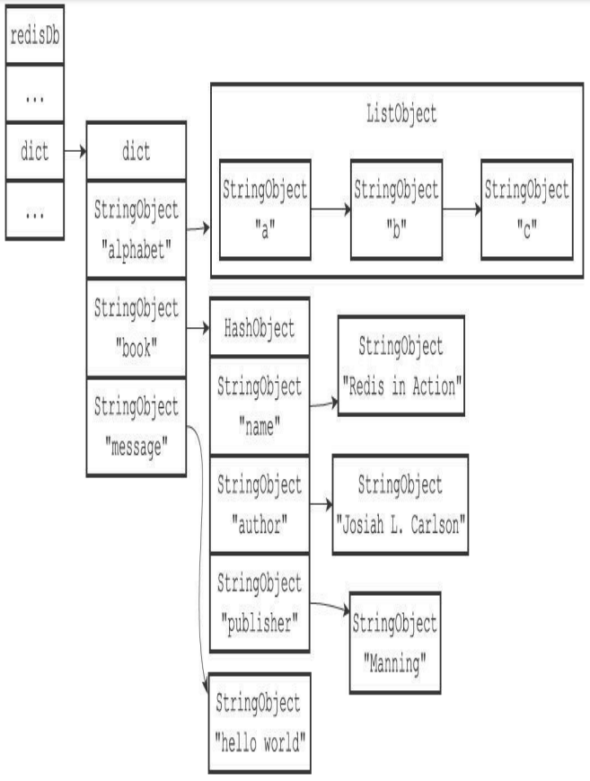
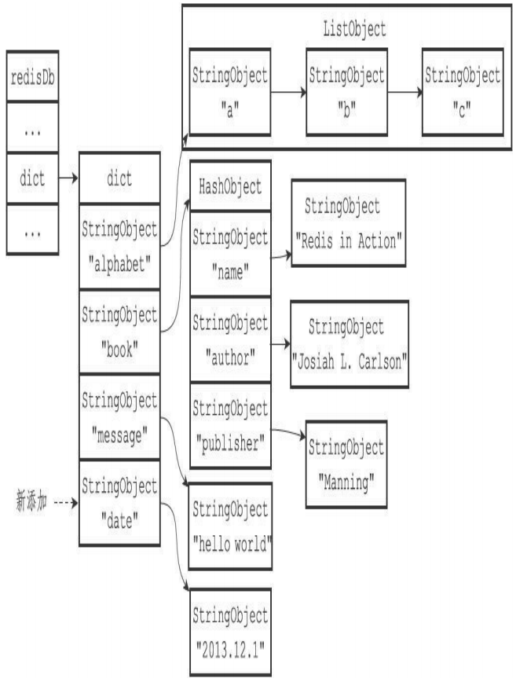
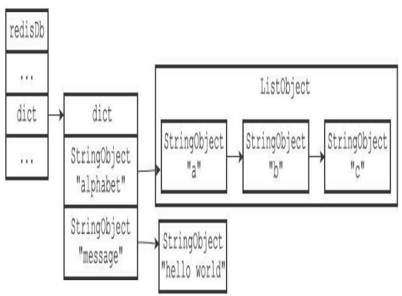
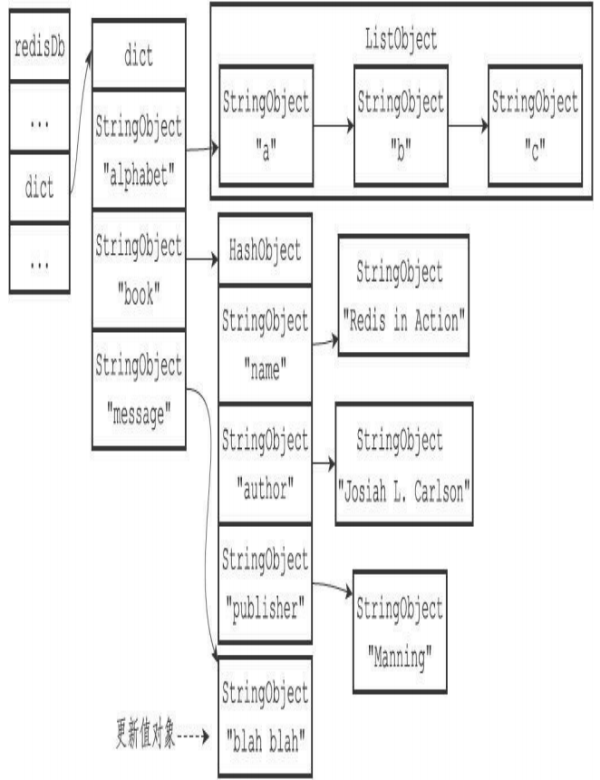
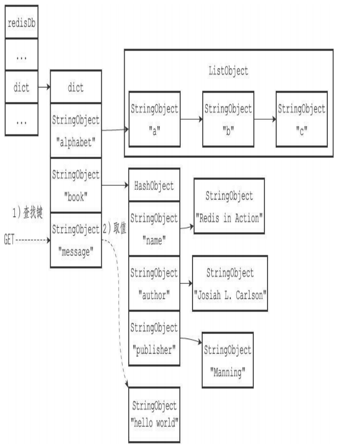

# 介绍
Redis服务器将所有数据库都保存在服务器状态redis.h/redisServer结构的db数组中，db数组的每个项都是一个redis.h/redisDb结构，每个redisDb结构代表一个数据库:

```c
struct redisServer {
  int dbnum;    // 服务器的数据库数量。在初始化服务器时，程序会根据服务器状态的dbnum 属性来决定应该创建多少个数据库。
                // dbnum属性的值由服务器配置的database选项决定，默认情况下，该选项的值为16，所 以Redis服务器默认会创建16个数据库
  redisDB * db; // 一个数组,保存着服务器中的所有数据库, 
  ...
}
```

```
┌───────────────────────┐
│      redisServer      │
|───────────────────────|        
│         ...           │ 
|───────────────────────|        ┌─────────┐─────────┐─────────┐─────────┐──────────┐  
│          db           │----->  |  db[0]  |  db[1]  |  db[2]  |    ...  |  db[15]  |
|───────────────────────|        └─────────┘─────────┘─────────┘─────────┘──────────┘
│          ...          |
|───────────────────────|
│        dbnum          │
|          16           |         
|───────────────────────|
|          ...          |
└───────────────────────┘  
                                      服务器数据库示例
```

# 切换数据库
每个Redis客户端都有自己的目标数据库，每当客户端执行数据库写命令或者数据库读命令的时候，目标数据库就会成为这些命令的操作对象。默认情况下，Redis客户端的目标数据库为0号数据库，但客户端可以通过执行SELECT命令来切换目标数据库。

在服务器内部，客户端状态redisClient结构的db属性记录了客户端当前的目标数据库，这
个属性是一个指向redisDb结构的指针：

```c
typedef struct redisClient {
  redisDb *db;   // 记录客户端当前正在使用的数据库
  ...
} redisClient;
```
```
┌───────────────────────┐
│      redisServer      │
|───────────────────────|        
│         ...           │ 
|───────────────────────|        ┌─────────┐─────────┐─────────┐─────────┐──────────┐  
│          db           │----->  |  db[0]  |  db[1]  |  db[2]  |    ...  |  db[15]  |
|───────────────────────|        └─────────┘─────────┘─────────┘─────────┘──────────┘
│          ...          |                    ↑
|───────────────────────|                   /
│        dbnum          │                  /
|          16           |                 /     
|───────────────────────|                /
|          ...          |               /
└───────────────────────┘              /
                                      /
┌───────────────────────┐           /
│      redisServer      │         /
|───────────────────────|      /       
│         ...           │    /
|───────────────────────|  /       
│          db           │/  
|───────────────────────|        
│          ...          |
|───────────────────────|
│        dbnum          │
|          16           |         
|───────────────────────|
|          ...          |
└───────────────────────┘ 
                                      服务器数据库示例
```
redisClient.db指针指向redisServer.db数组的其中一个元素，而被指向的元素就是客户端的目标数据库。通过修改redisClient.db指针，让它指向服务器中的不同数据库，从而实现切换目标数据库的功能——这就是SELECT命令的实现原理。

`谨慎处理多数据库程序`   
到目前为止，Redis仍然没有可以返回客户端目标数据库的命令。虽然redis-cli客户端会在输入符旁边提示当前所使用的目标数据库：
```shell
redis> SELECT 1
OK
redis[1]> SELECT 2
OK
redis[2]>
```
但如果你在其他语言的客户端中执行Redis命令，并且该客户端没有像redis-cli那样一直显示目标数据库的号码，那么在数次切换数据库之后，你很可能会忘记自己当前正在使用的是哪个数据库。当出现这种情况时，为了避免对数据库进行误操作，在执行Redis命令特别是像FLUSHDB这样的危险命令之前，最好先执行一个SELECT命令，显式地切换到指定的数据库，然后才执行别的命令。

# 数据库键空间
Redis是一个键值对（key-value pair）数据库服务器，服务器中的每个数据库都由一个redis.h/redisDb结构表示，其中，redisDb结构的dict字典保存了数据库中的所有键值对，我们将这个字典称为键空间（key space）：

```c
typedef struct redisDb {
dict *dict; //数据库键空间，保存着数据库中的所有键值对
...
} redisDb;
```
键空间和用户所见的数据库是直接对应的：
* 键空间的键也就是数据库的键，每个键都是一个字符串对象。
* 键空间的值也就是数据库的值，每个值可以是字符串对象、列表对象、哈希表对象、集合对象和有序集合对象中的任意一种Redis对象。

举个例子，如果我们在空白的数据库中执行以下命令：
```shell
redis> SET message "hello world"
OK
redis> RPUSH alphabet "a" "b" "c"
(integer)3
redis> HSET book name "Redis in Action"
(integer) 1
redis> HSET book author "Josiah L. Carlson"
(integer) 1
redis> HSET book publisher "Manning"
(integer) 1
```
那么在这些命令执行之后，数据库的键空间将会是图所展示的样子：
>alphabet是一个列表键，键的名字是一个包含字符串"alphabet"的字符串对象，键的值则是一个包含三个元素的列表对象。   
>book是一个哈希表键，键的名字是一个包含字符串"book"的字符串对象，键的值则是一个包含三个键值对的哈希表对象。   
>message是一个字符串键，键的名字是一个包含字符串"message"的字符串对象，键的值则是一个包含字符串"hello world"的字符串对象。   



因为数据库的键空间是一个字典，所以所有针对数据库的操作，比如添加一个键值对到数据库，或者从数据库中删除一个键值对，又或者在数据库中获取某个键值对等，实际上都是通过对键空间字典进行操作来实现的，以下几个小节将分别介绍数据库的添加、删除、更新、取值等操作的实现原理。

## 添加新键
添加一个新键值对到数据库，实际上就是将一个新键值对添加到键空间字典里面，其中键为字符串对象，而值则为任意一种类型的Redis对象。   
举个例子，如果键空间当前的状态如图9-4所示，那么在执行以下命令之后：
```shell
redis> SET date "2013.12.1"
OK
```
键空间将添加一个新的键值对，这个新键值对的键是一个包含字符串"date"的字符串对象，而键值对的值则是一个包含字符串"2013.12.1"的字符串对象，如图所示。



## 删除键
删除数据库中的一个键，实际上就是在键空间里面删除键所对应的键值对对象。   
举个例子，如果键空间当前的状态如图9-4所示，那么在执行以下命令之后：
```shell
redis> DEL book
(integer) 1
```
键book以及它的值将从键空间中被删除，如图所示。  



## 更新键
对一个数据库键进行更新，实际上就是对键空间里面键所对应的值对象进行更新，根据值对象的类型不同，更新的具体方法也会有所不同。   
举个例子，如果键空间当前的状态如图9-4所示，那么在执行以下命令之后：
```shell
redis> SET message "blah blah"
OK
```
键message的值对象将从之前包含"hello world"字符串更新为包含"blah blah"字符串，如
图所示。   



## 对键取值
对一个数据库键进行取值，实际上就是在键空间中取出键所对应的值对象，根据值对象的类型不同，具体的取值方法也会有所不同。   
举个例子，如果键空间当前的状态如图9-4所示，那么当执行以下命令时：
```shell
redis> GET message
"hello world"
```
GET命令将首先在键空间中查找键message，找到键之后接着取得该键所对应的字符串对象值，之后再返回值对象所包含的字符串"hello world"，取值过程如图所示。



## 读写键空间时的维护操作
当使用Redis命令对数据库进行读写时，服务器不仅会对键空间执行指定的读写操作，还会执行一些额外的维护操作，其中包括：
* 在读取一个键之后（读操作和写操作都要对键进行读取），服务器会根据键是否存在来更新服务器的键空间命中（hit）次数或键空间不命中（miss）次数，这两个值可以在INFOstats命令的key space_hits属性和key space_misses属性中查看。
* 在读取一个键之后，服务器会更新键的LRU（最后一次使用）时间，这个值可以用于计算键的闲置时间，使用OBJECT idletime命令可以查看键key的闲置时间。
* 如果服务器在读取一个键时发现该键已经过期，那么服务器会先删除这个过期键，然后才执行余下的其他操作，本章稍后对过期键的讨论会详细说明这一点。
* 如果有客户端使用WATCH命令监视了某个键，那么服务器在对被监视的键进行修改之后，会将这个键标记为脏（dirty），从而让事务程序注意到这个键已经被修改过。
* 服务器每次修改一个键之后，都会对脏（dirty）键计数器的值增1，这个计数器会触发服务器的持久化以及复制操作。
* 如果服务器开启了数据库通知功能，那么在对键进行修改之后，服务器将按配置发送相应的数据库通知。

# 设置键的生存时间或过期时间
通过EXPIRE命令或者PEXPIRE命令，客户端可以以秒或者毫秒精度为数据库中的某个键设置生存时间（Time To Live，TTL），在经过指定的秒数或者毫秒数之后，服务器就会自动删除生存时间为0的键：
```shell
redis> SET key value
OK
redis> EXPIRE key 5
(integer) 1
redis> GET key // 5 秒之内
"value"
redis> GET key // 5 秒之后
(nil)
```
SETEX命令可以在设置一个字符串键的同时为键设置过期时间，因为这个命令是一个类型限定的命令（只能用于字符串键）,但SETEX命令设
置过期时间的原理和本章介绍的EXPIRE命令设置过期时间的原理是完全一样的。   
与EXPIRE命令和PEXPIRE命令类似，客户端可以通过EXPIREAT命令或PEXPIREAT命令，以秒或者毫秒精度给数据库中的某个键设置过期时间（expire time）。   
过期时间是一个UNIX时间戳，当键的过期时间来临时，服务器就会自动从数据库中删除这个键：
```shell
redis> SET key value
OK
redis> EXPIREAT key 1377257300
(integer) 1
redis> TIME
1)"1377257296"
2)"296543"
redis> GET key // 1377257300
之前
"value"
redis> TIME
1)"1377257303"
2)"230656"
redis> GET key // 1377257300 之后
(nil)
```

TTL命令和PTTL命令接受一个带有生存时间或者过期时间的键，返回这个键的剩余生存时间，也就是，返回距离这个键被服务器自动删除还有多长时间：

```shell
redis> SET key value
OK
redis> EXPIRE key 1000
(integer) 1
redis> TTL key
(integer) 997
redis> SET another_key another_value
OK
redis> TIME
1)"1377333070"
2)"761687"
redis> EXPIREAT another_key 1377333100
(integer) 1
redis> TTL another_key
(integer) 10
```