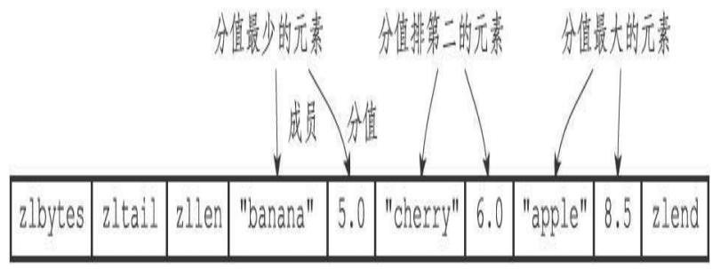

# 介绍
有序集合的编码可以是ziplist或者skiplist。

ziplist编码的压缩列表对象使用压缩列表作为底层实现，每个集合元素使用两个紧挨在一起的压缩列表节点来保存，第一个节点保存元素的成员（member），而第二个元素则保存元素的分值（score）。

压缩列表内的集合元素按分值从小到大进行排序，分值较小的元素被放置在靠近表头的方向，而分值较大的元素则被放置在靠近表尾的方向。

举个例子，如果我们执行以下ZADD命令，那么服务器将创建一个有序集合对象作为
price键的值：

如果price键的值对象使用的是ziplist编码，那么这个值对象将会是图8-14所示的样子，而
对象所使用的压缩列表则会是如图所示的样子

```
┌───────────────────────┐
│      redisObject      │
|───────────────────────|        
│         type          │      
|       REDIS_ZSET      |    
|───────────────────────|  
│        encoding       │  
|REDIS_ENCODING_ZIPLIST | 
|───────────────────────|        ┌──────────┐
│          ptr          │----->  | 压缩列表  |
|───────────────────────|        └──────────┘
│          ...          │         
└───────────────────────┘         
                             ziplist编码的有序集合对象
```

skiplist编码的有序集合对象使用zset结构作为底层实现，一个zset结构同时包含一个字典
和一个跳跃表：

```c
typedef struct zset {
zskiplist *zsl;
dict *dict;
} zset;
```

```
                    有序集合元素在压缩列表中按分值从小到大排列 
```

zset结构中的zsl跳跃表按分值从小到大保存了所有集合元素，每个跳跃表节点都保存了一个集合元素：跳跃表节点的object属性保存了元素的成员，而跳跃表节点的score属性则保存了元素的分值。通过这个跳跃表，程序可以对有序集合进行范围型操作，比如ZRANK、ZRANGE等命令就是基于跳跃表API来实现的。

除此之外，zset结构中的dict字典为有序集合创建了一个从成员到分值的映射，字典中的每个键值对都保存了一个集合元素：字典的键保存了元素的成员，而字典的值则保存了元素的分值。通过这个字典，程序可以用O（1）复杂度查找给定成员的分值，ZSCORE命令就是根据这一特性实现的，而很多其他有序集合命令都在实现的内部用到了这一特性。

有序集合每个元素的成员都是一个字符串对象，而每个元素的分值都是一个double类型
的浮点数。值得一提的是，虽然zset结构同时使用跳跃表和字典来保存有序集合元素，但这
两种数据结构都会通过指针来共享相同元素的成员和分值，所以同时使用跳跃表和字典来保
存集合元素不会产生任何重复成员或者分值，也不会因此而浪费额外的内存。

### 为什么有序集合需要同时使用跳跃表和字典来实现？

在理论上，有序集合可以单独使用字典或者跳跃表的其中一种数据结构来实现，但无论单独使用字典还是跳跃表，在性能上对比起同时使用字典和跳跃表都会有所降低。举个例子，如果我们只使用字典来实现有序集合，那么虽然以O（1）复杂度查找成员的分值这一特性会被保留，但是，因为字典以无序的方式来保存集合元素，所以每次在执行范围型操作——比如ZRANK、ZRANGE等命令时，程序都需要对字典保存的所有元素进行排序，完成这种排序需要至少O（NlogN）时间复杂度，以及额外的O（N）内存空间（因为要创建一个数组来保存排序后的元素）。

另一方面，如果我们只使用跳跃表来实现有序集合，那么跳跃表执行范围型操作的所有优点都会被保留，但因为没有了字典，所以根据成员查找分值这一操作的复杂度将从O（1）上升为O（logN）。因为以上原因，为了让有序集合的查找和范围型操作都尽可能快地执行，Redis选择了同时使用字典和跳跃表两种数据结构来实现有序集合。

举个例子，如果前面price键创建的不是ziplist编码的有序集合对象，而是skiplist编码的有
序集合对象，那么这个有序集合对象将会是图8-16所示的样子，而对象所使用的zset结构将会
是图所示的样子。

```
┌───────────────────────┐
│      redisObject      │
|───────────────────────|          ┌────────────────┐
│         type          │      ->  |       zset     |
|       REDIS_ZSET      |     /    |────────────────|
|───────────────────────|    /     |       dict     |---> ...
│        encoding       │   /      |────────────────|
|REDIS_ENCODING_SKIPLIST|  /       |       zsl      |---> ...
|───────────────────────| /        └────────────────┘ 
│          ptr          │/           
|───────────────────────|            
│          ...          │          
└───────────────────────┘          
                                                             
                             skiplist编码的有序集合对象
```

```
                                        有序集合元素同时被保存在字典和跳跃表中
```

# 编码的转换

当有序集合对象可以同时满足以下两个条件时，对象使用ziplist编码：
* 有序集合保存的元素数量小于128个；
* 有序集合保存的所有元素成员的长度都小于64字节；

不能满足以上两个条件的有序集合对象将使用skiplist编码。以上两个条件的上限值是可以修改的，具体请看配置文件中关于zset-max-ziplist-entries选项和zset-max-ziplist-value选项的说明。对于使用ziplist编码的有序集合对象来说，当使用ziplist编码所需的两个条件中的任意一个不能被满足时，就会执行对象的编码转换操作，原本保存在压缩列表里的所有集合元素都会被转移并保存到zset结构里面，对象的编码也会从ziplist变为skiplist。

以下代码展示了有序集合对象因为包含了过多元素而引发编码转换的情况：
```shell
#对象包含了128
个元素
redis> EVAL "for i=1, 128 do redis.call('ZADD', KEYS[1], i, i) end" 1 numbers
(nil)
redis> ZCARD numbers
(integer) 128
redis> OBJECT ENCODING numbers
"ziplist"
#再添加一个新元素
redis> ZADD numbers 3.14 pi
(integer) 1
#对象包含的元素数量变为129 个
redis> ZCARD numbers
(integer) 129
#编码已改变
redis> OBJECT ENCODING numbers
"skiplist"
```
以下代码则展示了有序集合对象因为元素的成员过长而引发编码转换的情况：

```shell
#向有序集合添加一个成员只有三字节长的元素
redis> ZADD blah 1.0 www
(integer) 1
redis> OBJECT ENCODING blah
"ziplist"
#向有序集合添加一个成员为66 字节长的元素
redis> ZADD blah 2.0 ooooooooooooooooooooooooooooooooooooooooooooooooooooooooooo
(integer) 1
#编码已改变
redis> OBJECT ENCODING blah
"skiplist"
```