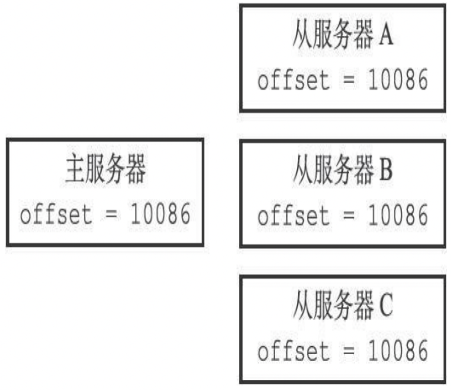
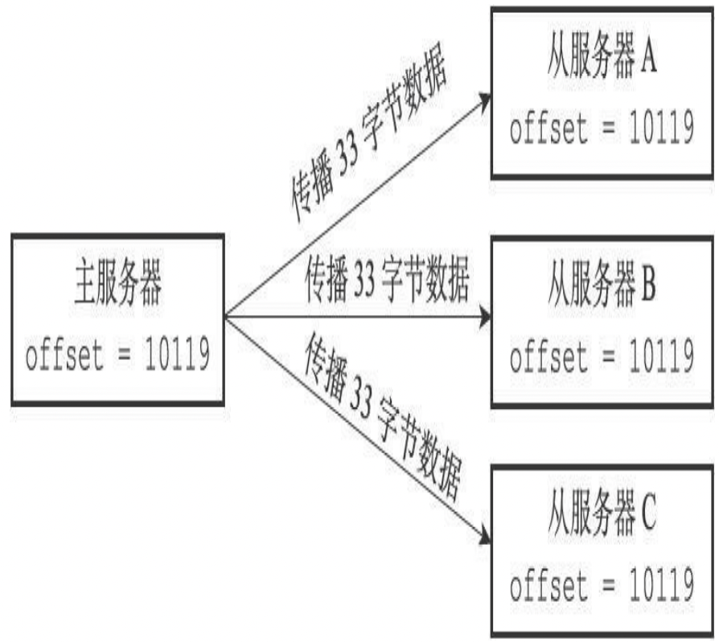
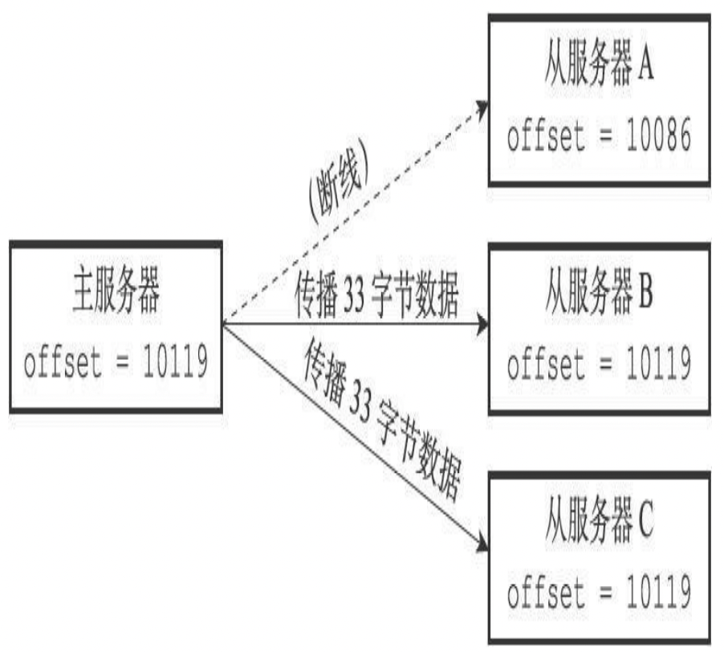
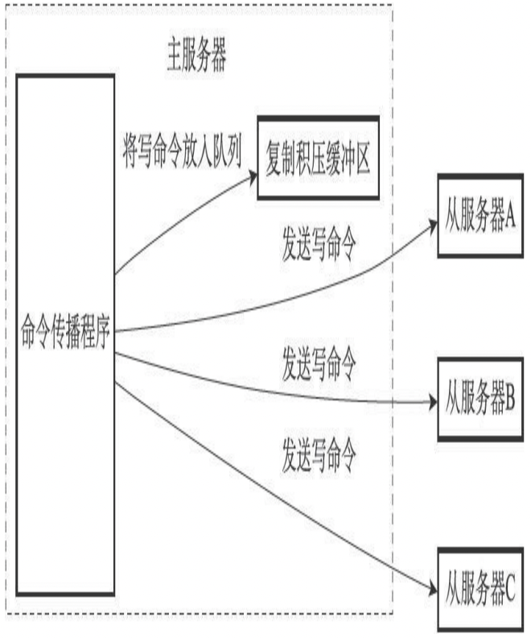
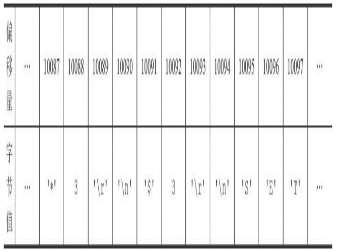

# 介绍
在`Redis`中，用户可以通过执行`SLAVEOF`命令或者设置`slaveof`选项，让一个服务器去复制（`replicate`）另一个服务器，我们称呼被复制的服务器为主服务器（`master`），而对主服务器进行复制的服务器则被称为从服务器（`slave`）。

## 旧版复制功能的实现
Redis的复制功能分为同步(`sync`)和命令传播(`command propagate`)两个操作:
* 同步操作用于将从服务器的数据库状态更新至主服务器当前所处的数据库状态。
* 命令传播操作则用于在主服务器的数据库状态被修改，导致主从服务器的数据库状态出现不一致时，让主从服务器的数据库重新回到一致状态。

### 同步
当客户端向从服务器发送`SLAVEOF`命令，要求从服务器复制主服务器时，从服务器首先需要执行同步操作，也即是，将从服务器的数据库状态更新至主服务器当前所处的数据库状态。从服务器对主服务器的同步操作需要通过向主服务器发送`SYNC`命令来完成，以下是`SYNC`命令的执行步骤：  
1. 从服务器向主服务器发送`SYNC`命令。  
2. 收到`SYNC`命令的主服务器执行`BGSAVE`命令，在后台生成一个`RDB`文件，并使用一个缓冲区记录从现在开始执行的所有写命令。
3. 当主服务器的`BGSAVE`命令执行完毕时，主服务器会将`BGSAVE`命令生成的`RDB`文件发送给从服务器，从服务器接收并载入这个`RDB`文件，将自己的数据库状态更新至主服务器执行`BGSAVE`命令时的数据库状态。
4. 主服务器将记录在缓冲区里面的所有写命令发送给从服务器，从服务器执行这些写命令，将自己的数据库状态更新至主服务器数据库当前所处的状态。

下图展示了一个主从复制的例子：
 <table>
　　　        <thead>
　　　            <tr>
　　　                <th>时间</th>
　　　                <th>主服务器</th>
                     <th>从服务器</th>
　　　            </tr>
　　　        </thead>
　　　        <tbody>
　　　            <tr>
　　　                <td>T0</td>
　　　                <td>服务器启动</td>
                     <td>服务器启动</td>
　　　            </tr>
　　　            <tr>
　　　                <td>T1</td>
　　　                <td>执行SET k1 v1</td>
                     <td></td>
　　　            </tr>
　　　            <tr>
　　　              　<td>T2</td>
　　　                <td>执行SET k2 v2</td>
                     <td></td>
　　　            </tr>
　　　            <tr>
　　　              　<td>T3</td>
　　　                <td>执行SET k3 v3</td>
                     <td></td>
　　　            </tr>
　　　            <tr>
　　　                 <td>T4</td>
　　　                <td></td>
                     <td>向服务器发送SYNC命令</td>
　　　            </tr>
                    <tr>
　　　                 <td>T5</td>
　　　                <td>接收到从服务器发来的SYNC命令，执行BGSAVE命令，创建包含键K1,k2,k3的RDB文件，并使用缓冲区记录接下来执行的所有写命令</td>
                     <td></td>
　　　            </tr>
                   <tr>
　　　                 <td>T6</td>
　　　                <td>执行SET k4 v4, 并将这个命令记录到缓冲区里面</td>
                     <td></td>
　　　            </tr>
                   <tr>
　　　                 <td>T7</td>
　　　                <td>执行SET k5 v5, 并将这个命令记录到缓冲区里面</td>
                     <td></td>
　　　            </tr>
                   <tr>
　　　                 <td>T8</td>
　　　                <td>BGSAVE命令执行完毕，向服务器发送RDB文件</td>
                     <td></td>
　　　            </tr>
                   <tr>
　　　                 <td>T9</td>
　　　                <td></td>
                     <td>接收并载入主服务器发来的RDB文件，获得K1,K2,K3三个键</td>
　　　            </tr>
                   <tr>
　　　                 <td>T10</td>
　　　                <td>向从服务器发送缓冲区中保存的写命令SET K4 v4和SET k5 v5</td>
                     <td></td>
　　　            </tr>
                   <tr>
　　　                 <td>T11</td>
　　　                <td></td>
                     <td>接收并执行主服务器发来的两个SET命令，得到K4和K5两个键</td>
　　　            </tr>
                   <tr>
　　　                 <td>T12</td>
　　　                <td>同步完成，现在主从服务器两者的数据库都包含了键K1,K2,K3,K4和K5</td>
                     <td>同步完成，现在主从服务器两者的数据库都包含了键K1,K2,K3,K4和K5</td>
　　　            </tr>
 　　　       </tbody>
　　　    </table>
&emsp;通过encoding属性来设定对象所使用的编码，而不是为特定类型的对象关联一种固定的
编码，极大地提升了Redis的灵活性和效率，因为Redis可以根据不同的使用场景来为一个对
象设置不同的编码，从而优化对象在某一场景下的效率。    

### 命令传播
在同步操作执行完毕之后，主从服务器两者的数据库将达到一致状态，但这种一致并不是一成不变的，每当主服务器执行客户端发送的写命令时，主服务器的数据库就有可能会被修改，并导致主从服务器状态不再一致。  
为了让主从服务器再次回到一致状态，主服务器需要对从服务器执行命令传播操作：主服务器会将自己执行的写命令，也即是造成主从服务器不一致的那条写命令，发送给从服务器执行，当从服务器执行了相同的写命令之后，主从服务器将再次回到一致状态。

## 旧版复制功能的缺陷
在 `Redis` 中，从服务器对主服务器的复制可以分为以下两种情况：
* 初次复制：从服务器以前没有复制过任何主服务器，或者从服务器当前要复制的主服务器和上一次复制的主服务器不同。
* 断线后重复制：处于命令传播阶段的主从服务器因为网络原因而中断了复制，但从服务器通过自动重连接重新连上了主服务器，并继续复制主服务器。  

对于初次复制来说，旧版复制功能能够很好地完成任务，但对于断线后重复制来说，旧版复制功能虽然也能让主从服务器重新回到一致状态，但效率却非常低。

下图展示了 从服务器在断线之后重新复制主服务器的例子：
 <table>
　　　        <thead>
　　　            <tr>
　　　                <th>时间</th>
　　　                <th>主服务器</th>
                     <th>从服务器</th>
　　　            </tr>
　　　        </thead>
　　　        <tbody>
　　　            <tr>
　　　                <td>T0</td>
　　　                <td>主从服务器完成同步</td>
                     <td>主从服务器完成同步</td>
　　　            </tr>
　　　            <tr>
　　　                <td>T1</td>
　　　                <td>执行并传播 SET k1 v1</td>
                     <td>执行主服务器传来的 SET k1 v1</td>
　　　            </tr>
　　　            <tr>
　　　              　<td>T2</td>
                     <td>执行并传播 SET k2 v12</td>
                     <td>执行主服务器传来的 SET k2 v2</td>
　　　            </tr>
　　            <tr>
　　　               <td>...</td>
                    <td>...</td>
                    <td>...</td>
　　　            </tr>
　　　            <tr>
　　　              　<td>T10085</td>
　　　                <td>执行并传播 SET k10085 v10085</td>
                     <td>执行主服务器传来的SET k10085 v10085</td>
　　　            </tr>
　　　            <tr>
　　　                <td>T10086</td>
　　　                <td>执行并传播SET k10086 v10086</td>
                     <td>执行主服务器传来的SET k10086 v10086</td>
　　　            </tr>
                    <tr>
　　　                <td>T10087</td>
　　　                <td>主从服务器连接断开</td>
                     <td>主从服务器连接断开</td>
　　　            </tr>
                   <tr>
　　　                <td>T10088</td>
　　　                <td>执行 SET k10087 v10087</td>
                     <td>断线中，尝试重新连接主服务器</td>
　　　            </tr>
                   <tr>
　　　                <td>T10089</td>
　　　                <td>执行 SET k10088 v10088</td>
                     <td>断线中，尝试重新连接主服务器</td>
　　　            </tr>
                   <tr>
　　　　               <td>T10091</td>
　　　                <td>主从服务器重新连接</td>
                     <td>主从服务器重新连接</td>
　　　            </tr>
                   <tr>
　　　　               <td>T10092</td>
　　　                <td></td>
                     <td>向主服务器发送SYNC命令</td>
　　　            </tr>
                   <tr>
　　　                 <td>T10093</td>
　　　                <td>接收到从服务器发送来的SYNC命令，执行BGSAVE命令，创建包含键k1至键k10089的RDB文件, 并使用缓冲区记录接下来执行的所有写命令</td>
                     <td></td>
　　　            </tr>
                   <tr>
　　　                 <td>T10094</td>
　　　                <td>BGSAVE命令执行完毕，向从服务器发送RDB文件</td>
                     <td></td>
　　　            </tr>
                   <tr>
　　　                 <td>T10095</td>
　　　                <td></td>
                     <td>接收并载入主服务器发来的RDB文件，获得键看k1至键10089</td>
　　　            </tr>
                <tr>
　　　                 <td>T10096</td>
　　　                <td>因为在BGSAVE命令执行期间，主服务器没有执行任何写命令，所以跳过发送缓冲区包含的写命令这一步</td>
                     <td></td>
　　　            </tr>
                <tr>
　　　                 <td>T10097</td>
　　　                <td>主从服务器再次完成同步</td>
                     <td>主从服务器再次完成同步</td>
　　　            </tr>
 　　　       </tbody>
　　　    </table>

在时间`T10091`，从服务器终于重新连接上主服务器，因为这时主从服务器的状态已经不再一致，所以从服务器将向主服务器发送`SYNC`命令，而主服务器会将包含键k1至键k10089的
`RDB`文件发送给从服务器，从服务器通过接收和载入这个`RDB`文件来将自己的数据库更新至主服务器数据库当前所处的状态。  
虽然再次发送`SYNC`命令可以让主从服务器重新回到一致状态，但如果我们仔细研究这个断线重复制过程，就会发现传送`RDB`文件这一步实际上并不是非做不可的：   
* 主从服务器在时间`T0`至时间T`10086`中一直处于一致状态，这两个服务器保存的数据大部分都是相同的。
* 从服务器想要将自己更新至主服务器当前所处的状态，真正需要的是主从服务器连接中断期间，主服务器新添加的`k10087`、`k10088`、`k10089`三个键的数据。
* 可惜的是，旧版复制功能并没有利用以上列举的两点条件，而是继续让主服务器生成并向从服务器发送包含键`k1`至键k`10089`的`RDB`文件，但实际上`RDB`文件包含的键k1至键k10086
的数据对于从服务器来说都是不必要的。

上面给出的例子可能有一点理想化，因为在主从服务器断线期间，主服务器执行的写命令可能会有成百上千个之多，而不仅仅是两三个写命令。但总的来说，主从服务器断开的时
间越短，主服务器在断线期间执行的写命令就越少，而执行少量写命令所产生的数据量通常比整个数据库的数据量要少得多，在这种情况下，为了让从服务器补足一小部分缺失的数
据，却要让主从服务器重新执行一次`SYNC`命令，这种做法无疑是非常低效的。

&emsp;&emsp;&emsp;&emsp;&emsp;&emsp;&emsp;&emsp;`SYNC命令是一个非常耗费资源的操作`

每次执行SYNC命令，主从服务器需要执行以下动作：

1. 主服务器需要执行`BGSAVE`命令来生成`RDB`文件，这个生成操作会耗费主服务器大量的`CPU`、内存和磁盘`I/O`资源。
2. 主服务器需要将自己生成的`RDB`文件发送给从服务器，这个发送操作会耗费主从服务器大量的网络资源（带宽和流量），并对主服务器响应命令请求的时间产生影
响。
3. 接收到`RDB`文件的从服务器需要载入主服务器发来的`RDB`文件，并且在载入期间，从服务器会因为阻塞而没办法处理命令请求。

因为`SYNC`命令是一个如此耗费资源的操作，所以`Redis`有必要保证在真正有需要时才执行`SYNC`命令。


## 新版复制功能的实现

为了解决旧版复制功能在处理断线重复制情况时的低效问题，`Redis从2.8`版本开始，使用`PSYNC`命令代替`SYNC`命令来执行复制时的同步操作。

`PSYNC`命令具有完整重同步（`full resynchronization`）和部分重同步（`partial resynchronization`）两种模式：
* 其中完整重同步用于处理初次复制情况：完整重同步的执行步骤和SYNC命令的执行步骤基本一样，它们都是通过让主服务器创建并发送`RDB`文件，以及向从服务器发送保存在缓冲区里面的写命令来进行同步。
* 而部分重同步则用于处理断线后重复制情况：当从服务器在断线后重新连接主服务器时，如果条件允许，主服务器可以将主从服务器连接断开期间执行的写命令发送给从服务器，从服务器只要接收并执行这些写命令，就可以将数据库更新至主服务器当前所处的状
态。

`PSYNC`命令的部分重同步模式解决了旧版复制功能在处理断线后重复制时出现的低效情况，表展示了如何使用`PSYNC`命令高效地处理上一节展示的断线后复制情况。

 <table>
　　　        <thead>
　　　            <tr>
　　　                <th>时间</th>
　　　                <th>主服务器</th>
                     <th>从服务器</th>
　　　            </tr>
　　　        </thead>
　　　        <tbody>
　　　            <tr>
　　　                <td>T0</td>
　　　                <td>主从服务器完成同步</td>
                     <td>主从服务器完成同步</td>
　　　            </tr>
　　　            <tr>
　　　                <td>T1</td>
　　　                <td>执行并传播 SET k1 v1</td>
                     <td>执行主服务器传来的 SET k1 v1</td>
　　　            </tr>
　　　            <tr>
　　　              　<td>T2</td>
                     <td>执行并传播 SET k2 v12</td>
                     <td>执行主服务器传来的 SET k2 v2</td>
　　　            </tr>
　　            <tr>
　　　               <td>...</td>
                    <td>...</td>
                    <td>...</td>
　　　            </tr>
　　　            <tr>
　　　              　<td>T10085</td>
　　　                <td>执行并传播 SET k10085 v10085</td>
                     <td>执行主服务器传来的SET k10085 v10085</td>
　　　            </tr>
　　　            <tr>
　　　                <td>T10086</td>
　　　                <td>执行并传播SET k10086 v10086</td>
                     <td>执行主服务器传来的SET k10086 v10086</td>
　　　            </tr>
                    <tr>
　　　                <td>T10087</td>
　　　                <td>主从服务器连接断开</td>
                     <td>主从服务器连接断开</td>
　　　            </tr>
                   <tr>
　　　                <td>T10088</td>
　　　                <td>执行 SET k10087 v10087</td>
                     <td>断线中，尝试重新连接主服务器</td>
　　　            </tr>
                   <tr>
　　　                <td>T10089</td>
　　　                <td>执行 SET k10088 v10088</td>
                     <td>断线中，尝试重新连接主服务器</td>
　　　            </tr>
                   <tr>
　　　　               <td>T10091</td>
　　　                <td>主从服务器重新连接</td>
                     <td>主从服务器重新连接</td>
　　　            </tr>
                   <tr>
　　　　               <td>T10092</td>
　　　                <td></td>
                     <td>向主服务器发PSYNC命令</td>
　　　            </tr>
                   <tr>
　　　                 <td>T10093</td>
　　　                <td>向服务器返回+CONTINUE回复，表示执行部分重同步</td>
                     <td></td>
　　　            </tr>
                   <tr>
　　　                 <td>T10094</td>
　　　                <td></td>
                     <td>接收+CONTINUE回复，准备执行部分重同步</td>
　　　            </tr>
                   <tr>
　　　                 <td>T10095</td>
　　　                <td>向从服务器发送SET k10087  v10087, SET k10088 v10088, SET k10089 v10089 三个命令</td>
                     <td></td>
　　　            </tr>
                <tr>
　　　                 <td>T10096</td>
　　　                <td></td>
                     <td>接收并执行主服务器传来的三个SET命令</td>
　　　            </tr>
                <tr>
　　　                 <td>T10097</td>
　　　                <td>主从服务器再次完成同步</td>
                     <td>主从服务器再次完成同步</td>
　　　            </tr>
 　　　       </tbody>
　　　    </table>

对比一下`SYNC`命令和`PSYNC`命令处理断线重复制的方法，不难看出，虽然`SYNC`命令和`PSYNC`命令都可以让断线的主从服务器重新回到一致状态，但执行部分重同步所需的资源比起执行`SYNC`命令所需的资源要少得多，完成同步的速度也快得多。执行`SYNC`命令需要生成、传送和载入整个`RDB`文件，而部分重同步只需要将从服务器缺少的写命令发送给从服务器执行就可以了。

## 部分重同步的实现

在了解了`PSYNC`命令的由来，以及部分重同步的工作方式之后，是时候来介绍一下部分重同步的实现细节了。部分重同步功能由以下三个部分构成：  
1. 主服务器的复制偏移量（`replication offset`）和从服务器的复制偏移量。
2. 主服务器的复制积压缓冲区（`replication backlog`）。
3. 服务器的运行`ID`（`run ID`）。

### 复制偏移量

执行复制的双方——主服务器和从服务器会分别维护一个复制偏移量：  
* 主服务器每次向从服务器传播`N`个字节的数据时，就将自己的复制偏移量的值加上`N`。
* 从服务器每次收到主服务器传播来的`N`个字节的数据时，就将自己的复制偏移量的值加上`N`。

在图å所示的例子中，主从服务器的复制偏移量的值都为10086。


```javascript
                                            拥有相同偏移量的主服务器和它的三个从服务器
```

如果这时主服务器向三个从服务器传播长度为33字节的数据，那么主服务器的复制偏移量将更新为10086+33=10119，而三个从服务器在接收到主服务器传播的数据之后，也会将复制偏移量更新为10119，如图所示:


```javascript
                                            更新偏移量之后的主从服务器
```
通过对比主从服务器的复制偏移量，程序可以很容易地知道主从服务器是否处于一致状态：
* 如果主从服务器处于一致状态，那么主从服务器两者的偏移量总是相同的。
* 相反，如果主从服务器两者的偏移量并不相同，那么说明主从服务器并未处于一致状态。

考虑以下这个例子：假设如图15-7所示，主从服务器当前的复制偏移量都为10086，但是就在主服务器要向从服务器传播长度为33字节的数据之前，从服务器A断了，那么主服务器传播的数据将只有从服务器B和从服务器C能收到，在这之后，主服务器、从服务器B和从服务器C三个服务器的复制偏移量都将更新为10119，而断线的从服务器A的复制偏移量仍然停留在10086，这说明从服务器A与主服务器并不一致，如图所示。


```javascript
                                            因为断线而处于不一致状态的从服务器A

```

假设从服务器A在断线之后就立即重新连接主服务器，并且成功，那么接下来，从服务器将向主服务器发送`PSYNC`命令，报告从服务器A当前的复制偏移量为10086，那么这时，主服务器应该对从服务器执行完整重同步还是部分重同步呢？如果执行部分重同步的话，主服务器又如何补偿从服务器A在断线期间丢失的那部分数据呢？以上问题的答案都和复制积压缓冲区有关。

### 复制积压缓冲区

复制积压缓冲区是由主服务器维护的一个固定长度（`fixed-size`）先进先出（`FIFO`）队列，默认大小为1MB。

&emsp;&emsp;&emsp;&emsp;&emsp;&emsp;&emsp;&emsp;固定长度先进先出队列

固定长度先进先出队列的入队和出队规则跟普通的先进先出队列一样：新元素从一边进入队列，而旧元素从另一边弹出队列。

和普通先进先出队列随着元素的增加和减少而动态调整长度不同，固定长度先进先出队列的长度是固定的，当入队元素的数量大于队列长度时，最先入队的元素会被弹出，而新元素会被放入队列。

当主服务器进行命令传播时，它不仅会将写命令发送给所有从服务器，还会将写命令入队到复制积压缓冲区里面，如图所示。


```javascript
                                            主服务器向复制积压缓冲区和所有从服务器传播写命令数据

```

因此，主服务器的复制积压缓冲区里面会保存着一部分最近传播的写命令，并且复制积压缓冲区会为队列中的每个字节记录相应的复制偏移量，就像表展示的那样。


```javascript
                                            复制积压缓冲区的构造

```

当从服务器重新连上主服务器时，从服务器会通过`PSYNC`命令将自己的复制偏移量`offset`发送给主服务器，主服务器会根据这个复制偏移量来决定对从服务器执行何种同步操作：
* 如果`offset`偏移量之后的数据（也即是偏移量`offset+1`开始的数据）仍然存在于复制积压缓冲区里面，那么主服务器将对从服务器执行部分重同步操作。
* 相反，如果offset偏移量之后的数据已经不存在于复制积压缓冲区，那么主服务器将对从服务器执行完整重同步操作。

###  服务器运行ID

除了复制偏移量和复制积压缓冲区之外，实现部分重同步还需要用到服务器运行 `ID（run ID）`：

* 每个Redis服务器，不论主服务器还是从服务，都会有自己的运行`ID`。
* 运行ID在服务器启动时自动生成，由40个随机的十六进制字符组成，例如53b9b28df8042fdc9ab5e3fcbbbabff1d5dce2b3。

当从服务器对主服务器进行初次复制时，主服务器会将自己的运行`ID`传送给从服务器，而从服务器则会将这个运行`ID`保存起来。当从服务器断线并重新连上一个主服务器时，从服务器将向当前连接的主服务器发送之前保存的运行`ID`：

* 如果从服务器保存的运行ID和当前连接的主服务器的运行ID相同，那么说明从服务器断线之前复制的就是当前连接的这个主服务器，主服务器可以继续尝试执行部分重同步操作。
* 相反地，如果从服务器保存的运行ID和当前连接的主服务器的运行ID并不相同，那么说明从服务器断线之前复制的主服务器并不是当前连接的这个主服务器，主服务器将对从服务器执行完整重同步操作。